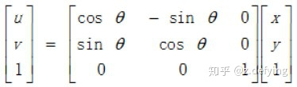

## 一、概述

图像的几何变换主要包括：平移、缩放、旋转、仿射、透视等等。图像变换是建立在矩阵运算基础上的，通过矩阵运算可以很快的找到不同图像的对应关系。理解变换的原理需要理解变换的构造方法以及矩阵的运算方法。

图像的几何变换主要分为三类：刚性变换、仿射变换和透视变换，如下图：


==仿射变换==是从一个二维坐标系变换到另一个二维坐标系，属于线性变换。通过已知3对坐标点可以求得变换矩阵。

==透视变换==是从一个二维坐标系变换到一个三维坐标系，属于非线性变换。通过已知4对坐标点可以求得变换矩阵。

## 二、图像基本变换

图像的几何变换包含很多变换，其中有一些基本变换，而仿射变换和透视变换就是对这些基本变换进行组合实现的。

基本变换具体包括：平移（Translation）、缩放（Scale）、旋转（Rotation）、翻转（Flip）和错切（Shear）。

a. 平移


b. 缩放


c. 旋转




d. 翻转


e. 错切

错切亦称为剪切或错位变换，包含水平错切和垂直错切，常用于产生弹性物体的变形处理。


下面这张图可能更形象：


### 三、仿射变换

### 3.1、原理

对于二维坐标系的一个坐标点（x，y），可以使用一个2x2矩阵来调整x，y的值，而通过调整x，y可以实现二维形状的线性变换（旋转，缩放），所以整个转换过程就是对（x，y）调整的过程。

仿射变换（Affine Transformation）是指在向量空间中进行一次线性变换(乘以一个矩阵)和一次平移(加上一个向量)，变换到另一个向量空间的过程。

仿射变换代表的是两幅图之间的映射关系，仿射变换矩阵为2x3的矩阵，如下图中的矩阵M，其中的B起着 **[平移](https://zhuanlan.zhihu.com/%5Bhttps://zh.wikipedia.org/wiki/%E5%B9%B3%E7%A7%BB%5D(https://zh.wikipedia.org/wiki/%E5%B9%B3%E7%A7%BB))** 的作用，而A中的对角线决定 **[缩放](https://link.zhihu.com/?target=https%3A//zh.wikipedia.org/wiki/%25E7%25BC%25A9%25E6%2594%25BE)**，反对角线决定 **[旋转](https://link.zhihu.com/?target=https%3A//zh.wikipedia.org/wiki/%25E6%2597%258B%25E8%25BD%25AC)** 或 **[错切](https://link.zhihu.com/?target=https%3A//zh.wikipedia.org/wiki/%25E9%2594%2599%25E5%2588%2587)**。

所以仿射变换可以由一个矩阵A和一个向量B给出：

![[公式]](https://www.zhihu.com/equation?tex=A+%3D+++%5Cbegin%7Bbmatrix%7D++a_%7B00%7D+%26+a_%7B01%7D+%5C%5C++a_%7B10%7D+%26+a_%7B11%7D+%5Cend%7Bbmatrix%7D_%7B2+%5Ctimes+2%7D+%2C%5C+%5C+B+%3D+++%5Cbegin%7Bbmatrix%7D++b_%7B00%7D+%5C%5C++b_%7B10%7D+%5Cend%7Bbmatrix%7D_%7B2+%5Ctimes+1%7D+)

![[公式]](https://www.zhihu.com/equation?tex=M+%3D++%5Cbegin%7Bbmatrix%7D++A+%26+B+%5Cend%7Bbmatrix%7D+%3D++++%5Cbegin%7Bbmatrix%7D++a_%7B00%7D+%26+a_%7B01%7D+%26+b_%7B00%7D+%5C%5C++a_%7B10%7D+%26+a_%7B11%7D+%26+b_%7B10%7D+%5Cend%7Bbmatrix%7D_%7B2+%5Ctimes+3%7D)

原像素点坐标(x,y)，经过仿射变换后的点的坐标是T，则矩阵仿射变换基本算法原理：

![[公式]](https://www.zhihu.com/equation?tex=%5Cbegin%7Bbmatrix%7D++u+%5C%5C++v+%5Cend%7Bbmatrix%7D+%3D+++A+%5Ccdot+++%5Cbegin%7Bbmatrix%7D++x+%5C%5C++y+%5Cend%7Bbmatrix%7D+++%2B+B+%5C%5C)

所以仿射变换是一种二维坐标（x, y）到二维坐标（u, v）的线性变换，其数学表达式如下：

![[公式]](https://www.zhihu.com/equation?tex=%5Cbegin%7Bcases%7D++u+%3D+a_1x+%2B+b_1y+%2B+c_1+%5C%5C+v+%3D+a_2x+%2B+b_2y+%2B+c_2++%5Cend%7Bcases%7D+%5C%5C)

其实到这里还没完，我们知道缩放和旋转通过矩阵乘法来实现，而平移是通过矩阵加法来实现的，为了将这几个操作都通过一个矩阵来实现，所以构造出了上面那个 2x3 的矩阵。

但是这个会改变图像的尺寸，比如一个 2x2 的图像，乘以 2x3 的矩阵，会得到 2x3 的图像，所以为了解决这个问题，我们就增加一个维度，也就是构造齐次坐标矩阵。

关于**齐次坐标**的更多内容可以查看[这里](https://link.zhihu.com/?target=https%3A//blog.csdn.net/hty1053240123/article/details/51992398)，还有[这里](https://www.zhihu.com/question/36296104)。

最终得到的齐次坐标矩阵表示形式为：

![[公式]](https://www.zhihu.com/equation?tex=%5Cbegin%7Bbmatrix%7D++u+%5C%5C++v+%5C%5C++1+%5Cend%7Bbmatrix%7D+%3D++++%5Cbegin%7Bbmatrix%7D++a_1+%26+b_1+%26+c_1+%5C%5C++a_2+%26+b_2+%26+c_2+%5C%5C++0+%26+0+%26+1+%5Cend%7Bbmatrix%7D+++%5Cbegin%7Bbmatrix%7D++x+%5C%5C++y+%5C%5C++1+%5Cend%7Bbmatrix%7D+%5C%5C)

仿射变换保持了二维图像的“**平直性**”和“**平行性**”：

平直性：

-   直线经仿射变换后还是直线
-   圆弧经仿射变换后还是圆弧

平行性：

-   直线之间的相对位置关系保持不变
-   平行线经仿射变换后依然为平行线
-   直线上点的位置顺序不会发生变化
-   向量间夹角可能会发生变化

### 3.2、python实现

通过仿射变换将图片中的每个像素点按照一定的规律映射到新的位置，仿射变化需要一个转换矩阵，但是由于仿射变换比较复杂，一般很难直接找到这个矩阵，opencv提供了根据源图像和目标图像上三个对应的点来自动创建变换矩阵，矩阵维度为 2x3。


两个图像中非共线的三对对应点确定唯一的一个仿射变换。经仿射变换后，图像中的三个关键点依然构成三角形，但三角形形状已经发生变化。

这个函数是 `cv2.getAffineTransform(pos1,pos2)`，其中两个位置就是变换前后的对应位置关系。输出的就是仿射矩阵M，最后这个矩阵会被传给函数 `cv2.warpAffine()` 来实现仿射变换。

原图为：


```python
import cv2
import numpy as np
img = cv2.imread('image0.jpg', 1)
height, width = img.shape[:2]  # 405x413
# 在原图像和目标图像上各选择三个点
matSrc = np.float32([[0, 0],[0, height-1],[width-1, 0]])
matDst = np.float32([[0, 0],[30, height-30],[width-30, 30]])
# 得到变换矩阵
matAffine = cv2.getAffineTransform(matSrc, matDst)
# 进行仿射变换
dst = cv2.warpAffine(img, matAffine, (width,height))
```

变换矩阵的数据类型是 `np.float32`，函数 `cv2.warpAffine()` 的第三个参数是输出图像的尺寸(宽，高)。

仿射变换后的图：


因为平移和缩放的矩阵的比较简单，我们可以直接手动指定。

```python
# 图像平移
# 移位矩阵，水平方向移动100个像素，竖直方向移动200个像素
matShift = np.float32([[1,0,100],[0,1,200]])  # 2行3列
dst = cv2.warpAffine(img, matShift, (width,height))
# 图像缩放
# 缩放矩阵，长宽各缩放一半
matScale = np.float32([[0.5,0,0],[0,0.5,0]])
dst = cv2.warpAffine(img, matScale, (int(width/2),int(height/2)))
```

向左下平移：


缩小50%：


要实现图像旋转，需要通过 `cv2.getRotationMatrix2D` 来得到二维旋转变换矩阵（2行3列）。

`cv2.getRotationMatrix2D` 三个参数分别为：1.旋转中心，2.旋转角度，3.缩放比例。角度为正，则图像逆时针旋转，旋转后图像可能会超出边界。

```python
matRotate = cv2.getRotationMatrix2D((width*0.5, height*0.5), 45, 1.0)
dst = cv2.warpAffine(img, matRotate, (width,height))
```


___

