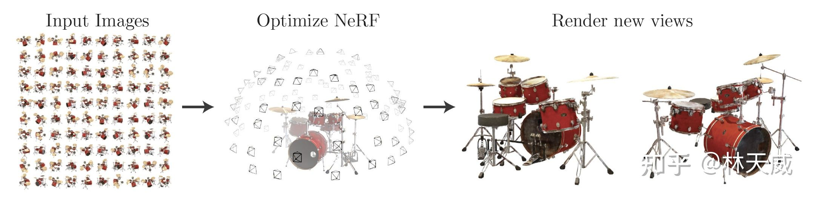
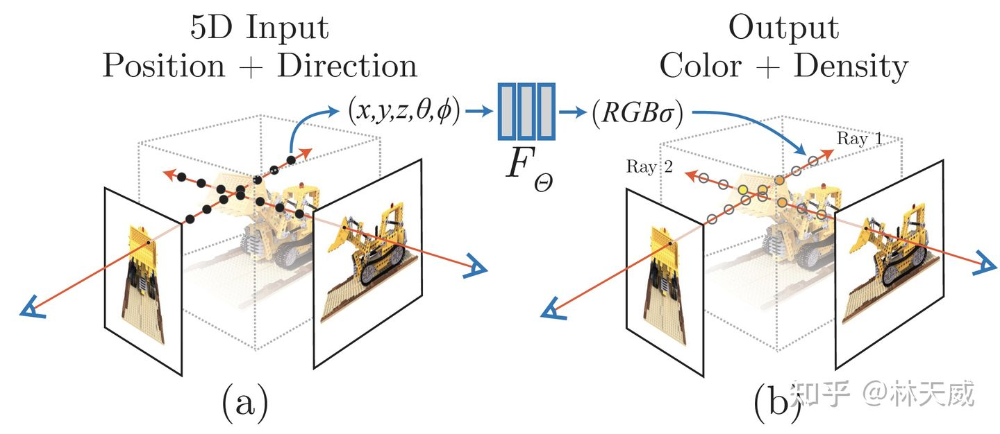
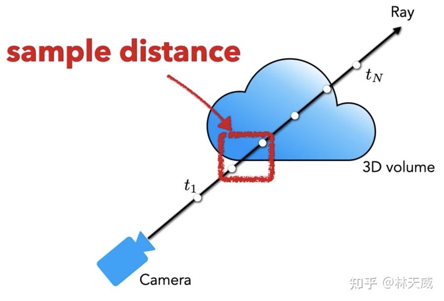
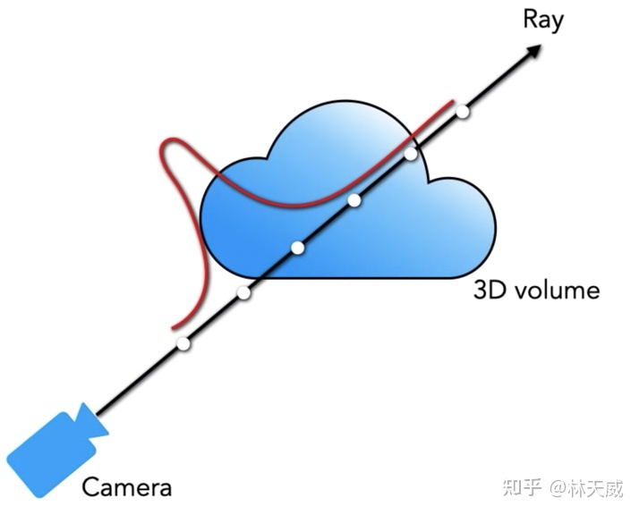
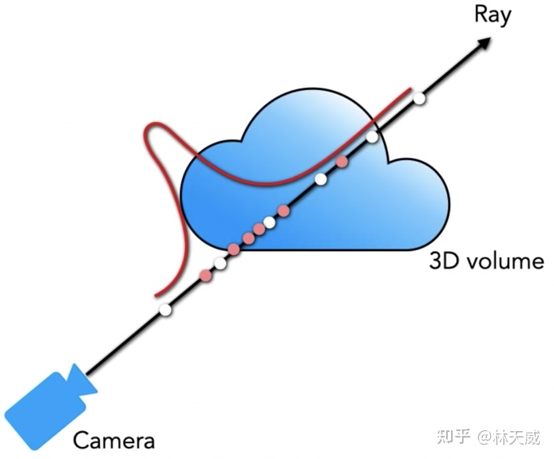
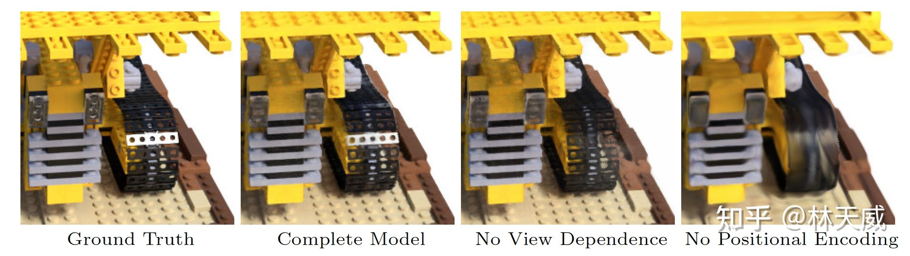
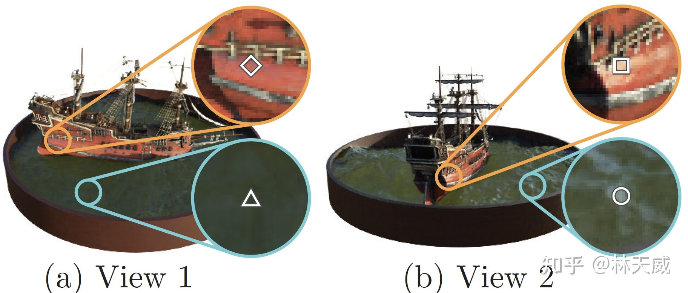
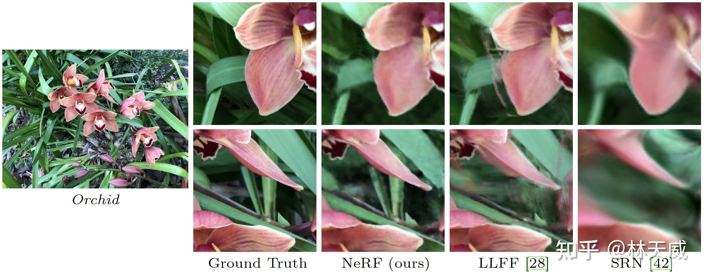

# NeRF

> ECCV 2020的神经辐射场 (Neural Radiance Field, NERF) ，其核心点在于非显式地将一个复杂的静态场景用一个神经网络来建模。在网络训练完成后，可以从任意角度渲染出清晰的场景图片

Code: [yenchenlin/nerf-pytorch](https://link.zhihu.com/?target=https%3A//github.com/yenchenlin/nerf-pytorch)

Awesome-Nerf: [yenchenlin/awesome-NeRF](https://link.zhihu.com/?target=https%3A//github.com/yenchenlin/awesome-NeRF)

---

NeRF可以简要概括为用一个MLP神经网络去隐式地学习一个静态3D场景。为了训练网络，针对一个静态场景，需要提供大量相机参数已知的图片。基于这些图片训练好的神经网络，即可以从任意角度渲染出图片结果了。理解NeRF主要需要理解三个方面：

- 如何用NeRF来表示3D场景？
- 如何基于NeRF渲染出2D图像？
- 如何训练NeRF？

即我们要理解NeRF是如何从一系列2D图像中学习到3D场景，又是如何渲染出2D图像。

**用神经辐射场来表示场景**

NeRF函数是将一个连续的场景表示为一个输入为5D向量的函数，包括一个空间点的3D坐标位置 ![img](data:image/png;base64,iVBORw0KGgoAAAANSUhEUgAAAFUAAAAUCAYAAAD88XGTAAAEeklEQVRYR+2YaahVZRiFH4v+lEZCRoNFpJERzRpUYDkgYqlFWYmFaEUjRBMiaKUmijMUZpZpRKX5o4GoMCtTIisaQDTQCgoipwhFEQU1Hnm/+Nqcad+Oly30/blX797vsL71rvWe04X/T9sR6NL2iO0JOAD4rD2hjmqU64C1wOE8SxVBnQqcBDxRLPaowtOx4JcBc4AhwKEUomqg3g5MA/rkRXas3057axGwNydBlUA9DvgUsMjlnQbJf0/UG/gBULK+MVyVQO0BfAxccQyxNF3JFOB04L4iqF2BC4CTgc+zCzwN2NYJ+nZXAPpYjVyy2JMbgoT4R8eaEC6R51+GUoKk6f2U0595/juBScBFwMH08MXhtjKlO3AG8HYk9YUXgdl1ikgNt1JjPRCM8QKwGZhbCDQwJOF8YCXwHuDvTwGO3s9NEjsBLwMjgLuBVwKQZ4ALgdtaKPxG4DngT+BB4Lwg3+J41+n6Nti6TVBt6CtgSRRv8ndjFB+KRtcANlfrpt8ARrdQWCO5sY7vgQXAsizW8cAEYGaw0jVrPzAcOAA8DsxrkNveng9Qp8cFPBw9fxE9ejmNTmLkIODScPrdgKaazgnAvsBorS9I2afjIUFzpZkcTNgeQOvI9ZLX0mX/r9YF1Bs/m5cFSsD7WbGXAJcDrwYQPwKvAc+Gfr3URAKsw94+Ar4EbgbeAc4BfgUESnNsdlI/dwSo9zrm2Uv+fWNc4MIEiE05mv57FTA43EyG1gMoxSxjdo1A/R2w2BzUvNk0YtcXNL8ZIP5dA5EsZwYYY4BZwNkt6rI9DgWuBpSNoowlUJ32uWn8ZUJPYCTwB3Ai4Oj5sqtCf0CHq3UE3k8WrRwvrxaw5voAeLMw/pqnI+eoamDqbaprbKwwm1oY34XAqTGN9qR+nwIIbjOzs+YVwHchQ9YvJnvSCgWk8TfeCkFVKz8JE3A0Xg/RvSpY+mE0u7RO8e0wKuuQOVsLRqX+aRCOqfIjyP0C2L/CMHYAw4AngflhZHmpxnbE10UM2eo0SqRkvqm38TUuXaI5QWq9mq65KTtOjjrqSVMkk9cnpgqqD/iC+nNLAOsnG5moaza70VaY2uiZe6I4zTGxWQA1Tt1X87wVeCS0V3OVcZ7kA2q/GlqcBrVal9fUHgBGZXoqKb4GroxpVYbS6RsXoha7Mik9q4H7C1uHG5Ja79a0NddUR9j91IJM5MhvAUzS0f2uDNDXxBpnYekCrcO92V35J6BbMFXmFS9ZWfgNOKtG0l7Rw7mhq+qiIO6KZ82jtLjJHPlUFMcx3wlsiKlNel7MrTRKQI3scBmTKQNQR561Ft19YrYjl4kzI9YsmZofG74hLsMd3Kn0GQ0xgWPuX0JOyhLIXXl9rHluGJX6mGo91wKCIyPKyI1MUxc1M1ez/CgNAuVXdI+GnCkDefy3YuVSk8sed2tNXkk5ciFVYmpqRuN0T3b0yhwvQv0vHgG3YR1adjryRTaas5V9tRhbzbfWm6r81V+uZcfCl9TjYiuo/JfUZdhZyWf/Bko//RXvpKKqAAAAAElFTkSuQmCC) ，以及视角方向 ![img](data:image/png;base64,iVBORw0KGgoAAAANSUhEUgAAAEUAAAAUCAYAAADbX/B7AAAESUlEQVRYR+2YbcyWYxjHf2XGYjajyWSWl0boQ00YSd5m1USNaanUYjWWD2psFcqHzMv4QDN6Q+jNatOaD4THmEJMM1NqNhSSNMOYt/0ex2lnV/d1X9fN8zzL1rk96+m6zvM8/sdx/I//cVxPNw6u/SLQ7QCMyS3AY12Eqx/wMfBnbq8qKCcApwN/AK92AdCzgTuA8WEzmRTnUOBi4J7Cu1ZgeYcBeC0OnQs8DgzM72wWFI3fHYd3Az2LEW0FTY29fYDNwBDgvWy/GG8DHgDeAg4DLgd+qHFncYsBuB/Ynr3w2a9ho50xVUwxooJ8BpjQyUGxZL7NEpFwDwaWASdGNt8HpgJvtxiU7sCnwCkFP04FPggmvlMVFC9ZH0EZE8BaxFF7+xHAzgCWs0QMq4DngZWRRMv4WeDJ2rf/vfFa4EZgeINzc4BewBQDVmSKIPoCRwFmZAdwbPz/39C1Lm6B3gf0L2RxXNDdbP4IiO/d0IEn6l4OHAI8BywAXmmgSTcAs4Azgd9TUPz3auB2YE/U3LQwugU4o0TcPFdVggm7Yl221IxLgasKWvIm8FkIr/Wurb3BqI01gnIWsBzYFgy5FxgGTAfasvMDQsdky9fJIQGtjZ/rjRbwSIjPfODWEj3RGffVWZeUdDAxPBxsnJRdJFvVGMX1yGCsYu9+2ftThVEdXAc8CiyO1mtyDfyauMMG4joU+BkQY5sGekSpWDZJO3wumPOAUcDqEgCNWOKzffp+nG30LOma928FZmR2LgTeAC4LbfPep4GTAd81Y557XwB0+qbw4YrQDEvpN2AQ0C6sEeiPIoDzPWwwPski5oF00MeHA7+0EJSyBDYLikL6eSEolvKDwDHAd4HpS2AmsKiiEx4dZy6KwD4VHfTlEFRF/Tjgm0JQFgIPGRQpo/hYu2ZB8OcA1qxsUWsSg9IlyXFV+646tQOcX9JGFc87AcU0L5+xwNIIhqwYGeUsc5qxRDiyYANgcL4H1CbPWSLamAxckAU2lY82l+dBcSZx4hOkg9tsYG4mpI2c7yihvQaYWBDa0wBFXjz+bAIUSlt0WmqFGDybM1HN2RWsMJEvAVdGYuxaJtlBMa0ktO2JS045uXroi6Crz08CrDNZ4ztbdGctv0GcQ+wWyTkDoeA7k5jBeVE66b0lLhssLweynD3ivy7OWDp+royOziXzPyw4Ykt2QD0e+Cpvyf6ugEk1DSvAgnUKtKY7c+mgGfU7ywynJaabgyXOJ0VdMnA64zzTqKTSACpz7JQOfo32KQPatvPuN7x1puPN7tZ5nXaAkzF1l04r0L2bCK+yYCW8XnKpWuYnw4ikeXUHr7og/8s+y9SuohCmVll13wrgxWBLo736JztsJmXi7JxleVlutT4Iq0B19HvHbGnuN0hVh9G2zvp9VrYMSv61X9xnImwo6sw/9g4kpiTAdsCu+NuN9uxaS1r9I1NHM+F/cd9f/O3vFRQlMrgAAAAASUVORK5CYII=) 。这个神经网络可以写作：

![img](data:image/png;base64,iVBORw0KGgoAAAANSUhEUgAAAIoAAAAUCAYAAABS66VXAAAHRklEQVRoQ+2aZaxkRRBGz2LBg7tLcHfXYMHd3d2CBJdgwT24hMCiP3CHxSG4e4BAdnF3y3mpTnovd+bekTfzg+3kZd/s9K0u+aq+6rpvCKPWKA/U8MCQGnv6uWUl4OE+KLACMBx4uw9nlx25J3Bhj3TR9mHAP/l5RaCMVkOZv2vs6caWzYENgc2KSndDeImMOYFp4qxHgDuAdYBe2dvIrC2AKYBzBsnuotgFgdOB1XLbi0Axe8cGlgQeA8YDxgUmDCcqdBXgoUFWegHg7DirF4G6EdgkbLoB2BLYFtgaWL2PYNkAWBXYp8c6XAz8DByUkrQIFD8fBpwUCiZAWIbGBH4HpgM+HUSgWNU89wrgmkE8pyjaKmLZ3Q24BNAX9wG3ADqu1yv5QX16TYGzAS8BUv9zGl4GlOuBJYBZCyhW8Qd7kOWTA/cDiwB/9Sg6KSgCZXbgvTh3PeAoYPEuZbTyH61p0xrAoT3wdyN1jgOmAna3qpT1KJ8AtwL7hXMsy2cEst4C5hjknmEbYKG87GWWjB/nS4U6XP1nAr4CvmtBL58THGaOFdL1QJTbCTJQKPtDYEbg45oBbrTN85KsKlHqdyowBnBgg83jANOG/iMAYzNSA1pxyOgl+30+yZB2jwTmMWGLQFkMeBbYLsq+32vcLF3IKBuy24B3gB0aGKEzL4o9gjNf8wY4bDLNevsny+MHwPbx3GlVEQhwmSU7Ap8F0OaP5+4B1sqcpf3S7EbAUzVkN9uirNeBc2tQmX64GXgikjSXq5ydgGOAN4FXga1i/941dFT2WcDGWd+ZHjs+5Pp5YeD5qCojikBxo6X2aeBPYNkIzsoZUBLa1wXeBQ4PB1ShWbBJXTcBhzQwSNk21FfFT9o2HyAl7hv9y5nAAVEFLggA2mPIqVXB0qnXAlcHWGyWk7wjoj9LMtTHyuWNwypbZWNVnAySgFu6glbdZ5A8V1/k+ngL1BfGyp/lwye3A8ak2VLuUEBaM1msSFYu+yBjKei+DAH2pL8Axn5YDhR/1xnTx61HB9r9+/nkeNg9NnczRCcuoPzsYc9UeQmw3DXrOxJQvJ5ZOdLy5qFzzaK0R773s1Tp+TrM8ttsTQS8GFXEjFL3XN5SkSS5DCucThRMZcvSPGUN29MWgyVQrZjaWbbcI51Kw7kfvA1aRX8NetbeiSNuJ0YiNlJFOwWE9hgH45v6TkFWtC9VwPOd4eRA8SFpwRuHAs2eEwAz1UrgErHnATNnFWYu4PEoZZ0Ox9Tnzhgu5Q7ybPXTOLnZfkTEW0HUz+fqZLtXe3uRH8IGgzFp0KtjgLFKKNZBl1l2dIMISFvSat2lHfcCezShIPdIebsUgCLlXAYY2PVbbAcEh9XMGNkku/y/l8PfxYFeAsrlgjoHitn0ZFQKUVRcKn8pMHVkQ7o6W5qklbmDDuo6rFEmeSU2mHnJ9exXgrPtc+7ODBU8DuesFlXXWDt5Ay6dCDLB5VDPyqIDzUor07EhX/+oi71CI6C0Yq8Uqh1VzbEBvCsoJvdDag3sc7xstLK8ILwQt0n/dSXb1wTsz/KVqEeqHpoDJSlh1um0YoYaLMfaZrM3AMufQxl5zMbH/1u7CcoFmF30F1kgioaqTxry5M1sCrDzjc9Djhxu861TpQbnP/Kv68rQz9F3bodZKNCslAZemwSFfZn2e+P5MQOF+khtpwBlydNKoDxrf+Cb0K/Zs6kP9DaT+8G+QupItmube50qS2f6Q5p2QKe+KaFS9ZAxnLi+H7Yrx+qkD4qDzdTMDtCxh9gcqcCKofkbUR00LHdy4jM5/qfsHYyZ6e3Baa63j0YUYNVx2ntdk2ZWFeyLbKL3ymSprNXMHmq5oEgnp3K84DPwyViBY78kpZTNgpz4esX/PvbYtHuLei0Ab/+V+ih//wiQXmz0OlnqJU1aserQ5M7Rh+iHtIyB1cT/cxCmneo4Sdxk9E9K+F3DZ7nOfrdpPG/fKe0Y+7K+0eux4DPBhwuU9JMEpipT9rAH6XzLUb5fpS2VVeW5qplV5jJx1bMjz1GukwSzztbRfhb1Xo+/LgG1RtoMFjNF+3zWK6+U4/fOZRaNTP02s80kspdINNUJUHw26V9HjoCybxCkuQ3qbwMrff0RV2T9kfb4vX626XWkkK/0nTRU5rd8r1XcSiWt/2fgVmWADlYBEW11cOlIHeDLq268l9EY5wNeu6WJdlaqKpbiOtlbdoZ6WGWcOdhA9nrpa0GrDa2O8KUTnzm4TaUdRHqj9aXowPwo71HqyjQIcrov0exP5Ex7gm6AJOlgVbEv8ArcjlypyIlro8FeHVsFqq8yrDy9epVQ1EtakIJaeYVgXJymO9VtV2/p2YouTQ0kWjtAySnH39vN2KpgeZsSkFVDtDI5PtvJG279YiMo4Lzx9HMZrMla+HsUq/tvHUySrWD6faTrdydA6YXz+vWHSzrb2YiZ2e+VerNOgN+KDVZhr+RN/3CpFYGj9v6PPPAvGXSyJNtpFd0AAAAASUVORK5CYII=)

输出结果中， 是对应3D位置（或者说是体素）的密度，而 ![img](data:image/png;base64,iVBORw0KGgoAAAANSUhEUgAAAE8AAAAUCAYAAADMfWCyAAAEUElEQVRYR+2YWchVZRSGHxsgpLooSq2wUdMcEgsiadYMRJEKtYsS0QalLMrqxtQMqSTKqMguGqQUNMiggki0JBukbJA0pUEjg/KikSSCBnlkffG52fucfY5H/nPRhp99/rO/Nb1rrXetfXrx/9U2Ar3aluy84ADgy86r7YjGs4BtwL+5tm4B7xBgDTAW+Kcj4banRD8uDR/eylRcBtwJjM/96wbwDgU2AbcA77YXc0ekxCIlbhEwv1BpjwN/Anel77sBvOnAycC9xbboCCStKbHy/gZmAM8WRA8HtgPXAB/6rKfB0/7rwBPAa63FeVBOjwQ+As6Ne9HIlcAVwCwTXQTP/08C+gNHAPb9weQgK+4b4Bjg54Kn+uKfJJ38bMWXJK/aunIPADdFJ/wednNZB8dqYIgVmoPnF08DjwAXAJcAfwCjKoxb4nUug99vSmVCU4CHwtn8zH3AxcBOYAcgL14EmPlfahgdCrwADAPeAdYD35a0Yq7KeDz7XUzWW6OF+8Tds0cBvwF9gd0JvFPDSVtoAnAmsBX4CTg+E07GzgM21gjCIwKxoOKsz84HLi9MtjuAlyOZcozOPgoMBz5rYncE8Ekk/f2oki3A1VE1VeJHA78CK4BrAcH8HLg+QE009z0wGXhb8Dz0KjAOmBoZ8+BjwGbgmQprZXyZ2qwoUlV5gmfLOmnTJdD6dCJwRqwO6tW3ZU2A85yT+69Iii13oYECx0YxVKlwHVkHnAN8HNUueKti8ibw5EQ79EmNnQ58Fe1wXBiuU1StDJsq8GyNgQXwtJ2yLudKznWvxKFzgftDaHHsj4LSiPtM5GwgYXAC8DVwA7A8dBmz4FmdD/tPQvzTQD03UFVJ8mG+RDYK7vZoubIz8ti8Qtt6TtpwLRgT1VAXvNHA2mg7A9T/DRGwfjQCbyFwdvCqyZ4D3AOo00rM2/Y2K1Llg4IgfXhY8Jvfi7yT50VAzihenRgYkvEHwCmFoeKeZWvIxU7j/LIypBKTbYvnVa1PJnUpsBJwIHmXwwSzStZ4Bc8tY1q0rAu7sS/JbKSBIU9vTK0nkncDvUPAqaYhiVuirmq7uhVRdc5kOVEl+R+zQy7MDi73raJtO8VJ6nuwn4udIqDuYu8BLra2YtrbGsmeBrwB3Ag8FdNZPbn+wTFE+gE/JPC8C5yc4dRx0u5pYT9qF0TtvhJVYYWky7VpV6wFZbpdXdzyBaWsFVNXuHZNChpwb/NqJKuclGRiXFmKibOonNrXlS3J7YJwIHJXBde08nomuA9Gdea2n4uKsfqOjCnrJpHrrpJtFoNV7B44M1ahHn8902GzLSHf3MIPA88DApUPLavYhdpnBjkxVhOBy6uzTLYZcD6XE21beXRfRbaybtQx0O6Z9EJuS9V5lZK73iwYMxaXbX8X9PNLvgWU6CuTbea3gNmuLuz/+dct4Om8+94XzaLooedWr9N6vx9ruwm8HsKlfbN7ASVZ9hWS25JOAAAAAElFTkSuQmCC) 是视角相关的该3D点颜色。在具体的实现中，  首先输入到MLP网络中，并输出  和中间特征，中间特征和  再输入到额外的全连接层中并预测颜色。因此，体素密度只和空间位置有关，而颜色则与空间位置以及观察的视角都有关系。基于view dependent 的颜色预测，能够得到不同视角下不同的光照效果，非常惊艳。可以看出，NeRF函数的表示非常简单。

## **如何从NeRF渲染出图片？基于辐射场的体素渲染算法**

NeRF 函数得到的是一个3D空间点的颜色和密度信息，但当用一个相机去对这个场景成像时，所得到的2D 图像上的一个像素实际上对应了一条从相机出发的射线上的所有连续空间点。我们需要通过渲染算法从这条射线上的所有点得到这条射线的最终渲染颜色。同时，为了保证网络可以训练，NeRF中需要采用可微的渲染方法。

***1. 经典的volume rendering 方式***

论文中首先介绍了经典的体素渲染volume rendering [2] 方法。体素密度  可以被理解为，一条射线  在经过  处的一个无穷小的粒子时被终止的概率，这个概率是可微的。换句话说，有点类似于这个点的不透明度。由于一条射线上的点是连续的，自然的想法是这条射线的颜色可以由积分的方式得到。将一个相机射线标记为 ![img](data:image/png;base64,iVBORw0KGgoAAAANSUhEUgAAAF4AAAAUCAYAAAAEEYpkAAAEyElEQVRYR+2ZachVVRSGHwsxKkJpztCkgYwoSq3AwiawP81zVFJRKkVpA6E0F+SPJm0kIjL70YgURdI8OiSVYSVNlpiVlUIUhVgZT6wtm809955z68Ph88Dlu9xz9rDe9a53vft8fdh0rRME+nS56hHA623GjgJ+AD7rcv6Nflg3wJ8BnAScDqypQMh5nweOBf7e6FGsH+BAYG8xaQr8/sBdwFEtAHWuPBFjgLOB0b0E/DL+Mh03ANfHjyuaAL8Z8BrwMPBoMevhIT37Ap/EPed+CXgGeKA+Kdbpk8Z4CvBkw118HLjc0WHcG4AyPKMJ8NsDLwPDgL+KBSZENrct2H08cC1w0AbCeoGXmdc1AN7qfwUYDrzfZlwirsCfmYD375GAmfspBicWJ/k4BzgAuCKTFMc5oRWwJXBqJCWN2Q34GhgELG0QzH95dPNgVT9gPrCyQdKN5Vbg6hobMHY/E4GrgD2B3wq5db4hgDi8BXwHbAds40C/fBSlcg1wczB0bgRgQnzufuBz4PZsU08BhwC/Aj/G7xcAX2Vysww4GZjTphHXrbx2jdog7SnnA6uAeRGHJHgEeKIGmCZNmXG/nS4rQ9CNb3lg9BjwUHw/IUhq4pcAl8SEYjjUgM8FZLf6PQOYBRwXQCkrlpLW0Y8B+EmX472vBB0ILCgy7v03gamh9a2CuTTudwrU+67lPstL0CcBtwRxBMUk7Q58GQ/vFAC1W8d5PgQ0EZ0uYzNRq4FxwIMxwEQPBWYD3wBHAyvClFwG3GcSHKwtVF5ky3mAen038B7wLXBiTCjwt4VNzDd1UWiictKKkVbKF0BV46nL9rRmKwsrwFbtVtGDPoiHd80kTgBeLdDUFu8M7JhVqFJqnF6/hzx8H+Qqk7FXnFUkaFrTZGgo7G9XhkIYo4lQHVxzZgraTMsM9Uif6cEnaZhg+v2FyJb+PGf8vcAuMWEr4L1vxqsa1v8BvPJmiVt5x2QEsHKfDZ1XUvOkGbOkshLaAS/ofnRo5SVpZfAOmeGw1/0cvU88HWsy/ozBWyiFKeiRwDuxQd1LCWBqoHbvXGr83RPqlGD0adGgP80Y5Jh32wCvt1Ua6lz2m1Yn5pvCPZnkpKXOd2Os69nj8jYHvrR2U6mxHwjoWcA+8ZFkVtZiYI9Yc0QoiKxX+9e6mlReyovlUJazCUpuJm+uyUr5Vy23xCyllDjH6WZMzD0VyKbKqgN8VXNVY5W06SGX7v9Q4O3QbIn1R40FBF7DUKe5+qy2Wjm5MwzFYYDyI/B6dl+tJIuqrZYg/5I9MT4xQ0dTJQlm1WAuLuykls0qmBxN5rksQHXfjr4fsLBG4N0+YnDTYm+SR5cxOJyMoNQB3bWb2kkZL8PHhtRdGJhaxUqePdKzjThvDfQF7Dujc41Xp7VGVe9fZM3TMTA/QPUPf29z+aVATg0cH5mvmrdbsMtxxjIgAHcfOgrXbLJu0wOUz+vm1HGxy3uf+5Goymzag01Yq72ySWPz2UVh22bWQMvnPZDJOBvfhnAll/d4T2+2CfDuRdar1x57O7111FcfHHpZvmLo6bjW+/mbAm9AOgsbhY2j6nLeF+MwY6ltugoEugHeKTr9I8STsN626Vu+XpOgboHvNQD1VKD/AB84EH9Va3q/AAAAAElFTkSuQmCC) ，这里  是射线原点，  是前述的相机射线角度，t 的近段和远端边界分别为  以及  。那么这条射线的颜色，则可以用积分的方式表示为：

![img](data:image/png;base64,iVBORw0KGgoAAAANSUhEUgAAAQwAAAAuCAYAAADdnycaAAARoElEQVR4Xu3dB5QtT1EG8A8zJlRQzCImzDlnQVTMYsAsKuacM4IRDCAg5ggGzGIWzCgqYM45JzDn7PlBF/Z/dmZn5u59+39vb/c5e/a9e7t7uqurv/qqunr2FhllSGBIYEhgowRusbHeqDYkMCQwJJABGNuU4EeSvGeS399WfdQaEriaEhiAsb6uL5jkh5O8UJL/Wa8+agwJXF0JDMD4/7V9liQvn+RHk/xv+/hTk7xakqdJnsjGXv/qqsKY2ZDAugQGYDxJRi+V5BuSfEuS10typyT/3cR33yR/l+SzOiDxFdl9cZIvTfK4dVGPGkMCN74EBmAkT5HkW5P8UpLfTfI1Se6Q5DfzpO9+KMmnNbekVpzc/ijJRyR5fGMlN742jBkMCaxIYABGcvskP5/knRur+Jgkd2zxiudqwHGrJPdMwkVR/H73FggVEB1lSOAkJDAAI7l3kk9O8tRJ/muy6mIWX9K+xza4LcobNOZxrw5ETkJhxiRPWwKnDhhAwAkIsHjthVOQ92iuyVd2qvL2Sd42id+jDAmcjAROHTC4I+IWn5vko3es+mcm+bUkD93RZlQdErjhJXDqgPFuLcj51km+Y8dqflWr/5072oyqQwI3vAROGTDM/Zuaa/G8Sf5042o6Zv2xJN83Erk2SmxUuzISOGXAEL/4s3YyAjAqWeu8xb1dEuwCYNSJyZVRhjGRIYE1CRwDMPQh2WnL8aJThy311sZ9jO8rfvHdSd78GB0esY8tMn3dJD++EeiOOLQndvUiSX77wE4FijG788qSnpjzT9wMzO4Dk3zhgfNd03lz+ot2fH/gI85tdlSZLQEG6/sWSdyjeNF2tPgLSV6yZTj+Shui9j/VMh4lPK2VRyT58CTVfq3+tfz+HZN8fUvK+pRr9CByPK+U/N1RKYbjM8e1/9CCsUvtX659/4aXDBpPmeT7k7zRARvXcfTHJnmTlbZLeiLm9MItJ2YLIzzGsr5MErk5nr33LpGrBh+V5F3PaWu9y2jt7X9ufnKGXql9Ielwj8zoqz3+HC1t4Ez/U8DQwHGhSf5eEiDxO0neIck3J/nENoBfbD1RbAt4nkD6h7LkUqzvdh2Axuc38HrLJA8/hmZN+iBbbArCc31+q31vMf88yT8mefYkz9cSxRzvKmT5Xi3XY6pAU2slNf2f23pdxgYCFo9N8kFJfnKnzF4gyWOSkPejJ225en/YAd+bJfnsGT0h059O8uAWrN45hN3VnzPJtyV573YqtqcDgI5JyRqerqNN+atdZ5IA3+VAEO7HZP/WlQafP3djL1tlRl/ppPFZ6xr3k9enBwwPe7sk35iE9TXZfqKU3v+fv/1+qiR/meTVu82wRaCU3N2Mj79ky9iPrd/M5vPHWwa+s065PDYIC+KZEB+AkF1tcJ9RFkFXayDVXKYpsO6LmIlsU3WqLbBWD5DYjNe6uOJv4xvLXoC6f5K/b3OYrsUvJ/nQiVVb0hPGyxH4qxxg8ffK54OT3GZmzGv9VH6P3J2vnVQu9/3Fun1DN36wXVEw74uUSir8pyTYhj27VWbFbl+85RhZY59ZH3emHlCA4bdOZTK+apKfnRkxpf/XriNWRl2UZ4/yQCt9vewEDS8ipL1tLSjQ+rckrMgxqOB0DDaXK/FYmeKZfNXvTXL3TmZQvVLRpaf77s6TMVmfhzTUV6cfL5Ynhf199gphZ/0C2c9J8j0HtPUuEQZpCmzm/sgkLz1hnUt6UpuL5f+inePYUx0td3OZfmNVe4p1Z3Dtj2n28Ic1wMMs+3VkWGQcv/LO/TQdV8nTKd6btr62yoyOukN1v8bi9H2T9SnAgNY/kwQi3mNhA1HMp2s+qI4p8Le3G579oAW1KEd/g7MXjGf6/i4H0Lw9i3ZeXQgq8YqvzBffA3hbxmCOaDNQLYroRiykZrUe1Dop9LZZChQeNnGRfI4eGu9XJHGs248XO+FCvsIRgK+PuXhuPcf6GaMLes/awLaXg+/+pa2rdndtelHrjp6LcfHp6zP1PK82ELbEvepjOUt6AijUE4y8yNp5PgbxPC2Q67ZyjY9rjtGJYfTPMG5WXBwOG1SKNVQ948IwrUs/H+tIDk/fwJNu1PcA0nwxOBcbtxbjuXUbP7f3AUneKcnHJblP18mSzMjgmVqsEiuhZ7KeuZxn1sfD/LgvAShc60aR5wra+yctOm7i/HDBqx4YPiTJF7TG4hUCXC/RNgjhV3lUks9rgLMkmLWAYbUj8L1KY5MBvL0ZnlsXca7eJ7UA62st+P9LMqWYZAHkHOcqFLYU+xWbhaY0hzKloqJAXH998UwbAvgJ/lHofhN8XaPW1ve7Gqv6uSSOqos5aYs1saL9u0YEwLliXFtjkDn75Rv0xC3h10nyNheYM3lzk4zNHP8qyWu0fsXv6O5rtuB/DaluL3MDAZ1bzIytGAFX07qYB9D3GR2vIgYoPqBeraNYlUxjRTuyALbTGM+S3omPfGQbJ+PnkKJO/KaewpzMzMe66QNQ/EASesqVUf/M+hgki/E37U6FiPsWpbtto9cG+AfdbFhAJw5ARCSdQFAyqOpORhUCFTgV2Jp7nskS+Jbi8lgPRmttzBlQEAh676TkWhcLQx7kK37RB6Z6ZfT5VKa1mW22YhE9QHq5D+vOStp4e0v1jw4DBFbeEaLNwF2i0CweOYtXmUMVzIIby3Co87dt09j0gKcMEOv2tO12b7Ut5vSfSd6v+ci+6+e2pCfGgGkJIM/Jck0G1gObFmwUrxO381O+vo1OBhg117IKfQbM/97AxiZF+21w8wWQZObnq9tPP19r/x9tHYHOlLkAEgzB6xbWjCDAq5iY5wqa6588lT5o6f9TmZG/tbP/GFDPA1iCz4Cz+rjJ+mgklmDwLC5/bakQcm1uC8UXRWXQmCqCYYI22Adag0lwZfz0wMBH4ndbrCXBlLvUj6enyf3na8Lt6/aCFg2GrNe6eJuXzSR247h6brwV4Z7KtCzvLZv1mbb1vYi705W5F/nImXB93yZmFael3FG/K75gvehFb8EBxrM1i1x9vHEDEbEZLpi4AipfJz5AzmmQFHq+8fS+jiN7n9tsWMm0LOmJuNOvt807Z3AYgi9L8gGTTVv9AwHGDe3GVPTB6HALzJMRnBszQOGWofv2CsoveE9u2LcrBgrAYJSsd1+c/tgfdXAwnS9gld/iBO+80oM8kMH+6UXFG6Q6YLK9rkxlRg/NsRivPu1bwc1KMzizPioZPFT59BZ0mRsoBRKkKbTlZlDSqXJrK4bBRz8vmEgRBIZ6ijp97hxgLAlxD2DYmE9o1uMZNzKqiwIKRUHX378pzFx/xmVzYW89CPuckrKIc4pETr53ylAbte+fK4PNsXjTwKi2LKnYAvZQheICB4BeG5K7SYFQ+L4YH5ZmM/muEpzKwJQlcxI1BQxtAI0A4xxTWNKTYrhTK1rjwmZl5GIE/S1j3xuXjYwV2exY7pzusb5zY9ae+4JpiBWoV649Wfm3oLB59YDhc+uHQS65UtrQzbW8IPP2DPE3TLDq16sasC8uVV96mfmcbI2Di2ncFdfjlgqYKmfWpwJPmAA6YrNPN5+zXNRL8KcW1YAptYf0Lon+Htheedf72dMFQTX/uinYnIXYmjmqX34WX3RrYXEFh9BIPuoesNn6jGk9m9kYpycBfT0yFfRi8XqZVrCUFcYUKAcAr+JqvtMrMYI5wFAPVZ1G631ecRO5MRRIodAC4Cxhr7jGxW3pXRL1bSC6w0D0R4U1Pt+zyIKaPb2nK04SjMvGY4SUPj9hSU9Y1KLgSy6JwCJXbVr6XAVsCP2fqzM3ZvXsh7p3xOiJd/RF/45SnfwA6V4OGI1YBuAwBy5kMVzy0EadNcDo58AYAQ/tneZwW7EHXgD5Vf+9zOw5LAijIHt7gHvGHWIorDMdO7M+hYwsD4WmDMCjnyTlgVwsZP+5DYfy9TRYf5Sae9MHfKYL4hn666O4c4s2s5ZnPtob9ASKBMmKXjTKvja+kq8YDj/Rxu2zOqeKZsEFn3uZltWwuW06VrO3HuVSAnSnMHsKxWNNrAVWaLxcFy8+7g2EPlkox+1oew+y5Z5ya4HanAFA1R0X94zSfICFkwRgJVbCLaqTB8+UBs5KT/XEunEhuLV7YxjmLMgvGYtbQVcVc8eiMGljqjHbfH1hZOgvWZDTnIsoiOjzfg/UfLkN3AhA1TMNz8doMJ46RePy1alaWX1jMQeyEWuomFitg+8xNm4J1oixKL3MCjCMgxw9257QjmvLwNGxM+tTtN8A0BgBHMoDDCA+YUEdlLMXjPoUS7KJYFGVsoa9PzxVYM+UPQrBoe1lF66X3Ij37QJt12IMGFZZCpFxiG7u2BP5zSkaOm8RLV6VUgQ5Aahw7yao4//mY4NvCVhP58rCOOnADFlPwcm3mtmIFBMDckSKHVYpv9kJx1JOjlgRa4Vh9ceqPsNoAM00eH2enthQYjpLKQBr64kZMxjWhR4L9DrVMXfjEJOg//STTvdrxfJa194VmJOp2EBvkMxHv1wl6yXQ22cYV2igB/4yFgy6mExf7E0uLnZJFsDLKxq4Y5iKmFBvWKYyw/YAFiNFH42vmDCDZWxn1qePE/g3hsGKCdKJEBPm0pmwUwbKP41D2ChL1NiEWSiDEUG3AS6zmCMlcHQlQWZvQs6esZa7R9n8u/+9tLFZJsHiqY/L6rHwlGDalgI/Q7OKe8bX12X9rKUAJLo956aZg3UDDD2g6ceaA7SleWmLQWBZLF+VotbmJ2jYF3oiNgOgetqvLy4y3eyN1d65ezaw4sMbm+ebdw9orLOjy571aFduyZI7i4XI6TCv3hWsP2VhHWW99kW8AABUANN35mptsDfANS3Gwi1y8lLjF2dSrGV//D0nszpWLRdXW3Nj3LSt9Xny6x96wDhE4CyNgFnvc6/1gw5CWsGoQyziWv/nfU8AaDsleeab4flrYzc+ysnibpEpa4QNspTXEvxq3ICMC3RIajiLyoXYegSOAdAPlLzXE1aQWymmstcdWZN//33FBLgIe5mwtk5xBFUlN64V9eXbcM36PBTtyI0R5yYdWo4ms4sAhsGziKgQdNyy+SWVsFIUx1HcZZc6QuRK8Q8vI+C5d457ZGoeAOOQDbx3XOoDNNYR1d57+WxP27p85vc0qC5nSDxkzxvSDpmrNlgoKu/0Z+9dHSwD2ADztb0BWOQeYb49CFaey0WuUdjjR5PZRQFD+89otGstsmsB6tjpos89VAEqw5OV4x9ej4VsxFnISrR6qfCRBewu+084Fk1dOtI8T6YV+Ftr66REbIZL0pc9YHqstbVpGblD5MxVs4bn/cU86y2gKSYyBWFuIsbZnxztnddRZXaMjUuBKqi3Nhln3320d63+sb//hAZw56XAH/uZh/S3RaZYBd/z5mBJfF0JRoc8e0tb7E9m7LTcXHMm562u1HTMW16gIz619lKhQ/RIm6PK7BiAcehELruduYo083+lw19L//ey5zaeNyRwKRI4JcBgtZ3eoHhzCWqXIvDxkCGBG1kCpwYYjrL4inJO+oK2jZf63siaPMZ+KRI4JcCQ9SYHQPS6zwUgaL74WiDuUhZkPGRI4HqWwCkBhjR2JzpemFLxC1FoLzqRJiz77np5o/n1rDNjbCcsgVMBDPN0q1BGZH+9XFIN0JAW7RhzuCUnvBnG1NclcJUBQ5BT6rDbei5/yaSTqeitQlXM3409l3imtw7XpTdqDAmcmASuMmDUyz9c05b44hKXCzd91p3befL05cr73Hm4rD5n7q77un7spb2jDAkMCbTLLVdVEPVeAinorir7WyjT9F7ZkrIq3bh0tdgLbLzDwF9n93IgN3fPy9K7qrIb8xoSmJXAVWYYJgw0XGX+jYVELQFPDMN1YK/AFwx1d8C7QbxIxN2TejfBUKEhgZOXwFUHjL0LTB5cE0es3rUgM7TePrS3r1F/SODKSWAAxk2X1LsXvN/D3QEnJliGtzCNMiQwJHDFYxhjgYcEhgSOLIHBMI4s0NHdkMBVlsD/AdulIRHxb7r5AAAAAElFTkSuQmCC)

此处，  是射线从  到  这一段路径上的累积透明度，可以被理解为这条射线从  到  一路上没有击中任何粒子的

概率。其具体的形式为：

![img](data:image/png;base64,iVBORw0KGgoAAAANSUhEUgAAAMYAAAAuCAYAAABzjGayAAANaUlEQVR4Xu3cBaxkSRUG4H9xCO7u7u7u7q7Bgmtwhw3O4izu7u6+uLu7s0hwlyXfUGdS3Ol+r/t195t+w61kM7N9S04dt5r9Mo4RAyMG9sDAfiNORgyMGNgTA6Ng7LtccUiSQyXx5zjmxMAoGHMibIdMv3GSuyY59w6Bd+3AHAVj7UgyF0AnSnKhJK/uLMP729+PmeQbSa43147j5F0YGAVj5zLCOZN8Jsljkvw1yYPbVdD0I0mekeTFoyu1NQKPgrE1vO3tVcdI8qEk90ly2SRXSXLqJP9KwlL8Osmhk/x7bwO6U88fBWNnUu6aSV6e5FhJ7pHkZElu2QTh2kkekIRFeUqSO+zMK+5dqEfB2Lv438rpaPa+5gZfcoJVuG4Tir81y/HkrRzy/75mFIydxwFHS/LzJE9Icr8J4B8lyX2TfDTJW3be9dYD4lEw1oMO80BxwyQvbXHFyPjzYG6OuaNgzIGsNZiKXk9LcrsWZP9mDWDaJ0EYBWNnkVUlmxtFIE4/pmJXR7xRMFaH21XsfKYkX07yiiQ3WMUB457/xcAyBEMW5FUbIPSMSb62j2s3OPhtknetmLFukeS5Se6V5LErPmu4/WZ03gicWddePMlPknxrwma+fWAFd57InyUY/txISOqbglHflPawJJ9P8roNAD5Xkme3vp19seDEvXlvkkttQ0Ht6Ulu286Sst2uIS187yRX2MId51l7jiSfnVKcVOGneN4zw6XR5BKNVzfD0/lalwA+3c2fxfD7t6IQrfeL9t+Fk3y3+bPHSXLSJOY9qAF25SSPb77ukOEBpWenhjXnSXLVfcxyqC6/rRXSVp0hQuxPJkHAoyf53QwMsowpx2/um+r6x+bccCtrH9gEf1ij4UZSQJdvyngjUPDeBRu8k2o9w7XaZ/6e5C7FnwQDwj+ehJn+arMc+m5UVE+b5KdtlxckeWdLFVrzvCTvaP5ufxCTB7C+JeGwrYWB+X/tnMhd5+k3T3LyJA/dgiad915wruXj20lOtw3nFXx3SnLsrhdrHri3shavHJTkcRN45VEtG3ebTRQsvqawvtcq/5u13mun4flQ6J+qGEMLwcWSuISBADTDEZOcrQPghQ3YL7X+nGcmOdUEArEq10hy1sE3v10tCWbaDNB5kL+35kI+n5eJf+s2AHHeJJ9I8pokfPbtwCGBwKQ3TfLpOe+4yFq8QnuXO1RHnyTJ19vvrOe0QSmLVbh/+HaWQbmxcFzVQxAXgg/TtJENTpPkm0mek+TWbUfzuEtlBVRdSfYduxPN8Z3EcStYnd7FEuSIRZhEmm87BiG/dGOo3vWomEqV2O/mXTTJBzuG4z7+owXVvlcAWXc6QbOmGvq4oKseCCbG0Af18CUe5m41ih/8v3tSmtzgsw9oaZ7f4O4HbfG1mtAWfmptr1x7sO2B1wzBdi/op2jeCF755wA+mv2pLW7t93OPEyc5XlPqaHnCJD8brLf3n1q40J/pDQvc7uLPSQF3XZB2f9MEAgAA4/P3Dui+056sxOE67cI9E6cYR07yhyaVB08h7GZJgH7ZRoE8GBXBNNZpydY3pAWb+1cuibcK4BEnEZ7jNsG+UpIztLkIJ6h+Scus0YIsooDu/I14BGPV2hteWGiKSmy3DAsFDw9JcsUWt/S4RUvamsb13gMv1B2tky7W8s61gQ/fv5CERq8kxKS1dQYFqnqvM1jBEkP2rrf7/rm5qUNeYTHxlP0LJoqdspCtw5t+11gpmC8+ITBqQLJ6wgOxTM//1cbPahw8FAz/z6RYxCL00lqXgpgvNrdK3NFrG1kLRHMIye4Zxt6kl+ZlnicN5vOJU74Nf0aASRmHIvhFGsOzTh7rICYYCK7XbVwggdkbklw/iezErRpxaWdt3RrwJCPMxQgE6yutT+k6SR7RtN6qs2194O1xUsV9M6Jqj2n2Q2P39shJm/r9W20EzT7Xki4HJjlCiz9rE8oODXXuYsJ3J6Ft+fQSA5QMumD44draQ6xJEd2sE074L35BJ+48Rh/yCgHwMpFAoy2r8PoWJ9+tHfCdBgN61hNffMWys4DoCo+sWp2J3//SeOKgoWBAGEBUVqdlkMzx/UYTmtSkbyGO5hhqUWdhLi4ahE8a89RVpmlpSGNGwY9hCZAAmWAQWtqFwFt/k8YMtDAiuTuk0qSPbCbXPV/ZhEq6EAIJFCIQuJ6gdSffNxu/TCJem2WAmVtH48HtJIU1yz41p7yCXkuzEhRXFQ7R4o3tFeA9u83dGT7BT/s+ujUtEoYft3jE9ElraxvJGUkaVp3bLkj2Xz9kiijgIa8QZq48xkZfPGcfmp6g4M8/tgbLUrKVUuceEwwCgkd6l959KT1u2oFDRuSj/agdBLBJwyECG2a9T1EW438/ifcCw1HfmdDeBevnLUMwMDhLxsQjHmRg9KFWr8waQTB3OGgkgiSWwJBcQfvZ+/YtSJNIGAqGfWcRDC7CrIJB2MVusoDgWsR1A9+HWz2gUu/wLrCnpVlT+/vNmw/80AsGPNmDa6qh0X/m1e/wvNFa81gcyqYGT8Pd+sHisGQFY30jGNxKLmzBzVXmITgb7quu1HsU5TVMO7MEg7AfMGTEYiqxwjSiVe4eMnpXShaLX8gdYqqG1c5ypXzvkdIjAwPXE80pcrn75ws08zmch2kRsl60Db+LGyrukfoUh9T7Bu5RVfGZbKa2epLqm/lcKsH689s5izDqZvf0nUugSEo7e7W3yEA/GlNcUIzDH6ctMV0pO8zvLHjkBfTDN0E3RSozWfisORut5aYSzN83q8EyY8ZeAPCKQp4nukPBQBew41GD1u8TRdw0fEyhiV1YFAqMRaIEZWBfNKjJ2adcqV0eQglGBb2QDwlM97DKXZc2F4FovF7zc1lcRmGQZhXUKgoV01TwPY2h7b+M4BuR9RN5t1BWAsHlvsHIPIOP1iHclVXiQiC2dwwIq2YDWZUylPZzF/ixr2BOAL/q4BtOKBoZQPeYplRmFRaCgfnRWpbQXdGTfy2+7N0LaVNM1QffzhGQY24pU/ScFGNNWusuhIjbZl8DvikY8PQ8xlIJ7rk2/RB8H6klIfwuFsR3FKq7+bsY7O3NxeMmO7MUmjVcuUqi1N4VfO/iT4CesmlYPtrV2yLIkrGZFmfQYDainWtIcyEaEwgIefceYTI9CojDFNqsBJ11XiFHKlZWTUVTBon2cD4zC2lMK4TJi8tcCRQrxSwwpGHMIwx8evtizLoT5UEAMQmTv6pR2pOLoLDHJ190cH/u3NwXLjFGoWWHaXQpdsH5WQa0JEA0OeaCs0kWs9aeeRBUEwJ4J1hooeDLu+h5RZcFJTX0XOBCUoelE+P5fzyoGi6eEGtwCblmFBpF6G4shDPdD+zCBE9++zMlELiHu1zn0tAEofzK/s9p2RbldpkAm/RzEE8GZygUCElDAFTAu2rXw30ghtmEGEF1Ed03v0sECNKk9CqD1ufgMQRhQHjILiHptRrBk8pdVItvxOjgFdTSkt54L6MGhO72dbdntZhxEk3M435gGpq9H2hN80/jkWlrncvKUq5vntJgSmlxuZzRw8V1oxjEsBWTOAduKPGigxoLhUhxGc5Uv2A90HFYNzGHwHCbKb9dBb6tDAfxST2tJCCbDSlSGY/LtCaxzebv7e+0Dy1E622UikUgBSyx0aqEHbF0J0uHIuyqzpmGcwxKAc4a+/X7bGUt95Uiko0SO/SDa8WzKXd2WXwijtIWtbsfbKuCASCXJvWTrMMQYKaLa6O1YBkab1kIGe4DHzQHqya79qskgu5pg4KQLeIfT8viLQprVbzVGdRNtnu4o45XrodgeJ5hLcssPpp1rfoKj4QS6HmFq455uYEszTIHRSj9u7vVZhHBsJa7IYDdqDGQWSSJhGLVhbBlIAu8hRfZm2EacXgG4svZC1BXcT8CJ3HA/ZtWGF3GvTfag0tZcda8d5xnLYHghYh1h7UaeBCXcF2XOXR9E0Zn7tF2vtWDMFB1007bg6RDjmzQvjp0IU/yWxe9L6FTS+HW7e1/QG2RO8669nItSJ70UIn7JE2+7CH2VXb4Hxd1EYuxbADH/fbEAMGQEpY5W5VFGvE+AQOjYKw3W1QriLcx07oF1vsGOxS6UTDWm3DaHMQV/uRf90OWSKJgHCvAwCgYK0DqErfUWq29RcGxD3rFdQRDrWYcK8DAKBgrQOqSthRfaEM5ansRWYJBGFSptUx4A6FFYhxLxsAoGEtG6BK3O3xrYXlZSyfW1tWyrfVGVVoL9jiWjIFRMJaM0AW30/jo4ZQOUU2XCocqvRr8amht8P7aa8LtroIveL2ds3wUjPWilYY4lkBjn4KeVhBt2b0AqPwqmGqP5l7pEdLE+MPWvKl/aRX/MNl6YWrF0IyCsWIEz7m9uEIbhCY4ncD+Pqw0VyZK/MGVqqF3zXNTfU16t8axAAZGwVgAeStaSjjq1eCkvrL6Zzr191TrtQdXGuHUO/R4adUZxwIYGAVjAeStyVIvEp+UxL9u4vWh9K432aM7tQCBRsFYAHlrslSvjy5gHadcKOndu68JbDsWjFEwdizpRsBXiYFRMFaJ3XHvHYuB/wBjHRVc4MmhBAAAAABJRU5ErkJggg==)

但是，实际应用中，我们并不可能够用NeRF去估计连续的3D点的信息，因此就需要数值近似的方法。这里也是NeRF中非常核心的一个部分。

***2. 基于分段随机采样的离散近似volume rendering方式***

一个直观且很常用的思路是，在需要求积的区域均匀地采样N个点进行近似计算。但作者提出，这样的方式会导致MLP只需要学习一系列离散点的信息，最终会限制NeRF的分辨率，使得最终生成的结果不够清晰。作为替代，作者提出了一种简单有效的方法，如上图所示，首先将射线需要积分的区域分为N份，然后在每一个小区域中进行均匀随机采样。这样的方式能够在只采样离散点的前提下，保证采样位置的连续性。第i个采样点可以表示为：

![img](data:image/png;base64,iVBORw0KGgoAAAANSUhEUgAAAUUAAAArCAYAAADv/ZrDAAAPY0lEQVR4Xu2dBZAFRxGG/6ApJATXAMHd3SU4FO7uEtwdgkNwC+7ubsHdHUKCa+HuXh/VnZobdnZnZd7u25upurqre7sj3T3/tM7bQ7VVClQKVApUChxOgT1WTIsjNKzt3yteb11apUClQDcFmjDvP+FrawVF1vVBSRcLFvthSZeQtIMA3TSsT1QKVAqsiAKPkHSRYD1gxSUlHa4wrRkUPyAJArw/IMDSNUX4sSnQPpOkr69I2OtSKgVyKAAAOu5hTR4s6Yi7CRQfFoFiDtHmfOYlkvaUdJ1CkziWpLNJurukH0u6Y6FxarfzUuC6kl4l6cKSPj7vVBY9OqD4rwqKy+URp9dDJH1L0ssKTNMF4L6SHiPpGRUUC1B5GV1eStK5JT1H0u+WMaVFzqKC4iLZsvlJuSBUUNw87euIy6JABcVl8WPHbM4o6ZmSnivpFYXn6YLwGkmYWbWthwLw9jaSjiLpqetZVrGVVFAsRtpxHcOYg8yU/bukU0v6zrguW992QXiipHsUHKd2vXkKEKS7sqR7SnqppBdsfgpbNWIFxYWyi2DQP83382RJJ5b008Rcc7MF2iLYLggPl/TghdKkTqs/BY4n6VBJJ5D0PUl3k/S6/t3sqjcqKC6U3eROkkP5bkm/NZO2KXUI5/n7MtZwV0lPaXmugmIGEbf0kXNJOq2kF0k6jWUYbOlSNjLtCoobIfOwQYgUflbSNSS9sQPQukZAS6yaYheV1vk5lgS+4qObGb30vNy5uVBBcW4OtIyPCQ0gnkPSKy1PsVQSd9UUFywII6d2SknflXQrSb+SdBer1hjZ7Wpfr6C4YNZSffMRSV+TdDJJTyg0VzL3iXR/RRJA/GZJXwyz+RvGRfu4naRnbbDaptDy/9ftQ23ta9Si3MVyJEnIFK6ZPusEJMiV5WfbG3ILrw9oocHiQZFN2tSoYaZUzxcZBhvea/64+D2eQSi2paIFYcYXeAFJJ+opyLnCC00Awb/ZC0S4iXazaVKbgHfeIek9kp6UO9DCn7uepGtK4jfVDGtq8Iv801MYIHymx+IcIJBF9s62N2jxKJNxwLHJ8soCRV4GhPjZZGMBIDoTpwTtGJKIjtLeKgnmcupRt8glD2hVNFIOiLQNAUXGW9qJuMna5xz+ns/yJ/kdaxxzyUo4b+q3ybXsy0fKKf8oaf+e2u/Q8XJoPfcz5Deex/Icp6Dx1Ou5tqQzG9jn9r23YQWWF8GnuHWCoqvel56xXpia31fbzK8q6S3RKlgEEVguemiLxHZpij7OjkLwXEonnqMvUlz6btCRwxZ7HVo/W9IhkshpDNsSZIX5DOUjm+udks7aswxu6HhtTDq5pFvOLDfI7ifMWolrpUuseYjQosRcXBKy18clcCPz12MdxNpiJyhy4lJRAbr2GXTIAlPvHGiJp39NpBSwiB9K4sRuq+lsA0U3MfaRBPBOtVbmBv0Q8DU0tMNPScJ5//1oQUuQlTF85N03SXqh/c7h15jx2vpnk99Y0s1zJlHomdtbcAZNMQSOUmvuuwz2Fjc6PV8SGNGn8e4vDDN+1qBkNV4IwUnAybmf2d+YoyR9vr3PyBM8y+TfJukKdmpxw0eM7GxGTgyCBW3R2RQokul/TEnntw0PuBJEIFI3tnHaYupfcWxHC3mfjQrAhyfzUmQFbRx6P8j8xkP4SFnlDyQ9LuNgnGK8FFuvJOn6ktBo5mjsO2jx8yiZH/cIhQSY1fjmh9B4ivW81viEW+3xdkhjSuc2sODL5iohHzhsSU2RJM/nGTBie+O/I6zfp9QMkzuutkj5xwiONDUmCDihqXKLy/0aHsKHCBh2aWMpUARUGYf64stYXzkJ0TkMoN8vSDp7zsNb8AwbgcMnFMA+slLSP0qSMlosUdahfES+Ti/pFhmgOMV4KZZz6HDYcDjP0ZBbApkoQk8PJsBeebkdPl00po+pLK6YBswDjf7Xkm5m44R3pObQjGDhG0zTDJWpVvP5LJamgd3Ny2FjU4DWbQ3Gxq1pU/C/FAh5AjP9XNYuf4xR/dOWrkIuX1trM59vbRUfpL5A6KEtPgQgMOV5lFnFrVTO4dC5d73HWhDEP0vCtApbm6zwHHThXTYS2n5TIMyf65oHn6doN5aPaMJoH8hdzoYeO56vNZYb9g7W0b1mkhs0bq6r40o59+f7VLrWTGkh2ID1hemdamPKU3kXpY07AQi0DtlLuLX+ZKWP2aB4J7tVg0XGpiTheSZTuiGgaKo/kYS/LxZUnOLMhdO9y9xNgSKbHcaj8XD6DyEwdOCgoLaUKDk/CAU/R5X0h+CHCCegcK0E8b6ZANHStG7qn4g+lwnQXHvA3Ijro9tkhXcvL4nNdBxJV0v4fuk/J+0DX1AT7abgoweLjmy15200n2I8l5vbRjLye0sNchnay2Tpky3BFyw56Du04ZcjWElD2/6Huc9ChaVrzewxTH72EdYdGnfTfmKv5FxmTMZLU5CS+YEJKEIkow9pWD1krcRBmqSmyOIoDSIKRp5c7GjNAQ7fTE0TpuTIG2NxI3DcmNzrbRNBHMzxGBTvLOnqtrCuObWBItrci6OT2U8y+g3/bmNAk6aII/f4DS+l5ssVT0tq5C3SWBt5iQAGaSsh/1Ky4u/h86Uh4F1+35y1p/LLxvIRTZE8NgJJXfmKbgWUkBs2KulmTZdzlJQb5zVr+5ykRxsOOE9Saw4/B0RJneOAK8Vrt0w8GwXNnvkio/G+TWn8aIpHs4BW+EwSFPmA6CJqMNoavpZvm7aA5oZf4d4d0stGICkYQvtvTp+4QThMq6b2NDtRUOUpag8bkVDmdwZJf8nYSSlQpN/DzIcDCLMZWP9vTL3mtHuspH1NE+xz9RL9fMnSPDKmuOhHoB/RUNwYJDmHG6FJVgBKHPH4pI5tpg5pPDjrS7QUH6kbx6eLDOMeQSNKXcV2HzuE+RIjB8UbWrAvzmyYYrwUHdpAsQTt4j7dVYKPloCLt9Sa2cNof3ewBwF0rxwpMV+sDm4Qh58chNwoxZypyiJLBWUOKwdLEnxoAkZ8ijyPXGSBIj4FBiL6TCY8fkUiYqA/UTHU1k2YzycJbvW4v4XgMUVR0dmg1AaTRtGlJcKYFCiigRLoQQMicgmAc0Ki1RCBZ3MDvtwyg9nbp4oDRr3LgKSEcGy6z/OaJnW5QJBSsuJzg+4E6LAcKFks1WI+chij9TkfGZuNykWrmJpNfATAMVlx3iNTyDgOfLTBOPji46HZP9AO/77jpWhB3+TfzXWNGzyjmgqLzk1q5tq0V1izt1MZRqBp5+zJobKA6XtRSxniazoANr9ZCk2VbA/23VcNKwh2ho31UcqK0oVvMmyt5rNHvzBdUYdBU15AsL6xgdugfaJsOgT7pHbC43PDn4D6yxct5RK/zXxGqz2dRdvQFn2taMcEB9jUBJtgxud7cNJP3Jv2eGfoo4zlEb/4Vhz+H5oVOUGEpnngXwZQKDvESe2HTZOs+PvwjSRgNsrQcXNowhpTfETrY4OjRaT4CH34DO3BwYj/AZBYB/ixQpN67Hhta8JnypeJjQFF9o3vjVgeWJfLBJ/Bl3gfIfeAffgVwKk1+1puYgpA6VQi5uEHGOlT8IyG9YjyhEuNZ7AwsQpiueMz3FpYAZSrZoFiimFoTmS3H9ccsbkRpByh7nomHCsXCOPToU/tMyo4mwRCA5jkaLL5+fa73PA/xOckJYpXsuH3hbn4VRBiXBue0ArdEAry79CyAXqEZghA0RcnMD7glMsjXid+H4SPNIohfBtLN/hILhsmP3wkvQzzmKBEGNgBhHB18Ns3GWO7Jpxb6ZQ7Xtu60MQvNKKiBT753QC4rKA7fTr9UWwIeOFW+JD9xAENAiW4RZAtKphyGkCFwhSm8eS8N9Uz7DOyI7AGSGcijQ+rD+AMZQ+tn+DWBROA2evb/NzByeZrqn2danEl+klpiqmxCCbgs0A1xyxALSf6xwYfAigl1hSfcLgScHUgzMw9nCfmImCGn2hMw5+DJkPKSA4dwiDLmHGHvpvi4w2ijUJOHlpwnAbD/JGdXK0td7yh6+nzHoUJaMeYifjXMCe9oQnyP+Si6bBizVSLkNXRlBoUz8OzE9AuP9pnkhM9y3w5qKlh50AA+Jg/QElMwBv+baw95klspGkdvUCRDoj0oG1wI/Q2tb6gGK8tNwI9F01OaJsaTRatkACZ524yd8CQUz8HyNrWQF/4cfCzAsJtDW2DQAcbL65Zn4tOTXzE7AP00CRj+uBTRsscSre55IZxAQisBtwXgD7g5gBIsQMBRr9IpYkfriWT8sazqQYg0tASyU0kpWiORmCP0j9vzCt2HaDFAvSjbsmZY3ElxhwLiiXmNGWfaLBsbjQ4TPZzWn4gQoHbA8c55VlTmLBsFiKkBKhS/fmNQ3zuwjnleqfsCzO6KeVryjE23Rc0JzCILxczkhxaosf8j71ABRfBSjTJtkY/zuvUc9DPc5d5dgoZK0Ev1g0YpgCRMZOBlhITmrvPtYMipgPaILfYkB5BQvpVLJ2EDYE/MY60leSJX+vWdqFnyfF3e9/4C7k3gKIHtDd8qf7FZBxqaI5kb0wBYAQz6AfAHapRL4VfFRSXwomR8wDwcYYDRORtYQbyLW5E6HEo40tkQ4Q+pZFD1tcXTgEOR0x/fOHIB+4OKk1woWA5EMh55MLXMMf0KijOQfUCY1Ix8yNJe9qJDWP9bkAAkjwt/ELbfooXIN0quwQE8QESSffCBgJLBBYIvlA2iJ+RTILadlKgguJKJIL8SS6dCG9VIVeMLz8nz46INKkxU5hKKyHZqpfhGzv05VKPTxCCu0dJbMfF8stVU2HY4iooDqPb4t5CAyD9IMyfhLncIIT2SPJxfFP24hZRJzQZBfgGSLIPCLyFje9qoRSPgowlB0QmI8SAjiooDiDa0l7ByY1DHT9RbB6jOR5keZbk4NW2fgpgOhPcomIDEAwbZZoclCSz5+Qerp9a/7/CCopbznX/ykqWQfkjIBhrix+zOwyrP3HLmZ0xfYJqfO0sjVxBkpTDOwoATAIwB2fch5ox3CofqaC4AraSXuEtvu5qrsThFZB1a5cQ1rk31TQjE9W3nGZvBcWtFf068UqBSoESFNiVoMhVSKGJWc3KEqJV+6wU2B4KeJkiM+ZvLtHYcQHIJm++2STZWBdRN64g98bV+uHVSJucTx2rUqBSYBkUQFF6QDSVXQGKfgrEbKia4jIEs86iUmAuCoSaos9hBy6sVVOci+B13EqBSoEtp8B/Ab/x3Vn5j5VjAAAAAElFTkSuQmCC)

基于这些采样点，我们可以将上面的积分简化为求和的形式：

![img](data:image/png;base64,iVBORw0KGgoAAAANSUhEUgAAAQkAAAAzCAYAAACE/v0bAAAPmElEQVR4Xu3dA7AsyRIG4H+fbRvxbNu2bdu2bVvxbNu2bcSzbcW3t2qjt3fQ0zNnzp2dqogT59yZ7kJW1p+Zf1bV3SetNAk0CTQJzJDAPk06TQJNAk0CsyTQQKLpR5NAk8BMCTSQSK6S5AxJvpfkhUVaD0xCNj9I8oKmQ00C2yyBBhLJRZKcNcnVkpw3yd+TnDbJw5N8Icn7knxgm5WkjX27JdBAYo/H8OIkF0py/yTPK17EW5NcJsn/tltF2ui3XQINJJLzJTlJ+TlPkoslOXLxJG657QrSxt8k0EAieUiSpyX5c+ElrlpA4rBJXtZUpElg2yWw7SBh/G9OcrkSVjwzyV+T/KGQmD/cdgVp428SaCCR/DjJcYsqCDVek+T9Sa7U+Ii2QJoE9pB221qM/cZJzpHk5kUIPvtkkjcleei2CqaNu0mgK4FtBokHJLlgkg8Vz6GmOS9ZBPSOpipNAk0C2+1JtPlvEmgSGCCBbfYkBoinPdIk0CQwDyRukOT4Gx6f21F5qCSHTnLQGVNOFtM2Tv0nyT/Kz3uS/LepTpPAtkhgFkhcI8n9kvwmyQfLbsRNlMvrSqZC39+b5PdlT8Tfym8pzyqHIyU5epKjJTlWkmMnOWpv0DdJ8vxNFETrc5PAGAlMAwkAYVPRg5L8NMmzk7w6ySvHNLLL75woiS3Wpy79uHaSl8/p00HK9zwLwHGuJGdPguz8aJLzN29il2e1Nb82CcwLN2pHLJpNdrFlLACFcfykZDW+s6CUvXuJJG9LcvEk717w/Z18fFaotJPttrpXL4Fpc7lrczwNJHzuxyajEyf5SAEJn12gdyry6klOk8Tx6iGHoTynPrH9uop+3yHJE0qDb0hy5YH97ffx9Em+WACnP94hoOuZVQLuhUsYBcSGyH9dMt+JdozxJUkAvMN4m1JOnuTSRW+E7tPm30nk05W11H3GqWQ7g0+6Yt0ZJL9JSq2T1yoHnT6W5Djl8NPdktyxHJ+uE3TmJLdIcuskyL0hRbyvXhuZgMW6irE6o3Gr0uB9kzxsZOPCDQrbPUKufjs1fe7vwyQ5YpI/JfltOYKO/zB+ZOoqgAJAPKpsCOvWpw9nSnL5BcB7pCjW9lqdv9fvZV7cPAEgyz9c+L3bJbnCFAOjHmN8bTGgT+9VLPQXOt9oRbozr9/7fd8FCX8DCIeavp4EL9FVPNzEwQqh53OKyIVHbn5mcIt7Hrxzcd0vteYBy3IIFxwLV2zDXpVH41j5bYuF+1zJqPwoyZeTWMzKdcqiPt4Kxk3+FMmdF86cVCXDHf0ziRDrS2WsBwYPAydkvH6vAmAXVNnRjwOJfxcAMGfHSPLzGbXZ4PeqJE4kf7vz3OHLXN973dxgFyS40QBCNkBI0J+ItySREajgYVG4mIXFWnTSDl62Pz8jyXNGi3/ciy6YwScgJD9erLpxLVueUqxA9S4QpV9Ncs8CDOqnMG8sFn5RmfX7Z7G4EEeK+ncdkBD+OX9CMbm2AHHTQcLielaSXya5z7ITteb39Z3H7NYzCYAhxZ0mUu489G7x7+uVy5GGeu5D2pv5TAWJExav4PvFHZqkwDdMcqok9yio+Pgkh0tys14LR0hyyiRfS/KX4nGcJcmne8oqjVjPT6xTibV5pySPK/32Wyi1TB/UCXBkQWo95EIpzlhiUc1RmAcX72uZ9tT1yCTmTbZmEjdiDtcJEjUjpG99/anf+bzq3KQ++8z3lV+p9QB0QOiaQd7RqkrtS5cUXHZeJvWNft29EN6fH9D5mxavVDjflaV1xcvHAVpfy5TKO5Kpaxr/OI0yqA8i9BB7VyyWblLjOv7dEnd7jxvNzX1q52EEy7sKCh4iCe/D3gQ8gEHdpvMsC6u9c8/wRIYQgbXKRSaXEvKYxIeKdK9YcJnSVTR/v6KEMziI7kSvgqXWf+loYR5Ool8qOboukOCF4rHcF8pLtJDJVj+cpsVhOX4vPOVu36VYVvF1jdnJyb8fmwTvwCC568PdoxRZ6pkBWtYDq2DtQiFEYV/HxP64pVUU83S2wtsZmzkjp3m6ak2QlT06fd3hTTmQSEZjCyIVv2iOfl0oBOvB+jyAfAnILUyINa6r1N4QN8bgPXfRAgK1swT8rSIYoCN88dupSlaWQtROYHstTLEW17hfKARGd2ipQDT0eWGS+mVwgB9+pBsDDq1n0nNkqk6LBR+xCsXutkP+ny0AzTWdBRI70X5tj/6oH69D+QEj3upfxRtgBCif/gp7GAxhAw/zmiVUAmSU80klNe05IdsTS3grvFAPj28V7D4d/EqxyAycenl72gBgzx2wiIfoBtlctui+fgMJZDk+Shp+VkF6k5HNfH3+AlgCEJ7kGL06Z+mTNS98se4raE3sm4FAaeSXex5tw56Gcl0LWEHCrsRfdEYLJLjTUoRcIkKizD8rwpcJqQOTNSGsWa7TJE9imiWeh86TJoUHgehTpEVZwjGC79cNACupO+nIOdBEbuJ+JhW8Cavz5LJ4+s+Qv52w4lPe2iyQmMdJmKNpxe1ctUzaSKefFjmv0HjpzymKcTBGgGDRCTWRttKXFB+PYuEAFSSdkAmw0B0b1hR8FWtvUbN6QAgP05/nIf33jnaqB0ZnZRp8rh9SqjyXb3TGy1prs5LcfRnZ5v+pMn6Edb9YV4yQ78hCRguY+m1hKtqvoNh9n47zvK9b1k/3OzKVNZvmkbjd/WTZcy1jX1bGj48D7HctAKktPJmfanD2N3YPnCCJG5i6E9QfMLLShNZFW5WUQnB/ukWGhAUleN9Pi0OPWVCSOzYtO7JT4Ubtr3FYqDI0+BjWZBUxb+Ud3FVBkRYtFWRYi3tNeLluCsN7LAsSgB1J5pbwej6lD5TmYZLHQokZF0CBN/BbBoI32VdQngHvDXvf/67u9ajeiPFZYNXjYFxYYvLsvus5c1f7XccxSd44MEYAqQtYgJrCg5Txwu/IRg0trC7Pk9ejjn65fRI/Fqw+V5Cw7wgHoJDFpJvYyZseAkfeV7cI8RlYocIkw8jTEE5Y131CvgKiufa3jOXcUkki7KuOQ/tJhJJKNVq9BuhuYQsl3MfQLT6jEFw5f0+zzBAUok5yqWp9JtRZiiHFJq8xhduLYJSNcEvVsoVMP1EqEWL1x29/iLidRZhVeGnTUmXkT8kBd/2/Qrp1rYuTqGAoxJgUplrEUnkUl0dp4eMn9I/HUD0p9Qg5zDV5Ieh4txaJRWFfSrWQy3h6AJdlt8CrniMUWV0Goo7BArS4eTOAalph0XEt/WLcdFd9eA8FQGm/ekPGZn4nHRGgHxa4Hb59kLDehEvGMUkWZCvVPyljV8GYx8SDn8SVAVDy32/slbjk1pkkC0YHaqlhhdzsI3qfizVZMe5kLepDqBDyPDJQexQFSEzjQbqM+bzFO0Z5cCoUV5ZmCBczrw++rzE50s34uqDLI6vpyUW8pH673kVYAu2apdkNkOApUjhWCcGoGKMfWTCb1Q5ZrL0QlH4JW4Ay997iNMd1IdRNZrwbysrLNK+8zm8mOcqS4aD6hXAIdvMCbHm8Fix3WwEOPCFhqIUyhsQ0PzwfwGCrgPL20gbQY2B5RcKPSeFMpQAQwhIE3fUlRMffTCKs5+lnBQkeBKNP5/VVWAksGTfGh3dDf/cNi6qiEtajCxvvIS4ypDFJYjkEZFfZvcdT4GFgqruDULF3uY59FOwOwvviOi7zmAU+TyDzvkdWmTiANiYk6NfPeyIXE1vdSBMs/KqKwIpSdspjP8Myhdy4791cuvYptbmqfZBGszC0PYa3mdVHC5wbz4vj0bBemHnt6QddsFfE4gSO5plXoG/V+1AHsBOqWDSUl/4YVyX4PCNGJ0f81thCzy0wN6NrQ/YAIMnIVdngeXg+9N5CHms8ACfjagzGVHkCMmA87DpmSIVS/WLtIGzpUndtCIl4/HSncmmLyIIcpf8BuKwG/ccPCU/sCsUdiSr2N/auNfO3HYgGh53nsvASpsVpsgnCk/6JSB2p7u4sEhSBon4u87oLwbiezgYobv8qFg8FFqNC6SpXvylZrd+/jZmCvHPJ8MZi5LXxxKoiqd8CtOC6hctr4lcxzv5caZOFogfaZYVqf2SokJtIWnl4gMmwkFN9pub+gQaw+VUBlr4rzFAJQcZY0G6f6SePRDjH+7FVvl8AsFDRIhqzGGt92sIfWE889K4eMCC2FZBLf88D4KrWvSsHBs34eWDkNKaYL9kTwCVcqvuZKhgau3BMf/cd+zIuLwFQdi5kJWKGdroeQ4eUY5F6aFv95whfJgMxZJPLGC+G3MYsuC542mA2ZGPNtHGqywSzVsvkzMfKcVXvCU0sCpzQrLng1coU2W4+RvaL9JcXxPvhYQK5VZf6v8XxFqTgu0BkTdiYB+xZ9m7h8ciUdPcmrbpvxi4Mt3cK8boUSHhfqCHv2j/nMavjlJsbyr1Z90k+bb+0ANP1Rypb5Wm6ez4WmSgEnLMVeKBllR0pKAPCAo8Bu0X6vRPPinvtHRCS4DZ4PLO8T96QuHkSD7PK/iFU8QLIwXl7Gsa0i6CVLWIkasq31gMIgET/VLVMklSzBTzr7MeY/nTfOcDYl/EkKshAd97A0AVf3ZmhR8uXHXR9v/Io/ks/ZNKYRQUgkHEUmQXf7VJdfQttWj5/t/s4q33GpRabe+bd0UH+rDuSre412JvHt2jfcExCHCFKXz9xBQxLN7GwaP2jnl8WJDRq4liyoSwwz6OmCEd1esRLxsml5UKK5xYFCO/jagAhYgsfAO33lgIghsp/b+nz2H6YC5mRZc8ujG1/J99jOOnpJG8KR7IrOrcKkNhJoa2qbikux9N5EZM2CtV2EEwYb8QWlxC5ZasuUg6pq7BkgG7ZUGFVY2v1NAnsqAS2ASS44mLfVRWu7mNWVVmrp0lgb5fANoAEdtoNTasqk+7aWFXdrZ4mgb1OAtsAEnud0FuHmgQ2SQINJDZptlpfmwR2QQLbCBIuw8UpDNkAJm9vn789EVJuB8a02y6oXWtykySwjSBh4Q/daiu1CCCQn04qNpDYJO1ufV2JBLYNJOwlWHTTUT001UBiJSrXKtk0CWwTSDhVKNRwh6IzGzatzCp1u2wDiU3T6tbflUpgm0BC6tLJN0e1naTrj71/aKt7Yo8H0jyJlapeq2xTJLBNIGE3JU7BARn3QzrePGv89S6M5klsija3fu6IBLYJJFzU4S5CHoI7MlwD1kBiR9SqVXpgksA2gYSDaO6QkP580cBJRHLiJhxgc6FKvd144OvtsSaBzZfANoHE2Nkioy5f0Q52jZVke28jJdBAYiOnrXW6SWB9EmggsT5Zt5aaBDZSAv8Hm2dVYYi5UBIAAAAASUVORK5CYII=)

其中， ![img](data:image/png;base64,iVBORw0KGgoAAAANSUhEUgAAAFwAAAATCAYAAAAd4WrhAAADUElEQVRYR+3YW8hmUxgH8N+MYkophSTTpMEN49QwMw2DceUQkRrKIdTgBlNu1Mw4piTlQjPjeIPkVIghiZQcmwkXyKEcyw25ochh+mu902639/eud7z2N1PfqtX3fvt93vX81389z/951p5nbgzKwLxBvc050yb8AJyFxfgYz85xNF0GmoTn8yt4HCfgepyB16frsnq1+fi72nr3MZwRd5vwN3AFvsZpyP+zMW4p/k/HP7MBYBd9BvepWN2Huy0p92I/XLmLDqfxs2D6HA/g7mksONAaVbjbhB+Dj3A7Ng4EtOkmeI7D9lJLInF7QoQ3cZ+Nl2si/Gg8iZ9K0TwJP0xA+iQdTxeJkbCX8AmWFt9flRSdAMbgphPhHpF0aCmOV+OXEmEXlQOo3cEzOLDS+NpCbNs8BedWXIBkWw5mTyic1bhDeIxfxAe4GXvhR2xuyMoL5RBSFPpGV4TnWVc098lE7N/FU7in5WgtLkYKac1I4UoByxxXfI/CYT2L7tt4Hqn7osOuGncMT8T7OB4fFsJfw8N4rGZnU7TZHz/jFLxVuW4yIrOdCQmO55BGYBzhOZyV+L0x/+jw/xne7nhejTuEp9++EYsK6EOKfi4rB5E2cW/cP4aAbLpWx5NJXVF+Jh7FQeX7C/E0zsPh2IJfWzjuw3U90nMy7qggvPJse836cJ+LdThnhDsE5Vb5Dg4uoC8vBmsQwEfgoSI9M3UMkaba0afLt2FVISgkxv8N5eAfxJsdd4P3sKKH8ETuhnKB+z9rQRP3ZYW/q8phL0G+//dOE8IzH0G06lPchEtLwUwk7oMcwsIBCliy6S68iuU4EmmztuLPInchLlGdQEnUZ0aGvmzM4M4I4Wlvx0lKbaD02QX3ndhUyE0dTO1Il/VNA/dOCYhB3qEEWDTv28bKSYlo1BB9ebLkGvyFRPQoKhMAkZdIS0Yzm75ryGG+SxaOMnEowoMnRT0jF7Ym7lwidxb6Gs1NKlyC7yfQ6P8aMe3fB0NSNNIWEpvjeZw/g6QMEeF9+w3uBaUhyd+qIpdqv62kdSJvNkYk4lis7+jf+7qUbDYBldSO9sdu6HdD4e43PIFkYhXhs0HwJD77CB9l7+gusFu8IqiRlEk2P2c7hoEdO/HAFF5oY3IAAAAASUVORK5CYII=) 是邻近两个采样点之间的距离。此处 为：

![img](data:image/png;base64,iVBORw0KGgoAAAANSUhEUgAAAJEAAAA2CAYAAADHwXt1AAAKbUlEQVR4Xu2cCdC91RzHPyFhUBIq2ihky6SyFCWlRWImsmRJUSiRZETSqtC+YipRJkR2lUEJQwzaMFSoEC0zNROVJc3n7Xemp6d773Oe+zzP+3/v2zkzd+597z3r9/yW7/md3/MuRSkFgY4ILNWxfWleEKAIURGCzggUIeoMYemgCNGwMrAS8DfItvgvBjYGNgC2Ae4cdnr99F6EqB8cJ/XyGOCGzGH2B34I/AB4YBGiTNQWcbWnAK8DLohX7lJVbC1QEaJcxBZxveOAk4DtAS1MbklC9CDgf7mNlmS94s6GQ1/B+QjwduBTwCaAnGdcsa6lWKLh9mTmen4U8H1gvXBPCsc4pf0/4KsI0cxt87AT1o29GnhVS35TLNGw+zJTvT8Z+H2Q6y9kzlx3p1vzmO8pTVLehk9lDtNvtcKJ+sWzj96S26u6uD76HayPIkSDQXv/6bgIUf97/YDMLsU+kelJTRa8RSpClLnjLaqdH8d5m8hr6kWhGIX70wCj2/XyTODyFuPPe9UiRP1D/nLgG9HtT4AtgH9VhtFSGZFOlijtge9PjJDAOsC6wObAMcCemVar/9Vk9FiE6B6Qct1LBqwcBOwbFacVAufjSW0r4PkL+R6tCNHdO611+GVofw5PaRIkcT0XeGlUfBNwelOjEb87r/cBNwGnTNE+t8mqgNcsVzdctSjUdwAfq1rGJEQvCT+e/k5ALhem+Ebg4cDPgW/nzmxG6rlRn4xNP7vHOa8PfBcQw2vDrf1uiv7dk/cDHx/IpXklY2D03zHP44HTxszTufwa5iztV1IdvxTEzwC3Al8C/gu8Atg7clqUvNXCPH8A+OIUQCzkJq51S2C3AVzG7oAXsZavAdsNMEZXbA1ovh74O/AW4NQGYbXuXsBGwG0OrhCZAHUYsFmF8H0HeGhcGCardBbw5UUmRCrQ10Orxmlfl00S388Cb4xOPhrK2IfL7DKvatszw5Uf3qJD5ePHgOuZEyKF40TAo2niB6YgaLL2i+/SfY4W6ZoWgy3pqnX3XCfPcpZvhsuZ06oByvLAt4Ic2/0bgM8PMM60Xe4QfEssLszs5N2APE+Xfaeg7hTuLGmHP8h9NPPpqGrfuwKfHsgvj5v74+ISU/O5epA/Bdx5e8+klsvRdBta06eHqf1tXHqqHLrj9wL/Af4Qbut7MeBbgdcEXxkyFfU5Iaymy14HbA1cnLlhTdUUUtNMnl2r6H6m9JJxfSQ6ozUy68BwRA4Ouv+vAo5926jTmfkvJlM9Afhr0wpG/O6mVPNmHj2hD8fy5DGqGG85Nl6ebCR/DwGOBNx8raL8bI+wJD+Kuvp4x/8jsFZwPEH6UAifAvSyuBw9NPp57RTrbNvEG305p0VaIE45GzZJADYNAyB5/wewZgQ4FSDxSJ5kVB+6cnF9cOCmFXpluPemtT0e+EsI7iV1IbJjucFzgaeOsDpqlFovARtX1gAcRAvQlJn3qzGdPDZMqzfY3oA7L2/ENaFXhla/IDbhwCCszwIUEMGznVzHw4EnIk+f5i3bz88ATyBnBIg3h3WqTiX36qKNEIj10SH0jqUiNJHYSZuZHgJQiSTvzvnSWLunzPp1iZjoYeQzzkWX5D7rzizulafAT1QGtZ641ZPp/F4iriycVReiFCtQw3UB9aLZ1HJc1iSqHX53TgKs67Tomn4DPCLcQJWUCpygeIR+24gxtXQKmYALkvV9+uLg4IECpAbWNfaAiBYvA/hSW9Pn6ruHkcQlc5asxXC+Bg9dk9bI97ZFjLRmWnk3OGHiXAwraGHrRSHSQPw5cHBc8fFqxv5UaJWrGo9yv72KkTdXi/Udaw67uhC9MH4QHLPy6g0TwZ60aHmJXCan6Hrq2uxGK8QrRLDOkINl1IlGi6dleseI2IZzTe5DV2h7rxEEedsgu0eFcNi+vtac+U9zypJ3yCfkFblEtj6XpAyS9MTvTOwXCyPldeJeP2Do9q6ocMxHhiLqcsXHUm9Tx0dLtI/WtC5Eau2HASOYane1uCEbAgqafGNceQawYs4OhKDWNyKZWv1zVcskcYYjzov7JCPCWifdnZeXui0tiK5QoRBoI7DGwJKl0X14L+XhwXF3DjIpePNRnJMbbHT8iA6HlOS6dGVaU4uu3vWIWVUxFdZzgJ/G/rluMZJDpYcBjPlovUyGs639a5F2DGuZlDFhlDjRnLFxw3wpHEryCbEZRnAdLE1Qs2bHktNDKt8PBbyP26ilWg6f2RIICbVEWzcnn/lgnMheBCwNvDNSUZ2rQLgmYxkWF+33BhStn7ianxU8OVMbfjPNusVPfMXZk+40ViyN654ZgtG1ymPkRB7R5bHVdVhPBbJucueOm4Tkc+HO/O1d4c4cQ9en4Ohubx/hHpNgemH8p3RUVhO92qgmi/vZztJ3Twq/qV/vAkDuBsgb1A6vW3Rvulf9tgD40uwasrd4y63lVLA00xbDAu8J4Tk5uIeaWwVZt6tZHvrxHHHWyktkdWd94GeKiAr1vFAOsRh3kNF7SOo9GKVie/O/FbJRl8RirNvVYtbdrqTcAKqeYS5OlFsUKGMtav185f3Wg4NVTfTzpM2QDBoSMN41zsrYv25wlw78pAk/x9ACGkbQ8vVp8Sbxluq8PHGZjlKPG01qn1xe/SFK26jA3p3psbKfEbeubFxOoSDlJp43ATzU7y7cU4h8SIGftHH6fV/GXPrc4LQ2n4L1ekBLPk3/bpprqHqFNrhpUQx7SLjbnCTfHKGcKi91XLMKVAit6pzla2OJ2kx8SdZNJ0jJv1c014dvHzcn63u0VfP6Jti6LjV22YyY2bj5eQyXQhiRb1t0156WpQIKUxs3Kify+C+Pq3oAFUFO5AFnrixGIaquKxc0AZYbSLJz2zRtqA8tGvBUY43uti3OydCEfM4T5VUtO9ByyYU8mHg1lJvPpLUy9KJ1rlvP9F9L7kVnFqsQtcS79+qeWrRAhhouqvWeeF5VWNM++K7wqOkpPcXosxZyGleoizbS3+b6ygCmcSTzuv+Zg0wRohyU2tXR9ShACsMofD0yG78y8m9d41++G1w1sr5ybTivbtqkabSbbQ+1ixD1AGKtCwXIYKuRdoOhCofa/bBaPS2L2YTeMfpKn6vvfjb+M1SaSi+rL0LUC4z36iT38naUWxs1m744Wv8rXeTEejDASsf3RaBYovmRCq9cPPHkFvfFNm3iOrl9916vCFHvkN6nwyQMOVhbxyuIVYBL5vFmoBMKOQvrNEBpPBUCKV41X9dLU00yNSpC1Am+xsbpuXwzQU0Ia8I7kegiRI3Q3j8q+GCBx3PTUBSOlFpRVeDqycvgXsogVIgsTYn2CwLJJs1YEJOc0Umk/3Zmzo4PLrZ5urYI0Yxu+hDTNmbkI0JrR+Kbie3jigmASXiKEA2xGzPap9cYJsQbsdZ15Vh+LVh6uiL9I/UFHXDMWdSM7t+CmLapq1535J6y3A+zMb1Ls9wC+DBBEaIFsZ3zOwmFxotW009Nw5gJgjwtRMUSTYvc5HZaDp8v+0XPOUrDzLZjr0WIOgJYmucRvYJTQWAiAsUSFQHpjMBdNd4dVaJT8jAAAAAASUVORK5CYII=)

同样，基于分段采样的渲染方式也是可微的。因此，基于这样的渲染方式，我们就可以用NeRF函数从任意角度中渲染出图片。

## **NERF的训练过程**

介绍完NeRF的基本原理，论文接下来介绍了NeRF中的两个重要Trick，以及训练方式。

***\*1. 训练高质量NeRF的重要技巧 —— 位置信息编码\****

NeRF函数的输入为位置和角度信息，作者发现直接将位置和角度作为网络的输入得到的结果是相对模糊的（见实验部分）。而用positon encoding 的方式将位置信息映射到高频则能有效提升清晰度效果。具体而言，这里采用的是与Transformer 中类似的正余弦周期函数的形式。我的理解是，采用position encoding 能够使得网络更容易的理解并建模位置信息。

***\*2. 训练高质量NeRF的重要技巧 —— 多层级体素采样\****

NeRF的渲染过程计算量很大，每条射线都要采样很多点。但实际上，一条射线上的大部分区域都是空区域，或者是被遮挡的区域，对最终的颜色没有啥贡献。因此，作者采用了一种“coarse to fine" 的形式，同时优化coarse 网络和fine 网络。这一部分也非常有趣。首先对于coarse 网络，我们可以采样较为稀疏的  个点，并将前述的离散求和函数重新表示为：

![img](data:image/png;base64,iVBORw0KGgoAAAANSUhEUgAAAHcAAAAzCAYAAACt8JfwAAAI6UlEQVR4Xu2cB8x0RRWGH0pAJKAoLYCoIL2FDhIQKSIg0qVLCdIJBjAoTUBCB0NAJAqCIL1KLwIqEFpACL03IaFoIhZCqHngDMx/3bt77/1299vv/+8kG/7v7szcM+ed854ys0xF2yZbDUw12a6sXRgtuJPxJmjBLQf368AO8fVhwIfA6vFJo3w+sq0FtxyaNYA5gfOAbwF/DWC/D3wZOAv488giCy0t9wDnBOCnwGnArmG9hwO/A14cZWCVrbXccoTUza3AWsB7gDQtoHcDKwXQI41vC245PLMBzwJfAC4DHga02l+HFY80sK3ldofnh8AfgX8BmwCnAPrbhcMPt+COvAbKBTwf2CboV4b7C3BlWPHI+9vWcsuBXRO4GJCaP4huPwLWBzaeCP62BbczuOaypjm/z3Jc/zk18A9glonCRm1ANVGQaiBnC24DpU2UIb3ANZ+bEbhloiyohpzfBmaIz7Q1xuVdLUm+E5+ngOcazjOQYd3AXQc4AJgV+HEk9AMRYpwmtThxc7zbMuJb8fkv8D/gP/GdOvp8lBxnB+aIsuRcBbn10TuOUrBVBu4WwKaRrM8DnBoluIvGCYhBvNa1/wI4KCY/EfhJBXAc58cAS2ZbEfg5MB2wWBQ+BiFv7Tl70XKa0H5SUN1Wd1zd/nXlKfYXIAsV34sv3NSmQHWbVnw94OY/qu7gQfUvAzftzmWDnp6MfM/nnpBUOQ1Rcfpqy3VVFOauPwdYPsstB7XufN5FgRsBGUqfaY77QoMXTwPodxcYsvylohbB9e/Fgc1ikRbOZ4qdLX35/PQK/td5DgFeAs6uoagjwqft1pAparxqkq5Wov4QT9yIWzZ8/6oB7J1NBennuBxc/70EYNntDmCPbAf63cvAu8D8FXamdVnPQ3eq0Ddfjxvpb+EHh+nfXd/xwH4hzP7ASQ0B7ic+Y5orB3fJANbbBZd2mPVq4HXAMlwqyXV6uXR8bcx1bgPp3FTbAavU3BgNXjXJEGlVN6LbMWJeG7hrrJOO5/gE7lcDkOeBDUuUKugee3n81a3NG+eenn8WfZfMoOLSc/PMtwvvWwR4DHAe2WKYTbZJOf2fANPBbhu5jmxJ100C0/w9KR5aKvRoCvd+J0FSx18C+wAbRfTYqa/gejJyW48VGXGeGb46X4jj9W3fAGQBwfNvj9K0kiSgMskQHq+VWU7VKF9R6yjTeT2zNV6wmSqZ5tSZo6gemSytzfkOjQ7qQ6MyN7aW7ab+Zo/NZM1B2Yx93gRmBm4A9uw0zsVYCP9nBEkqeaw71aBIWs1989cAWWH6qOa4Pk9Y3EzSvAWFZDHKpM93w3VyD45V4VpZleYVmTr+O7mV78bkKrIXW3WTw4DSIoh3sH4GfCU2i0HXVcAxgDrTzxtzdLRCYG7gmqio6boMdtOmc2M8URRCRWreDwL6x+277NKqOaiCrguskM2lolYG/g78Jnab4F4YFrx5gYKNyE0rDGrKGKcKsHUtN825IHBdbFBvY7gJH6n6wqyfOhOE70Q1zLl2jqqfaZeB5xVRELkfMPXUuHYBtgIskdryfPxo4MAopJijawjHRb9Jxvny5CMFRYvo1NxxLlgK6dV2j35WbnI6U8DfRgRtOfPkTPAiW2ht0k6isE6bspcc6fumlKrFXhKTbDvG2xfe3ngc2Bq4IDKRXwHm2D5XNwKfs11uTD5/JmTJWa6rDlIZTfQNctLNg3yQfXTaJvleOUnNfNiAQ/rMwVktfIi+tQiuxRCfLxSWWWaVBjPSVhm4Kn7viuh691iXULdZVJHOze+1kLE0N4dxiC7QurVGJFsZYKojiyhasIxlrKEhWfwx+LSlQO/fMUcn6k7jvJmpm/24RurHooFO2eQ9p58UDEgD0kFq0sW+wAYR/Pwgq1pZWBdEF5KDuwwg9egCEv2UgWuUfGwEW2V9qgZVTWIIZb8JODj+29T6k+zWrAV46TAEgylTLvXoOu6NOvUXg7EM6vTRUnoO7qvBtILrOE/sPNwRM12cTPNpkSkpyBxP3jagMkf1ZVKGftOKjYWNtEAn1B9KvwYE3lzIy5HO9Wjkqd5cSM2ynhZpJUhfU6aw5CbMu029ht3UicBqtVrbWIFVfllO5ZviabFGzV66eyioWpDVYcpIBMlDiUTFzmGBRSB1V8YtGokxiX20cFlOtjMF/diyixUqwZXf3bmfA86IEmKu4OWAyyOM77Rw5xR0QSxGqdKLi+hmTaZSMol9+6HYOptD2VWclbi9+pA55O9Wp1ruPZHbfyko2FRGi0zNdVstk2ZfyZ4rm1G36ZMW/nTQb6Josw6NxkBVN9roUrr3eG8HtKxE2wqU57/uSqPw9Bubqgp2AVKMftyNNczmu/WvWpGnRBZX6rZ+FCqM0gXX0q0pZdWm/g22jIOcoxG4jrPgYQRtkcEjrvsKEgj6A+HH6xTRndMo27Pksnyv6mLr9jNFkfZMW5oEYAJrOmlBYiw3VwRH5pI5csvttR4NSYP6dFzVoKTXxJ2+T1atD64S1CRfd2RUwpq8s+kYA0NdjZF+03qyUbkuRVqsst6mslYeN0hwFcKzTX1DlZZ+Hjnsn0UaNAqsqZXpSN2m/zPTcFPm+Xvdefref9Dg9l3gPk9ocCKg3n+yxl10VQZ06siyoAGQHy+qp7tUBkhaqt/buuXvfRa993RTMrhmA/48RB/Xj2bUu944RPilsk/J4JoPVimnVgXeIMpTs5FpUzK4IwPCoARpwR2UZkdg3hbcz0AwSvfwpOqFPuu/5qFeax12hF9p67TgfqYma74WY6pca1Vvnn3rt42oW3Arbbfx6TRf/GLg/24z9BBH623BHR/MKr3VqpRRrlZrQcPTMCtNqeWH5j6z9p0O8QXXVnbJoZIAg+rU0vInlOpZs//HGg88bMXTsuLpVPq7BXdQO7OP83oRzzPoZIGePZe117ILDS24fQRhUFNpiVqtNWattgV3UJoe8ryC6dUUr4vaqhw1OsYrMNaZbW+M0+WCrqpqfW7znVTU3bBvjfSUvAW3p4ombocW3ImLXU/JPwKfHcZDhue4DwAAAABJRU5ErkJggg==) ，其中 ![img](data:image/png;base64,iVBORw0KGgoAAAANSUhEUgAAAMQAAAAUCAYAAADSmJJEAAAI2klEQVRoQ+2bBWxlRRSGv0WDW3AI7hbcgjvBneDuwd1dF2dx18XdHYK7uwbYxd0t3+bMZvZy73u3fW13WzpJ0/Z17p0zR///zLQPvaNXA70aGKyBPr26qNTAEsAD/xP96AczAa/1wP0uBjwC/F3Y28zA68A/+efdISCGq2Ek9/FXjXl1pywJ7AasUqLIuu/oLvPU7yfACsAL3UVoYCFgOeB74Hng/grZNwamBQ4uOP/8wFnA3LmNh/WAUL4bwzE/Bz4GpgfGAB6L7/48JbBUA6W0xc5TAHcBmwGPx4PK4dd0wBHAuj0kUNzTrcDdwCltUdJQnjsZsAbwDbAz8ANgRS8b7vEJoB9wcWGCAfF7vGNQpRjWA2Ia4GjgMuAWwGzWHxgTWD4252fvAAtHpmvFVr6rb2ScS7IXPQhYeoVQKn74HhIQCwCHACt2s/2Y/A4EFs9sMQT0KTiBCWxPYL7CPq0cVkVt+nR3CIitgD+Ai2KDVoc3gTOAHbPsrcMKc1qFTeMHrpwB+CpTqoFi8jgovnpCQLgfM+SLkT1bSSRd/exowBfAqsA9NRZ3r1bB64EzC/MPBSYCthVS5RVCIxtlRfKRnl8buKbG4h01RdmEJ5Zy4ZJjc+B8YEPg8iwglFmnbZQl6shlJtkLmKfiXSrPoOiqgEj8SV24x3x/KUj9PEG6fE7+WZqb23fcCHqdYWAd5dSck/zI9ZO8VT5V85X/mea7RQ3ayUQoB2o2DATl2aGgR33pAGAWE2pS2smA5MPy4QI+qPEXjXJiNj4tyMm7zVYuZNY6012vjjMrg7KMDXyXvThXfp31quaIM8Wnkumy0ZUBYXBeFUK8DRwDXBCBbyW0auoQciyrqLL5mUljcuB2YKTgO+fE73IgA1qIOQfwEGBgdITDzgrsAWxSojihjWt1xDDg3M9cgJX8hBLCXLaOTRL9We6R79f3PBtVYqCOdGTgJ4nJvcAI8cDVwOiBL+cFngxG/lzNXcniJTN1hjhWgzYaZrnUSTBoO8KI+XrqQo7wXjhVo4BQR63Cs6q9uk+hgOU9rSM/Oj540ojArsBxkazuA7YBJgW2jGA4PILp1Eg0OwGvAicBvwH7AavFOw2SVnU5G3Ap8AFwejjeIlHhrT6uXSfhNfMVbXQ28BlwWPDKiYudooqXLBM6M4nktlOfv0QheNgFdEahidnRl5sdUxvzRGD3WOAZYFng65j3aQ1S3hbS3kxh4sYfQ+EauDi2BtZv0G2YAHgJuBPYtOT5FBCSKwlY2dAIkrlmkMmAbTZcT2cuDoNATiTm9fvSwOwBFW0smBXfCgfbKHjAhHGOoHHtvmlTg+LPyNipQXBh7F35dwHWA0xcRd3XkV8Y+0pULINXLmJr0yHpvQEYp+B8NwMmVOUrG5Jek56Bq56LQ/1vEeRYmLR3rGniNqj13yq/FBp67jBeIQFoBwPWQO6XHNasJBQ6Cjg3oJFlWgF1EP8unLLMJuVJQCU2jUZHBoQcxqqlQoQObR1CoZcDOmxQ8rCyXhmt3aqAqAuZdIg6e7ciF4fP+rnGN/no5DqS9lD3drsS/JBHGegmqjKnNuAMKL9rQ4PMVuU6QSJtLRcDwnl1AsLMrz7XBK4tJAkDzQo2VRsrqZXw0fDD/QuKUZ/CwC8BE4Fj9QiuOTMnr/JLk8aAkmSWAkJu2jcZzT7++5GJ3GRyvpQJPQSxzSn+FCuuFdnLDFY1xI11T3rNVs364AosPrYVK6zJhxDD0i9x+qmBTBq7Ch74t30iGbhO2ahbIdoarPn87aOLVgXLbDlrXBOYCcmOm3ZJXbAEPZVVvcq33LOBpL22i6oinrZitAqZ9o2ATNzTvVjJ7O/rR0nfcgsrc9V5QdLByAHrijrUPkIdeYqtcYfcd9SAjPql/MBkUeaXrmv1Keo1QSaTZP8UEFYCOYLRZQQmQp0yhZuyOgg5xGBGvgKkElnlAHVOmX22EalOxD/nD/l8e+hiV8uwAVE3CMtkNuOYNatIdVcEhAeD7icPfAm2X0IECaVZ3v0KU0wGVhBb1DZGxO6Jb6knK472s/JLIOWD/m5Q2cIW1jSDq40C3PfroGZp36PPWJHkNMIXhzIKd618zeBmI19KUMsEkAIkoZjz4kDVblEZJLO7pL8Kq3IOkUj1gnLeHDK5CTOOjqfSrAi3xcmwTiYmVZEe8UvWjP7OPurXOcWTHwESNyNfmc12SXZllRTdESfWrZBd77fYWjbYcycxEHQ0E4YKT3KYdVpxpirjWw11HHvsQj2Npc61gweTT0W1vA6YJGDeygFx3b/OIqQxW+qEPm83yV57alE6x7tL7kGS2t6hnHJNeY7r2caUz+VXKbSXFc07RVO3oDOzuz56U/iAUM02uTYQkQgPRTjqqDjkCKNE4shRgvLaEDBQBuQ419LqvQ4rxc+ROVzA3z/MNqGzuGh7I70tile+dL6Q4E5qseabMjt6hcOrHa2clbgnyeKMBX6UqpSyp/VT46Et+6k713fbOlUOibEBmParHsx0Jgrv8VhJ/EyOkeb4nARSB9IZhVlWkVxnrnFFJLVj6wpWMc/1rTQGhdddfi2Z5yGgd47eaLEF61p2yL6NBJESkvbXT+U0RZTgXk0uVpHUyk4iiobUl7xniIO5ujqxHJlZxooFOiND1pUlzVMBlm7xrG3k9g4VZzfNnn8rgdXe9TvqOeGVhrbiNWqpCjes/KKBzrSjelUOz0XseNkN7Ohh59GgkEOmdnNaw/tONhLkTTmC8OqGRwMrpSOCOp2QouBidrswZiizzrAwDFI5jod2dU4tG8ksBLOLJbEedL+lm43Ec6wqXj8R2lY5u/Y38M3qiah21na1kbBEUt/quUeZjFZBoVTRL92j3Trht4eY+ZCUy3UMlm5xua+zjNPsvcJCM05nGa/Z+q383eqQRuKEjd4nBJGTiMWrrlC3Is/QftZzNC8xDnb6EMjE51mH8GtwgLanQgztDXbV+r3/INRVmu7cddItiGKVtGJ41aXb/YNQ56qr9+29Gsg08C/Bvg8zmq7lgAAAAABJRU5ErkJggg==)

接下来，可以对  做归一化

![img](data:image/png;base64,iVBORw0KGgoAAAANSUhEUgAAAGgAAAAsCAYAAACJ1f3bAAAHGElEQVR4Xu2bBagsZRTHf89AsRXF7sJWxMQubMRGsDtRUcFuQTHAbrFbEcFORLHA7u7CwMJWfrzzPefO292ZvXd3dofdA5d9797Zme87/+/U/5wZx1D6WgPj+np11SxudmAf4CLgy8wjlwReBWaMn/erWc7Ipww6QNMCRwQQgrQ2oE4uAeYFNgQeARYB5gb+qRqkQQfoOWA/YDdgwQBEDN4GTgcuA5YGHgTmAP4OgNYCHqsCrEEHaF3geeAd4BrgMGA24AtgFeBpYJKwIq3rX0Bwjg9r6zpGgw6QCl4NeALYICxlO+AmYDrgp7Ccz8L1dR2Q/AOGAI13cUdnYowWJTDrhMXsHjHqGWB7QAB3imu6DtgQoP8zuEmBxQIM44subWPg4IhNawD7A9MA1wPXdR2dArPV9D0tB8VJqmI9vXiGwBhTdgXmAlYPUIxPL8TvP4qFee2nwPzAb1UstpkFbRKnRbP2JKUAWcWaevUMkwHFVFq9+JNPq08AFgXeAvx316URQP7ulvC3Zi37At9G4Oz6gvr8AUkvtwJbVbHWMjHIawRqKONTbOXxqnSSAFoK2Bq4APg6FuHfFgDei4xmzTDrIVgVHlVBkHN6BTAoSnHoY/W9JwKCYvzR3x4HrAhYfZeVTVtcOHXmbwZjq/eh5DQgQAJxG7B4xJnJAqBHgQ8ji5kzQFw5AqS3EbSiQGl29Afwe+Yz0SXZpbwJPDVEZ2INCNA2wB3AXUFx7BX0xl+RYp+XyWgETwXPBxwemV639TrlgIK3qql8ikHm998BgnNzxJyHg5f6KuiOO4OfaofRTalrGRCb3VeArDsGTT7IAmRsseaRYv84XJfuSeBSPPoBOCcs5wxgW8B0s5noMqVGyshrcTDKXDtQ1yQLsoL+BDCbU1l3AxarAqR8AywRDS2zOBOGs4BfB0pbPdhsAshPA/6ygJZyCrBjxJpZoqllpqfMEBmXALaT0fVge00fmZgCD1u2bEj66JtSIl+oGjOyscD/5zexGXBUgHhPVQVbh9H1MJrwyGKnPerS947DZz3Yyn13eDnNb1eGSch/2+7jFWE9xq46ivu2hNB1Xw5cHJu4Edihnw7daACyj798lXRHF06AXVNbBpeGN9C1K8ZhZw/61sV1QRcdu6WMh60P+zEeEjuefmZ/dFuWBdJVfjqlo5XokrOu20ERaSybdc8CFwJXA9Z+ozm0Hdtk/kZ9tZiCXRorVKRxwj6V7EeeyJ0eWA6YJ2qnPaKGk8ZyOieJFmIDzlb3gVH3WTbI3J/bNW2P4sZ1AsjtaTX3BQDyfC8W7FmKSkC1ukPj2tTnScmBtZ/x6OwYGhE8r5G51vVZ+/VM6gaQirLTe28A5akvihfWcq8DUif2tfx/1pWpA9kTLcrYJHC3A1vG2JUu0FjVE6kjQK5ZV2QqvCdwZYmBQtvYxidB0D3+GCBLFCubAwfEZI+00qmRzfUElOxD6wiQ61fZpsdOfvpT5Ooaxd5mljdzkMCCdz9wWmSsZcHaCJD1fylIaL9nIiMp7WEyOXEq6KQSB6u/MpayGojr3KiErkOHgtQOiVv0KFvbMiWCJO9YVtJMnSNbuk2nUXWngqH12luTkLbuyicuDZ9RVwtKm0lF88kxmVMUj8oqerTX+XzrqC2AI+Pf3uvlIKOdsTPG2aUWoOxAvofCLHXESHHdAXL9VwE7lz2Ro9V8G99zTTYfneeWVNYd/xnMvlaVssjJw7rSrRs2QOsOkJtzntpXSGwgtuPmbDqu0CbnZo0lWWy3uZlMBXwfVmS2aaYpMKl1Y43mHHh2lC1fz024d90B0rdPEe6kHXBUwC7B1he17b1WZab+mJ/ZojcP1EoxdD9TAGUcMykwZuoC7VA/mRljS25ZclYwR0idAfJEehJ1bwbibou60nI8FK0ASr01Y4zKvxawYF4PWAY4JBqjaUBSN+hbFF43a76uqytAguMbCNZB9q+KRKUaF2QhDNK6HGkhm44PFPBvyTLLAuRaTLXNLCWVzeiOiWaoRa/vHeWtXZZjoeAGa29BBl0nhdaPNLsIHLvEthF8EUvF+FqjxOsNkaLLMtieT5KPB4LpNe0A1GhNTeMMYF/tzEaWWTcL8vS/EdmRimsl7s13fuTYZKqz9Yz3cQ5Pn+9MXitJMSIBZOGq1XVKXItpuKn5u3WOQSrIwUpbCXkXkQjOtD/ZAOuRNDhpDPg8s/mFAzR5vWPDDTVT+PmR6SWAnOHzfdZOiISs9zWmJfK2ti5ON5S4s+wmfPvt5/hFtlDNnnwDcfZvDr77iqMpehlJ7Lb38c0GWx0Plflii2vMHl2D01RmddJKE0ndXNwYdTLh6wLtAHyrbCz/rPzhMN0ei3hgTCBcR9MSYdAAUinWNLa7fbX+l7FouIrvDhpATmvqpsya7A31vQwaQH0PSH6B/wFb0nA8mfl69wAAAABJRU5ErkJggg==)

此处的  可以看作是沿着射线的概率密度函数（PDF），如下图所示。通过这个概率密度函数，我们可以粗略地得到射线上物体的分布情况。

接下来，基于得到的概率密度函数来采样  个点，并用这 个点和前面的 个点一同计算fine 网络的渲染结果 ![img](data:image/png;base64,iVBORw0KGgoAAAANSUhEUgAAACoAAAAZCAYAAABHLbxYAAADWklEQVRYR9XXWcitUxgH8N/BhbjhijJEhpQx06HMJEnGjDcujnNwciFkyjxkKjIPkXIhJGMnQ4gSIpIUOmZRZhlvcPT/el6tdnu/+/2+oz5n1e799l5rPeu//s//+T/vt8AqMhZMwbkatsE7832fPqABeQWOwRK8MJ9gJwENyJdxN37AxTgIX88X2D5G92tY3B2vYcX/EWgwdRdZGYCJkYxcMvCSWfs9bmnXj2M0ad8Ji+vzKa7HA9gTT+DPgYcm1l+4HBfNYs8XOADvdXtGga5et78QS3En1sduuAxbY1u8O/DQFOEuOKUAD9zmeByHI/B3m9r8vQYCMDffHB+NRA3oHJx1YWnaCJvR9el4ZdrikfkQ+Cpuw30t0ExcWkB3xptjAp+II3H4wKI6FScVozOszHKci0OwV1jtUn9sabBPS/tjV1w14MDEvR3fjNFmDj8Lb+A8nFZyehKPNbGPKumtlwwmYD5JzcYF5MsJQLJuaPUn7WkQj+CmJl4s7/nSe1dcV+KlIiBEdOxviQ+Q5/IcHoCfVTX/K94BrHVL9sDR1Rgin07v7xeb9zexHsUn+KXm4iTX4i3EXTZrgAbbz1VUy/IlZh5G78LJPQBTuXeMEf0FlcZzsG/Nxz1+Kz0/3ezZtEh5FpFSzsu58dg4ycPN2mB7vX67Jl/WwY+4AWdMAHozvq2UtUuS4jAUgB83E/k9aTsbYbEda+M7rIkt8GGP1BL76hAUoAn6eC0+dIwOY/43Fjs5oBvRW+xsH7xYrpFnRhh9EGEz7wvtOBDPlC5zwUm67wg8GE91VR+AAbsI99bmzO1Q+on55uB2ZD774q15tt7a2d3vxUi7L40jF5zWrWJLKbKZBtMBzTPdIJuT4hj1YWUvZ9ab1LgMXYdfi83R+RPKd1NoLWshIt0qMotWJ40QkCazLn4abaFrYZOaTBV+1ZOaSCapvbWRTnvohqW/Deolo52LNKZ1t3vKSaLzFdPe8HsuPOO/uchCfD5mYeZTzXkTar20L2Y3tzeWYfuula8M0I3KvLdqvG8URFh/G+kyy4cgrAb0EOLD0fLMmCvQeF46ynbVBvswJM3PIS4xpLPlX58dcX5LwFyBJqV5w8o76x8DmJpN+x0bbq5AB2D7b5esMkD/AVcruBpjJlKrAAAAAElFTkSuQmCC) 。虽然coarse to fine 是计算机视觉领域中常见的一个思路，但这篇方法中用coarse 网络来生成概率密度函数，再基于概率密度函数采样更精细的点算的上是很有趣新颖的做法了。二阶段的采样示意图如下所示：

***\*3. 损失函数与一些训练细节\****

最后，训练损失的定义倒是非常简单，直接定义在渲染结果上的L2损失(同时优化coarse 和 fine）：

训练时长方面，论文中提及的速度是一个场景要用单卡V100 训练1-2天左右。

## **实验与讨论**

***\*view-dependence and positional encoding\****

这张图中的结果表明，加入位置编码能有效地提升结果的清晰度。而video-dependence 的颜色建模则使得建模的细节更好。

当然，video-dependence更重要的意义在于，它使得3D场景中的一个点在不同角度观察时呈现出不同的光照效果。非常酷炫

***\*Comparison with previous works\****

作者也对比了于此前一些方法的对比，不管是质量还是清晰度上都有非常大的提升。这里也不多描述了。

## **小结**

NeRF的效果非常酷炫，同时也提供了一种3D场景建模的新形式。NeRF本身当然存在很多的问题，最重要的是其渲染速度很慢，渲染一帧约要1分钟左右。但后续的新方法提出了很多优化的方式，大大优化了速度问题，也使得NeRF有了在实际场景应用的可能。除了速度，另外一个值得关注的点在于，NeRF本身就可以看作是对场景的一种conditional 的表示（NeRF中的视角就是一种condition），那么自然的想法就是拓展condition来建模动态场景。比如最近的AD-NeRF 就是将语音特征作为condition，使得NeRF可以实现Talking-head Animation 的效果。总的来说，NeRF简洁的表示方式和优秀的效果带来了丰富的可玩性和拓展性，是非常棒的工作。此外，在论文附录中，还对论文中所使用的归一化设备坐标系（Normalized Device Coordinate, NDC)进行了详细的推导，感兴趣的话可以看看。

## **参考文献**

[1] Mildenhall B, Srinivasan P P, Tancik M, et al. Nerf: Representing scenes as neural radiance fields for view synthesis[C]//European Conference on Computer Vision. Springer, Cham, 2020: 405-421.

[2] Kajiya J T, Von Herzen B P. Ray tracing volume densities[J]. ACM SIGGRAPH computer graphics, 1984, 18(3): 165-174.

## **题外话**

如果你读到这里，对3D、NeRF方向感兴趣，并且有学术论文写作经验，欢迎给我们（百度-视觉技术部）投递简历～实习hc多多～我的邮箱是lintianwei01@baidu.com

