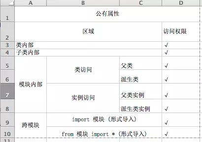
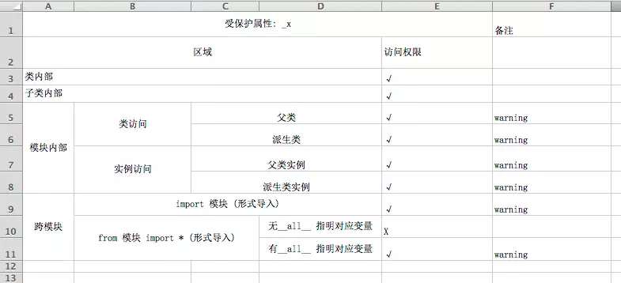
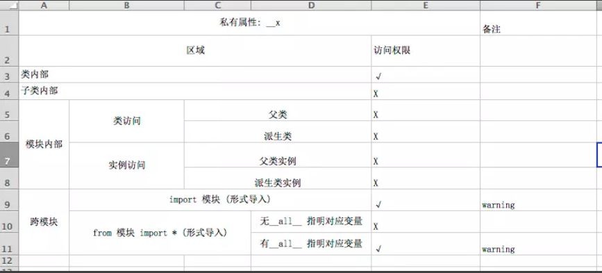

# 18-面向对象（属性限制-公有私有）

## 1 公有属性访问权限



### 1.1 类、子类、模块内部测试

```python
class Animal:
    x = 10
    def test(self):
        print(Animal.x)
        print(self.x)
    pass


class Dog(Animal):
    def test2(self):
        print(Dog.x)
        print(self.x)
    pass


# 测试在类的内部访问
a = Animal()
a.test()

# 测试在子类内部访问
d = Dog()
d.test2()

# 测试在模块内访问 - 类访问：通过父类(Animal) 或 派生类访问(Dog)
print(Animal.x)
print(Dog.x)

# 测试在模块内访问 - 实例访问：通过父类(a) 或 派生类访问(d)
print(a.x)
print(d.x)
```

### 1.2 跨模块测试

 通过公有变量测试，而公有变量与公有属性的区别是是否有数组

```python
# 文件1.py 代码
a = 666

# 文件2.py 代码
import 1  # 通过这样的导入方式，需要使用 模块名.xx 来访问
print(1.a) # 666

或者

from 1 import *
pirnt(a) # 666
```

## 2 受保护属性访问权限



### 2.1 类、子类、模块内部测试

```python
class Animal:
    _x = 10
    def test(self):
        print(Animal._x)
        print(self._x)
    pass


class Dog(Animal):
    def test2(self):
        print(Dog._x)
        print(self._x)
    pass


# 测试在类的内部访问
a = Animal()
a.test()

# 测试在子类内部访问
d = Dog()
d.test2()

# 测试在模块内访问 - 类访问：通过父类(Animal) 或 派生类访问(Dog)
print(Animal._x)
print(Dog._x)

# 测试在模块内访问 - 实例访问：通过父类(a) 或 派生类访问(d)
print(a._x)
print(d._x)
```

### 2.2 跨模块测试

 通过公有变量测试，而公有变量与公有属性的区别是是否有数组

```python
# 文件1.py 代码
_a = 666

# 文件2.py 代码
import 1  # 通过这样的导入方式，需要使用 模块名.xx 来访问
print(1._a) # 666

或者

from 1 import *
pirnt(_a) # error
```

- 注意，如果_a 被 __all__修饰的话，则通过 `from 模块名 import *`方式导入也是可以访问的。

  ```python
  # 文件1 中 模块内其他位置
  __all__ = ["_a"]
  _a = 666
  
  
  # 文件2 模块内访问
  from 1 import *
  pirnt(_a) # 666
  ```

## 3 私有属性



### 3.1 类、子类、模块内部测试

```python
class Animal:
   __x = 10
    def test(self):
        print(Animal.__x)
        print(self.__x)
    pass


class Dog(Animal):
    def test2(self):
        print(Dog.__x)
        print(self.__x)
    pass


# 测试在类的内部访问
a = Animal()
a.test()

# 测试在子类内部访问
d = Dog()
d.test2()

# 测试在模块内访问 - 类访问：通过父类(Animal) 或 派生类访问(Dog)
print(Animal.__x)
print(Dog.__x)

# 测试在模块内访问 - 实例访问：通过父类(a) 或 派生类访问(d)
print(a.__x)
print(d.__x)
```

### 3.2 跨模块测试

通过公有变量测试，而公有变量与公有属性的区别是是否有数组

```python
# 文件1.py 代码
__a = 666

# 文件2.py 代码
import 1  # 通过这样的导入方式，需要使用 模块名.xx 来访问
print(1.__a) # 666

或者

from 1 import *
pirnt(__a) # error
```

- 注意，如果__a 被 __all__修饰的话，则通过 `from 模块名 import *`方式导入也是可以访问的

  ```python
  # 文件1 中 模块内其他位置
  __all__ = ["__a"]
  __a = 666
  
  
  # 文件2 模块内访问
  from 1 import *
  pirnt(__a) # 666
  ```

### 3.3 私有属性的实现机制

  - 实际是通过：名字重整(Name Mangling)，即重改 __x 为另外一个名称, 如_类名__x
    
```python
    # 可通过__dict__类属性查看
    print(Animal.__dict__)
```

- 使用私有属性目的：

  1. 防止外界直接访问
  2. 防止被子类同名称属性覆盖

## 4 私有属性的应用场景

- 通过实例方法对私有实例属性 age进行访问，同时对传入的数据进行数据过滤

  ```python
  class Person:
      def __init__(self):
          self.__age = 18
  
      def setAge(self, value):
          if isinstance(value, int) and 0 < value < 200:
              self.__age = value
          else:
              print("你输入的数据有问题, 请重新输入")
  
      def getAge(self):
          return self.__age # 这里能够通过__age访问是因为在类的内部
  
  p1 = Person()
  print(p1.getAge()) # 18
  
  p1.setAge(10)
  print(p1.getAge()) # 10
  ```