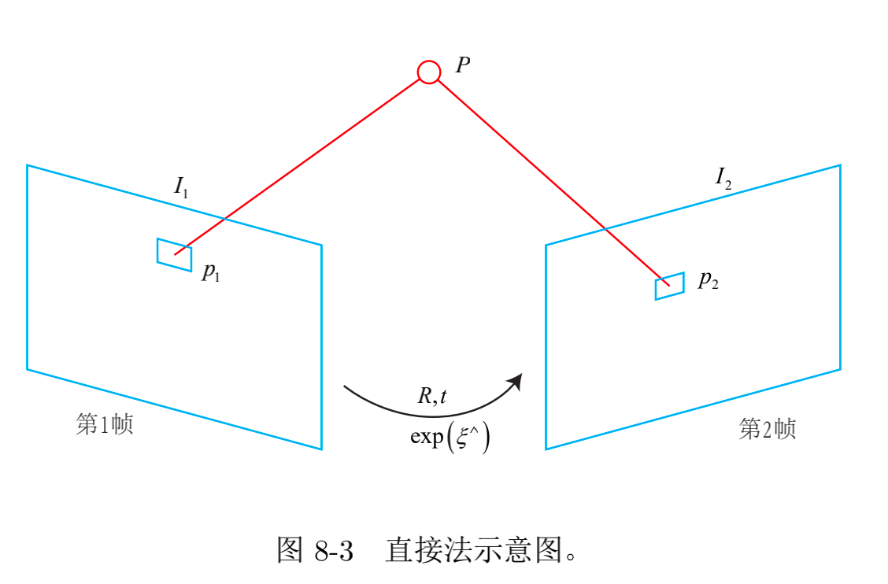

## Chapter 7 视觉里程计

### 7.1 特征点法

#### 7.1.1 ORB 特征

ORB 特征：

- Oriented FAST（关键点）：FAST 关键点
- BRIEF（描述子：Binary Robust Independent Elementary Features）

提取 ORB 特征分为两个步骤:

1. FAST 角点提取：找出图像中的” 角点”。相较于原版的 FAST, ORB 中计算了特征
点的主方向，为后续的 BRIEF 描述子增加了旋转不变特性
2. BRIEF 描述子：对前一步提取出特征点的周围图像区域进行描述
3. 

### 7.5 三角测量

在单目 SLAM 中，仅通过单张图像无法获得像素的深度信息，我们需要通过三角测量（Triangulation）（或三角化）的方法来估计地图点的深度。

三角测量是指，通过在两处观察同一个点的夹角，确定该点的距离。

### 7.7 3D-2D: PnP

求解 3D 到 2D 点对运动的方法。已经3D点的空间位置和相机上的投影点，求相机的旋转和平移（外参）

PnP 求解:

- 三对点估计位姿的 P3P
- 直接线性变换（DLT）
  - 最少通过六对匹配点，即可实现矩阵 T 的线性求解, 当匹配点大于六对时，（又）
    可以使用 SVD 等方法对超定方程求最小二乘解
- EPnP（Efficie ntP）
- UPnP
- 非线性优化的方式，构建最小二乘问题并迭代求解(Bundle Adjustment)

### 7.9 3D-3D: ICP

ICP 求解：

- 线性代数的求解（主要是 SVD）
- 非线性优化方式的求解（类似于 Bundle Adjustment）

## Chapter 8 光流法与直接法

### 8.1 直接法的引出

特征点估计相机运动缺点：

1. 关键点的提取与描述子的计算非常耗时（SIFT 目前在 CPU 上是无法实时计算，而 ORB 需要近 20 毫秒）
2. 使用特征点丢弃了大部分可能有用的图像信息
3. 相机有时会运动到特征缺失的地方，往往这些地方没有明显的纹理信息。例如，有时我们会面对一堵白墙，或者一个空荡荡的走廓。这些场景下特征点数量会明显减少，可能找不到足够的匹配点来计算相机运动

**解决思路：**

- 光流法（Optical Flow）：保留特征点，但只计算关键点，不计算描述子
- 只计算关键点，不计算描述子。同时，使用直接法（Direct Method）来计算特征点在下一时刻图像的位置。这同样可以跳过描述子的计算过程，而且直接法的计算更加简单
- 既不计算关键点、也不计算描述子，而是根据像素灰度的差异，直接计算相机运动。

### 8.4 直接法（Direct Methods）

光流法仅估计了像素间的平移

- 没有用到相机本身的几何结构
- 没有考虑相机的旋转和图像的缩放
- 对于边界上的点，光流不好追踪
- 直接法则考虑了这些信息

#### 8.4.1 直接法的推导

直接法的思路是根据当前相机的位姿估计值，来寻找 **p**2 的位置
