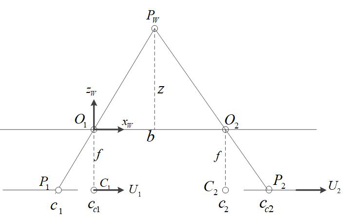
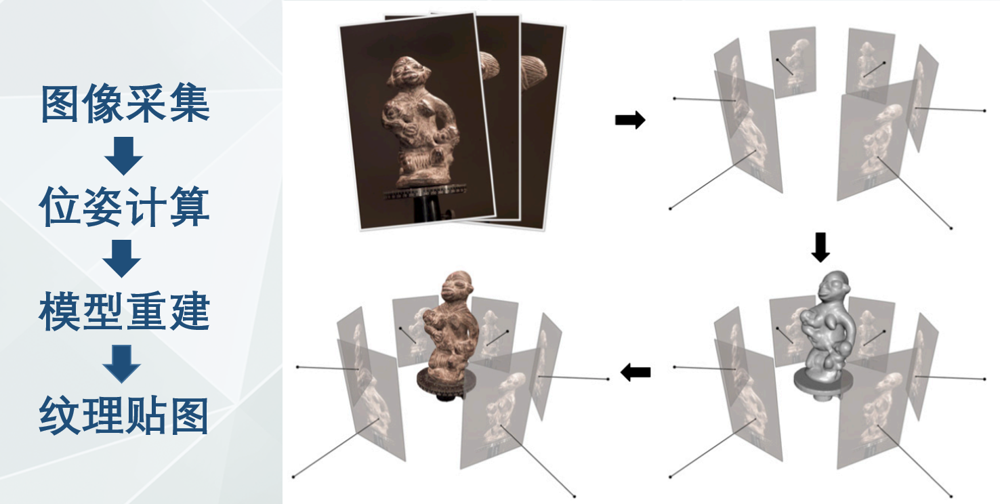

# 视觉几何三维重建

## 1 三维重建与OpenMVS简介

### 1.1  **什么是三维重建**

#### 1.1.1 定义

- 3D Reconstruction：涉及技术：多视图立体几何、深度图估计、点云处理、网格重建和优化、纹理贴图、马尔科夫随机场、图割等

- 三维重建是计算机辅助几何设计(CAGD)、计算机图形学(CG)、计算机动画、计算机视觉、医学图像处理、科学计算和增强现实（AR）、混合现实（MR）、机器人导航、自动驾驶等领域的共性科学问题和核心技术

#### 1.1.2 分类

主动式测量和被动式测量

- **被动式**

  被动式一般利用周围环境如自然光的反射，使用相机获取图像，然后通过特定算法计算得到物体的立体空间信息。主要有SFS(Shape From Shading，从阴影恢复形状)和立体视觉方法等。

  - SFS

    - 图像的阴影边界包含了图像的轮廓特征信息，因此能够利用不同光照条件下的图像的明暗程度与阴影来计算物体表面的深度信息，并以反射光照模型进行三维重建。阴影恢复形状法的应用范围比较广泛，可以恢复除镜面外的各种物体的三维模型。缺点体现在过程多为数学计算、重建结果不够精细，另外不能忽视的是，SFS法需要准确的光源参数，包括位置与方向信息。这就导致其无法应用于诸如露天场景等具有复杂光线的情形中

  - 立体视觉

    - 主要是分为双目立体视觉（Binocular Stereo Vision）和多视立体视觉（Multi-View Stereo，MVS）前者可以看作是后者的特例

      - 双目立体视觉：利用成像设备从不同的位置获取被测物体的两幅图像，对它们进行立体校正，然后基于视差原理，通过计算图像对应点间的位置偏差，来获取物体三维几何信息的方法。双目立体视觉融合两只眼睛获得的图像并观察它们之间的差别，使我们可以获得明显的深度感，建立特征间的对应关系，将同一空间物理点在不同图像中的映像点对应起来，这个差别，我们称作视差(Disparity)图像。

        

      - **多视立体视觉（****Multi-View Stereo****，****MVS****）**：从一系列图像中重建3D模型即基于RGB的建模（刚体重建），mvs算法可以仅根据图像重建出精细的三维模型。它能取一组可能非常大的图像，然后构造一个准确的3D几何模型，主要是基于一些合理的假设比如场景的刚性。

        

- 
- **主动式**
  - 激光三角法
  - 

### 1.2 基于**MVS**（**Multi-View Stereo）**重建简介

### **2.8** **立体匹配**

通过寻找匹配点，利用三角测量或对极约束得到其在空间中的3D信息。立体匹配算法主要分为全局、局部、半全局。

#### **2.8.1** **全局立体匹配算法**

原理：采用了全局的优化理论方法估计视差，建立全局能量函数，通过最小化全局能量函数得到最优视差值

通过二维相邻像素视差之间的约束（如平滑性约束）而得到更好的匹配效果，但是对内存的占用量大，速度慢不适合实时运行。主要的算法有图割（graph cuts）、信念传播（belief propagation）、动态规划等算法

#### **2.8.2** **局部立体匹配算法**

原理：采用局部优化方法进行视差值估计，局部立体匹配算法有 SAD，SSD 等算法，与全局立体匹配算法一样，也是通过能量最小化方法进行视差估计，但是在能量函数中，只有数据项，而没有平滑项。

该算法由于每个像素计算互不干扰可以并行计算，所以可以实时。但由于所基于的局部窗口视差相同的假设在很多情况下并不成立导致匹配效果较差。

#### **2.8.3** **半全局立体匹配算法SGM**

综合上述局部和全局算法的优缺点，半全局算法依旧采用全局框架，但是在计算能量函数最小化的步骤时使用高效率的一维路径聚合方法来代替全局算法中的二维最小化算法，使用一维最优来近似二维最优，得到的视差图在效果上和全局算法没有太大的差别，但是算法效率却有非常大的提升。

## **3.** **稠密重建**

稠密重建即深度图重建或深度估计（depth estimate）

在传统算法中比较经典实用的两个算法是PlanSweeping和PatchMatch两种算法。在平面Sweeping算法中用的比较多的是SGM算法。

## **6.** **纹理贴图**

### **6.1** **原理介绍**

#### **6.1.1** **基础知识**

- 彩色纹理网格模型
  - 分两类，一类是彩色顶点网格，一类是彩色贴图网格
    - 彩色顶点网格：网格顶点带有颜色，三角形的颜色由网格顶点颜色插值得到。网格的色彩分辨率等于顶点分辨率
    - 彩色贴图网格：网格的三角形的颜色对应于图像的一个三角片。网格的色彩分辨率等于图像的色彩分辨率

- 纹理贴图是彩色贴图网格的生成技术，指将2D 图像映射到3D几何模型上，形成物体的色彩信息

- 纹理贴图关键技术
  - 一是给每个三角面选择合适的视图;
  - 二是由于不同视角下图像的亮暗程度不一样且位姿可能有偏差导致网格的纹理贴图在不同图片之间，也还会有一些色差，因此需要做颜色融合，消除这些色差。

#### **6.1.2 Face View**的选择

## 7. 三维重建拓展1-基于RGBD重建 

### 7.1 RGBD的获取 

- 深度相机主要分为结构光和ToF:主流ToF相机
  - Kinect v1:结构光方案
  - Kinect v2:ToF方案

### 7.2 经典开源框架 

- 最经典的RGB-D重建算法即为帝国理工的Newcombe等人在2011年提出的KinectFusion 
- 后续有Kintinuous，ElasticFusion，ElasticReconstruction，DynamicFusion，InfiniTAM，BundleFusion等

- review:State of the Art on 3D Reconstruction with RGB‐D Cameras 
- KinectFusion: Real-time dense surface mapping and tracking
- BundleFusion

#### 7.2.1 KinectFusion 

