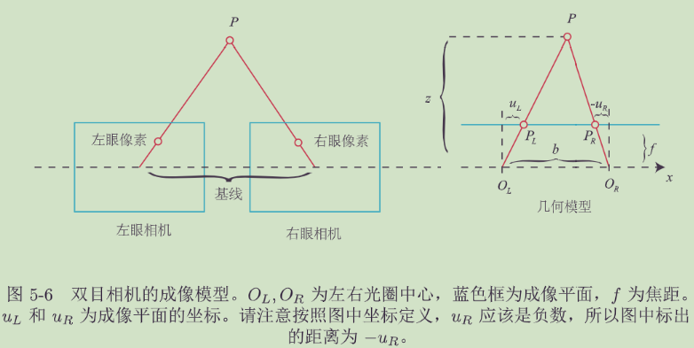

# 2 初识SLAM

经典视觉SLAM框架

视觉SLAM流程包括以下步骤:

1.  **传感器信息读取**: 在视觉SLAM中主要为相机图像信息的读取和预处理.如果是在机器人中,还可能有码盘、惯性传感器等信息的读取和同步.
    
2.  **视觉里程计**(Visual Odometry,VO): 视觉里程计的任务是估算相邻图像间相机的运动,以及局部地图的样子.VO又称为前端(Front End).
    
    视觉里程计不可避免地会出现**累积漂移**(Accumulating Drift)问题.
    
3.  **后端优化** (Optimization): 后端接受不同时刻视觉里程计测量的相机位姿,以及回环检测的信息,对它们进行优化,得到全局一致的轨迹和地图.由于接在VO之后,又称为后端(Back End).
    
    在视觉 SLAM中,前端和计算机视觉研究领域更为相关,比如图像的特征提取与匹配等,后端则主要是滤波与非线性优化算法.
    
4.  **回环检测** (Loop Closing): 回环检测判断机器人是否到达过先前的位置.如果检测到回环,它会把信息提供给后端进行处理.
    
5.  **建图** (Mapping): 它根据估计的轨迹,建立与任务要求对应的地图.
    
    地图的形式包括**度量地图**(精确表示地图物体的位置关系)与**拓扑地图**(更强调地图元素之间的关  
    系)两种.

## SLAM问题的数学表述

“小萝卜携带着传感器在环境中运动”,由如下两件事情描述:

1.  什么是**运动** ?我们要考虑从 k − 1 k-1 k−1时刻到 k k k时刻,小萝卜的位置 x x x是如何变化的.
    
    运动方程:
    
    x k = f ( x k − 1 , u k , w k ) x\_k = f(x\_{k-1}, u\_k, w\_k) xk\=f(xk−1,uk,wk)
    
    -   x k , x k − 1 x\_k, x\_{k-1} xk,xk−1表示小萝卜在 k k k和 k − 1 k-1 k−1时刻的位置
    -   u k u\_k uk表示运动传感器的读数(有时也叫**输入**)
    -   w k w\_k wk表示噪声
2.  什么是**观测** ?假设小萝卜在 k k k时刻于 x k x\_k xk处探测到了某一个路标 y j y\_j yj,我们要考虑这件事情是如何用数学语言来描述的.
    
    观测方程:
    
    z k , j = h ( y j , x k , v k , j ) z\_{k,j} = h(y\_j, x\_k, v\_{k,j}) zk,j\=h(yj,xk,vk,j)
    
    -   z k , j z\_{k,j} zk,j表示小萝卜在 x k x\_k xk位置上看到路标点 y j y\_j yj,产生的观测数据
    -   y j y\_j yj表示第 j j j个路标点
    -   v k , j v\_{k,j} vk,j表示噪声

这两个方程描述了最基本的SLAM问题:当知道运动测量的读数 u u u ,以及传感器的读数 z z z 时,如何求解定位问题(估计 x x x )和建图问题(估计 y y y)?这时,我们就把SLAM问题建模成了一个**状态估计问题**:如何通过带有噪声的测量数据,估计内部的、隐藏着的状态变量?

# 3 三维空间刚体运动

## 3.1 旋转矩阵

### 3.1.1 点和向量,坐标系

1.  向量 a a a在线性空间的基$[e_1,e_2,e_3]$下的坐标为 $[a1,a2,a3]^T$.
    
    $$
    a=[e_1,e_2,e_3]=a_1e_1+a_2e_2+a_3e_3
    $$
    
2.  向量的内积与外积
    
    -   向量的内积: 描述向量间的投影关系  
        $$
        a\cdot b=a^Tb=\sum_{i=1}^{3} a_ib_i=|a||b|cos<a,b>
        $$
        
    -   向量的外积: 描述向量的旋转  
        $$
        a \times b =  
        \begin{vmatrix}  
          \mathbf{i}& \mathbf{j}& \mathbf{k} \\  
          a_1& a_2& a_3 \\  
          b_1& b_2& b_3 \\  
        \end{vmatrix} =\begin{bmatrix}
         a_2b_3-a_3b_2\\a_3b_1-a_1b_3
         \\a_1b_2-a_2b_1
        \end{bmatrix}=\begin{bmatrix}
          0& -a_3 &a_2 \\
          a_3& 0 & -a_1\\
          -a_2&  a_1&0
        \end{bmatrix}b≜a^∧b
        $$
        其中$a^∧$ 表示 a的反对称矩阵
        $$
        a^∧=\begin{bmatrix}
          0& -a_3 &a_2 \\
          a_3& 0 & -a_1\\
          -a_2&  a_1&0
        \end{bmatrix}
        $$
        

### 3.1.2 坐标系间的欧氏变换

1.  欧式变换:
    
    在欧式变换前后的两个坐标系下，同一个向量的模长和方向不发生改变,是为欧式变换。一个欧式变换由一个旋转和一个平移组成。
    
2.  旋转矩阵 R:
    
    -   旋转矩阵 R的推导:
        
        设单位正交基$[e1,e2,e3]$经过一次旋转变成了$[e'_1,e'_2,e'_3]$对于同一个向量 a,在两个坐标系下的坐标分别为 $ [a_1, a_2, a_3]^T$ 和$[a'_1, a'_2, a'_3]^T$根据坐标的定义:  
        $$
        {\color{Red}[e_1,e_2,e_3]\begin{bmatrix}
         a_1\\
         a_2\\a_3
        
        \end{bmatrix}=[e'_1,e'_2,e'_3]\begin{bmatrix}
        a'_1\\
        a'_2\\a'_3
        
        \end{bmatrix}}
        $$
        等式左右两边同时左乘 $[e_1^T, e_2^T, e_3^T]^T$,得到  
        $$
        {\color{Red} \begin{bmatrix}
         a_1\\a_2
         \\a_3
        
        \end{bmatrix} =\begin{bmatrix}
          e_1^Te'_1& e_1^Te'_2 &e_1^Te'_3 \\
          e_2^Te'_1& e_2^Te'_2 &e_2^Te'_3 \\
          e_3^Te'_1&e_3^Te'_2  &e_3^Te'_3
        \end{bmatrix}\begin{bmatrix}
         a'_1\\a'_2
         \\a'_3
        
        \end{bmatrix}≜Ra'}
        $$
        矩阵 R描述了旋转,称为**旋转矩阵**
        
    -   旋转矩阵R的性质
        
        -   旋转矩阵是**行列式为1的正交矩阵**,任何行列式为1的正交矩阵也是一个旋转矩阵.所有旋转矩阵构成特殊正交群SO:
        
        $$
        {\color{Red} SO(n)=\{R\in\mathbb{R}^{n\times n}|RR^T=I,det(R)=1\}}
        $$
        
        - 旋转矩阵是正交矩阵(其转置等于其逆),旋转矩阵的逆$R^{-1}$(即转置$R^T$)描述了一个相反的旋转.
    
3.  欧式变换的向量表示:
    
    世界坐标系中的向量 a,经过一次旋转(用旋转矩阵R描述)和一次平移(用平移向量t描述)后,得到了 a ′ 
    $$
    {\color{Red}a'=Ra+t}
    $$

### 3.1.3 变换矩阵与齐次坐标

1.  变换矩阵T:
    
    在三维向量的末尾添加1,构成的四维向量称为**齐次坐标**.将旋转和平移写入**变换矩阵**T中,得到:
    $$
    {\color{Red} \begin{bmatrix}
     a'\\1
    
    \end{bmatrix}=\begin{bmatrix}
      R&t \\
      0^T&1
    \end{bmatrix}\begin{bmatrix}
     a\\1
    
    \end{bmatrix}≜T\begin{bmatrix}
     a\\1
    
    \end{bmatrix}}
    $$
    
    齐次坐标的意义在于**将欧式变换表示为线性关系**.
    
2.  变换矩阵T的性质:
    
    1.  变换矩阵T构成特殊欧式群SE  
        $$
        SE(3)=\left \{ T=\begin{bmatrix}
          R&t \\
          0&1
        \end{bmatrix}\in \mathbb{R}^{4\times 4}|R\in SO(3),t\in \mathbb{R}^3\right \} 
        $$
        
    2.  变换矩阵的逆表示一个反向的欧式变换  
        $$
        T^{-1}=\begin{bmatrix}
          R^T&-R^Tt \\
          0&1
        \end{bmatrix}
        $$
        
        

#### 3.1.3.1 齐次坐标优势

齐次坐标(Homogeneous Coordinate)

- ==优势1:方便判断是否在直线或平面上==

若点 p = ( x , y ) p=(x,y) p\=(x,y)在直线 l = ( a , b , c ) l=(a,b,c) l\=(a,b,c)上,则有:  
a x + b y + c = \[ a , b , c \] T ⋅ \[ x , y , 1 \] = l T ⋅ p ′ = 0 ax+by+c = \[a,b,c\]^T \\cdot \[x,y,1\] = l^T \\cdot p' = 0 ax+by+c\=\[a,b,c\]T⋅\[x,y,1\]\=lT⋅p′\=0

若点 p = ( x , y , z ) p=(x,y,z) p\=(x,y,z)在平面 A = ( a , b , c , d ) A=(a,b,c,d) A\=(a,b,c,d)上,则有:  
a x + b y + c z + d = \[ a , b , c , d \] T ⋅ \[ x , y , z , 1 \] = A T ⋅ p ′ = 0 ax+by+cz+d = \[a,b,c,d\]^T \\cdot \[x,y,z,1\] = A^T \\cdot p' = 0 ax+by+cz+d\=\[a,b,c,d\]T⋅\[x,y,z,1\]\=AT⋅p′\=0

- ==优势2:方便表示线线交点和点点共线==

在齐次坐标下,

1.  可以用两个点p,q的齐次坐标叉乘结果表示它们的共线l
2.  可以用两条直线l,m的齐次坐标叉乘结果表示它们的交点x

这里利用叉乘的性质: 叉乘结果与两个运算向量都垂直:

-   性质1的证明:  
    $$
    l^T\cdot p=(p\times q)\cdot p=0
    $$
    
    $$
    l^T\cdot q=(p\times q)\cdot q=0
    $$
    
    
    
-   性质2的证明:  
    $$
    l^T\cdot p=l^T\cdot (l\times m)=0
    $$
    
    $$
    m^T\cdot p=m^T\cdot (l\times m)=0
    $$
    
    
    

- ==优势3:能够区分向量和点==

  -   点$ (x,y,z)$的齐次坐标为 $(x,y,z,1)$

  -   向量$(x,y,z)$的齐次坐标为$(x,y,z,0)$

- ==优势4:能够表达无穷远点==

对于平行直线 l = ( a , b , c ) l=(a,b,c) l\=(a,b,c)和 m = ( a , b , d ) m=(a,b,d) m\=(a,b,d),求取其交点的齐次坐标 x = l × m = ( k b , − k a , 0 ) x=l \\times m=(kb, -ka, 0) x\=l×m\=(kb,−ka,0),将其转为非齐次坐标,得到 x = ( k b / 0 , − k a / 0 ) = ( inf ⁡ , − inf ⁡ ) x = (kb/0, -ka/0) = (\\inf, -\\inf) x\=(kb/0,−ka/0)\=(inf,−inf),这表示无穷远点.

- ==优势5:能够简洁的表示变换==

使用齐次坐标,可以将加法运算转化为乘法运算.

## 3.2 旋转向量和欧拉角

### 3.2.1 旋转向量

-   旋转矩阵的缺点:
    
    1.  旋转矩阵有9个量,但一次旋转只有3个自由度,这种表达方式是冗余的.
    2.  旋转矩阵自带约束(必须是行列式为1的正交矩阵),这些约束会给估计和优化带来困难.
-   旋转向量: 任意旋转都可以用一个**旋转轴**和一个**旋转角** 来刻画.于是,我们可以使用一个向量,其**方向表示旋转轴**而**长度表示旋转角**.这种向量称为**旋转向量**(或**轴角**,Axis-Angle).
    
    假设有一个旋转轴为n,角度为θ的旋转,其对应的旋转向量为θn.
    
-   旋转向量和旋转矩阵之间的转换:
    
    设旋转向量R表示一个绕单位向量n,角度为θ的旋转.
    
    -   旋转向量到旋转矩阵:  
        $$
        R=\cos \theta I +(1-\cos \theta )nn^T+\sin \theta n^\wedge
        $$
        
    -   旋转矩阵到旋转向量:
        
        -   旋转角$\theta =\arccos (\frac{tr(R)-1}{2})$
        -   旋转轴n是矩阵R特征值1对应的特征向量

### 3.2.2 欧拉角

-   欧拉角将一次旋转分解成**3个分离的转角**.常用的一种ZYX转角将任意旋转分解成以下3个轴上的转角:
    
    1.  绕物体的Z轴旋转,得到偏航角yaw
    2.  绕**旋转之后**的Y轴旋转,得到俯仰角pitch
    3.  绕**旋转之后**的X轴旋转,得到滚转角roll
-   欧拉角的一个重大缺点是**万向锁问题**(**奇异性问题**): 在俯仰角为$\pm$90° 时,第一次旋转与第三次旋转将使用同一个轴,使得系统丢失了一个自由度(由3次旋转变成了2次旋转).
    

## 3.3 四元数

为什么需要四元数: 对于三维旋转,找不到**不带奇异性的三维向量描述方式**，因此引入四元数
四元数是一种**扩展的复数**,**既是紧凑的,也没有奇异性**

### 四元数的定义

1.  四元数的定义
    
    一个四元数 q q q拥有一个实部和三个虚部  
    q = q 0 + q 1 i + q 2 j + q 3 k q = q\_0 + q\_1 i + q\_2 j + q\_3 k q\=q0+q1i+q2j+q3k
    
    其中 i i i, j j j, k k k,为四元数的3个虚部,它们满足以下关系式(**自己和自己的运算像复数,自己和别人的运算像叉乘**):  
    { i 2 = j 2 = k 2 = − 1 i j = k , j i = − k j k = i , k j = − i k i = j , i k = − j \\left\\{
    
    i2\=j2\=k2\=−1ij\=k,ji\=−kjk\=i,kj\=−iki\=j,ik\=−j
    
    \\right. ⎩⎪⎪⎪⎪⎨⎪⎪⎪⎪⎧i2\=j2\=k2\=−1ij\=k,ji\=−kjk\=i,kj\=−iki\=j,ik\=−j
    
    也可以用一个标量和一个向量来表达四元数:  
    q = \[ s , v \] , s = q 0 ∈ R v = \[ q 1 , q 2 , q 3 \] T ∈ R 3 q = \[s, v\], \\quad s=q\_0\\in\\mathbb{R} \\quad v=\[q\_1, q\_2, q\_3\]^T \\in \\mathbb{R}^3 q\=\[s,v\],s\=q0∈Rv\=\[q1,q2,q3\]T∈R3
    
    s s s为四元数的实部, v v v为四元数的虚部.有**实四元数**和**虚四元数**的概念.
    
2.  四元数与旋转角度的关系:
    
    -   在二维情况下,任意一个旋转都可以用**单位**复数来描述,乘 i i i就是绕 i i i轴旋转90°.
    -   在三维情况下,任意一个旋转都可以用**单位**四元数来描述,乘 i i i就是绕 i i i轴旋转180°.
3.  单位四元数和旋转向量之间的转换:
    
    设单位四元数 q q q表示一个绕单位向量 n = \[ n x , n y , n z \] T n =\[n\_x,n\_y,n\_z\]^T n\=\[nx,ny,nz\]T,角度为 θ θ θ的旋转.
    
    -   从旋转向量到单位四元数:
    
    q = \[ cos ⁡ ( θ 2 ) , n sin ⁡ ( θ 2 ) \] T = \[ cos ⁡ ( θ 2 ) , n x sin ⁡ ( θ 2 ) , n y sin ⁡ ( θ 2 ) , n z sin ⁡ ( θ 2 ) \] T q = \\left\[ \\cos(\\frac{\\theta}{2}), n\\sin(\\frac{\\theta}{2}) \\right\]^T= \\left\[ \\cos(\\frac{\\theta}{2}), n\_x\\sin(\\frac{\\theta}{2}), n\_y\\sin(\\frac{\\theta}{2}), n\_z\\sin(\\frac{\\theta}{2}) \\right\]^T q\=\[cos(2θ),nsin(2θ)\]T\=\[cos(2θ),nxsin(2θ),nysin(2θ),nzsin(2θ)\]T
    
    -   从单位四元数到旋转向量:  
        { θ = 2 arccos ⁡ q 0 \[ n x , n y , n z \] = \[ q 1 , q 2 , q 3 \] T / sin ⁡ θ 2 \\left\\{
        
        θ\=2arccos⁡q0\[nx,ny,nz\]\=\[q1,q2,q3\]T/sin⁡θ2
        
        \\right. ⎩⎨⎧θ\=2arccosq0\[nx,ny,nz\]\=\[q1,q2,q3\]T/sin2θ

### 用单位四元数表示旋转

给定一个空间三维点 p = \[ x , y , z \] ∈ R 3 p=\[x,y,z \]\\in \\R^3 p\=\[x,y,z\]∈R3,以及一个由轴角 n n n, θ θ θ指定的旋转,三维点 p p p经过旋转后变为 p ′ p′ p′.如何使用单位四元数 q q q表达旋转?

1.  把三维空间点用一个虚四元数 p p p表示:  
    p = \[ 0 , x , y , z \] = \[ 0 , v \] p = \[0, x, y, z\] = \[0, v\] p\=\[0,x,y,z\]\=\[0,v\]
    
2.  把旋转用单位四元数 q q q表示:  
    q = \[ cos ⁡ θ 2 , n sin ⁡ θ 2 \] q = \[\\cos{\\frac{\\theta}{2}}, n\\sin{\\frac{\\theta}{2}} \] q\=\[cos2θ,nsin2θ\]
    
3.  旋转后的点 p ′ p' p′可表示为:  
    p ′ = q p q − 1 p' = qpq^{-1} p′\=qpq−1
    

这样得到的点 p ′ p' p′仍为一个纯虚四元数,其虚部的3个分量表示旋转后3D点的坐标.

> 只有**单位**四元数才能表示旋转,因此在程序中创建四元数后,要记得调用`normalize()`以将其单位化

## 4 李群与李代数基础

旋转矩阵构成特殊正交群$SO(3)$,变换矩阵构成了特殊欧氏群$SE(3)$ 
$$
SO(3)=\left \{ R∈R^{3×3}|RR^T=I,det(R)=1\right \}
$$

$$
SE(3)=\left \{ T=\begin{bmatrix}
 R&t \\
  0^T&1
\end{bmatrix}\in \mathbb{R}^{4\times 4}|R\in SO(3),t\in \mathbb{R}^3\right \}
$$

### 4.1 李群李代数基础

#### 4.1.1 群

-   群(Group)是**一种集合**加上**一种运算**的代数结构.把集合记作$A$,运算记作 $\cdot$那么群可以记作 G = ( A , ⋅ ) G =(A,\\cdot) G\=(A,⋅).群要求这个运算满足如下条件(**封结幺逆**):
    
    1.  封闭性:$\forall a_1,a_2\in A,a_1\cdot a_2\in A$
    2.  结合律: $\forall a_1,a_2,a_3\in A,(a_1\cdot a_2)\cdot a_3=a_1\cdot (a_2\cdot a_3)$
    3.  幺元: $\exists a_0\in A,s.t.\forall a\in A,a_0\cdot a=a\cdot a_0=a$
    4.  逆: $\forall a\in A，\exists a^{-1}\in A,s.t.a\cdot a^{-1}=a_0$
-   **李群**是指具有连续(光滑)性质的群. $SO(3)$和$SE(3)$都是李群

### 李代数的定义

每个李群都有与之对应的李代数,李代数描述了李群的局部性质.

通用的李代数的定义如下:  
李代数由一个集合 V V V,一个数域 F F F和一个二元运算 \[ , \] \[, \] \[,\]组成.如果它们满足以下几条性质,则称 ( V , F , \[ , \] ) (V, F, \[, \]) (V,F,\[,\])为一个李代数,记作 g \\mathfrak{g} g.

1.  封闭性: ∀ X , Y ∈ V , \[ X , Y \] ∈ V \\forall{X, Y} \\in V, \[X,Y\] \\in V ∀X,Y∈V,\[X,Y\]∈V.
    
2.  双线性: $\\forall X,Y,Z \\in V, a,b \\in F $有:  
    \[ a X + b Y , Z \] = a \[ X , Z \] + b \[ Y , Z \] , \[ Z , a X + b Y \] = a \[ Z , X \] + b \[ Z , Y \] \[aX+bY,Z\]=a\[X,Z\]+b\[Y,Z\], \\quad \[Z, aX+bY\]=a\[Z,X\]+b\[Z,Y\] \[aX+bY,Z\]\=a\[X,Z\]+b\[Y,Z\],\[Z,aX+bY\]\=a\[Z,X\]+b\[Z,Y\]
    
3.  自反性: ∀ X , ∈ V , \[ X , X \] = 0 \\forall{X,} \\in V, \[X,X\]=0 ∀X,∈V,\[X,X\]\=0.
    
4.  雅可比等价 ∀ X , Y , Z ∈ V , \[ X , \[ Y , Z \] \] + \[ Z , \[ X , Y \] \] + \[ Y , \[ Z , X \] \] = 0 \\forall X,Y,Z \\in V, \\quad \[X, \[Y,Z \]\]+\[Z, \[X,Y \]\]+\[Y, \[Z,X \]\]=0 ∀X,Y,Z∈V,\[X,\[Y,Z\]\]+\[Z,\[X,Y\]\]+\[Y,\[Z,X\]\]\=0.
    

其中的二元运算 \[ , \] \[,\] \[,\]被称为**李括号**.例如三维向量空间 R 3 \\mathbb{R^3} R3上定义的叉积 × \\times ×是一种李括号.

### 李代数 s o ( 3 ) \\mathfrak{so}(3) so(3)

-   李群 S O ( 3 ) SO(3) SO(3)对应的李代数 s o ( 3 ) \\mathfrak{so}(3) so(3)是定义在 R 3 \\mathbb{R^3} R3上的向量,记作 ϕ \\phi ϕ.
    
    s o ( 3 ) = { ϕ ∈ R 3 , Φ = ϕ ∧ = \[ 0 − ϕ 3 ϕ 2 ϕ 3 0 − ϕ 1 − ϕ 2 ϕ 1 0 \] ∈ R 3 × 3 } \\mathfrak{so}(3) = \\left\\{ \\phi \\in \\mathbb{R^3}, \\Phi=\\phi^\\wedge = \\left\[
    
    0−ϕ3ϕ2ϕ30−ϕ1−ϕ2ϕ10
    
    \\right\] \\in \\mathbb{R^{3 \\times 3}} \\right\\} so(3)\=⎩⎨⎧ϕ∈R3,Φ\=ϕ∧\=⎣⎡0ϕ3−ϕ2−ϕ30ϕ1ϕ2−ϕ10⎦⎤∈R3×3⎭⎬⎫
-   李代数 s o ( 3 ) \\mathfrak{so}(3) so(3)的李括号为  
    \[ ϕ 1 , ϕ 2 \] = ( Φ 1 Φ 2 − Φ 2 Φ 1 ) ∨ \[\\phi\_1, \\phi\_2\] = (\\Phi\_1 \\Phi\_2 - \\Phi\_2 \\Phi\_1) ^\\vee \[ϕ1,ϕ2\]\=(Φ1Φ2−Φ2Φ1)∨  
    其中 ∨ ^\\vee ∨是 ∧ ^\\wedge ∧的逆运算,表示将反对称矩阵还原为向量
    
-   s o ( 3 ) \\mathfrak{so}(3) so(3)和 S O ( 3 ) SO(3) SO(3)间的映射关系为
    
    李 群 R = exp ⁡ ( ϕ ∧ ) = exp ⁡ ( Φ ) 李 代 数 ϕ = ln ⁡ ( R ) ∨
    
    李群R\=exp⁡(ϕ∧)\=exp⁡(Φ)李代数ϕ\=ln⁡(R)∨
    
    李群R李代数ϕ\=exp(ϕ∧)\=exp(Φ)\=ln(R)∨

### 李代数 s e ( 3 ) \\mathfrak{se}(3) se(3)

-   类似地,李群 S E ( 3 ) SE(3) SE(3)的李代数 s e ( 3 ) \\mathfrak{se}(3) se(3)是定义在 R 6 \\mathbb{R^6} R6上上的向量.记作 ξ \\xi ξ:
    
    s e ( 3 ) = { ξ = \[ ρ ϕ \] ∈ R 6 , ρ ∈ R 3 , ϕ ∈ s o ( 3 ) , ξ ∧ = \[ ϕ ∧ ρ 0 T 0 \] ∈ R 4 × 4 } \\mathfrak{se}(3) = \\left\\{ \\xi = \\left\[
    
    ρϕ
    
    \\right\] \\in \\mathbb{R^6}, \\rho \\in \\mathbb{R^3}, \\phi \\in \\mathfrak{so}(3), \\xi^\\wedge = \\left\[
    
    ϕ∧ρ0T0
    
    \\right\] \\in \\mathbb{R^{4\\times 4}} \\right\\} se(3)\={ξ\=\[ρϕ\]∈R6,ρ∈R3,ϕ∈so(3),ξ∧\=\[ϕ∧0Tρ0\]∈R4×4}  
    s e ( 3 ) \\mathfrak{se}(3) se(3)中的每个元素 ξ \\xi ξ,是一个六维向量.前三维 ρ \\rho ρ表示平移;后三维 ϕ \\phi ϕ表示旋转,本质上是 s o ( 3 ) \\mathfrak{so}(3) so(3)元素.
-   在这里同样使用 ∧ ^\\wedge ∧符号将六维向量扩展成为四维矩阵,但不再表示反对称
    
    ξ ∧ = \[ ϕ ∧ ρ 0 T 0 \] ∈ R 4 × 4 \\xi^\\wedge = \\left\[
    
    ϕ∧ρ0T0
    
    \\right\] \\in \\mathbb{R^{4 \\times 4}} ξ∧\=\[ϕ∧0Tρ0\]∈R4×4
-   李代数 s e ( 3 ) \\mathfrak{se}(3) se(3)的李括号和 s o ( 3 ) \\mathfrak{so}(3) so(3)类似:  
    \[ ξ 1 , ξ 2 \] = ( ξ 1 ∧ ξ 2 ∧ − ξ 2 ∧ ξ 1 ∧ ) ∨ \[\\xi\_1, \\xi\_2\] = (\\xi^\\wedge\_1 \\xi^\\wedge\_2 - \\xi^\\wedge\_2 \\xi^\\wedge\_1) ^\\vee \[ξ1,ξ2\]\=(ξ1∧ξ2∧−ξ2∧ξ1∧)∨
    
-   s e ( 3 ) \\mathfrak{se}(3) se(3)和 S E ( 3 ) SE(3) SE(3)间映射关系为  
    李 群 T = exp ⁡ ( ξ ∧ ) 李 代 数 ξ = ln ⁡ ( T ) ∨
    
    李群T\=exp⁡(ξ∧)李代数ξ\=ln⁡(T)∨
    
    李群T李代数ξ\=exp(ξ∧)\=ln(T)∨

## 李群与李代数的转换关系:指数映射和对数映射

### S O ( 3 ) SO(3) SO(3)和 s o ( 3 ) \\mathfrak{so}(3) so(3)间的转换关系

-   将三维向量 ϕ \\phi ϕ分解为其模长 θ \\theta θ和方向向量 α \\alpha α,即 ϕ = θ α \\phi=\\theta\\alpha ϕ\=θα.则从 s o ( 3 ) \\mathfrak{so}(3) so(3)到 S O ( 3 ) SO(3) SO(3)的**指数映射**可表示为:
    
    R = exp ⁡ ( ϕ ) = exp ⁡ ( θ α ∧ ) = cos ⁡ θ I + ( 1 − cos ⁡ θ ) α α T + sin ⁡ θ α ∧ R = \\exp(\\phi) = \\exp(\\theta \\alpha ^\\wedge) = \\cos \\theta I + (1-\\cos\\theta) \\alpha \\alpha^T + \\sin \\theta \\alpha ^\\wedge R\=exp(ϕ)\=exp(θα∧)\=cosθI+(1−cosθ)ααT+sinθα∧
    
    上式即为旋转向量到旋转矩阵的罗德里格斯公式,可见\*\* s o ( 3 ) \\mathfrak{so}(3) so(3)本质上是旋转向量组成的空间\*\*.
    
-   从 S O ( 3 ) SO(3) SO(3)到 s o ( 3 ) \\mathfrak{so}(3) so(3)的**对数映射**可表示为:  
    ϕ = ln ⁡ ( R ) ∨ \\phi = \\ln(R)^\\vee ϕ\=ln(R)∨
    
    实际计算时可以通过迹的性质分别求出转角 θ \\theta θ和转轴 α \\alpha α  
    θ = arccos ⁡ t r ( R ) − 1 2 , R α = α \\theta = \\arccos \\frac{tr(R)-1}{2}, \\qquad R \\alpha = \\alpha θ\=arccos2tr(R)−1,Rα\=α
    

### S E ( 3 ) SE(3) SE(3)和 s e ( 3 ) \\mathfrak{se}(3) se(3)间的转换关系

-   从 s e ( 3 ) \\mathfrak{se}(3) se(3)到 S E ( 3 ) SE(3) SE(3)的**指数映射**可表示为:
    
    T = exp ⁡ ( ξ ∧ ) = \[ R J ρ 0 T 1 \] T = \\exp(\\xi ^\\wedge) = \\left\[
    
    RJρ0T1
    
    \\right\] T\=exp(ξ∧)\=\[R0TJρ1\]
    
    其中  
    J = sin ⁡ θ θ I + ( 1 − sin ⁡ θ θ ) α α T + 1 − cos ⁡ θ θ α ∧ J = \\frac{\\sin\\theta}{\\theta} I + (1-\\frac{\\sin\\theta}{\\theta}) \\alpha \\alpha^T + \\frac{1- \\cos\\theta}{\\theta} \\alpha^\\wedge J\=θsinθI+(1−θsinθ)ααT+θ1−cosθα∧
    
    可以看到,平移部分经过指数映射之后,发生了一次以 J J J为系数矩阵的线性变换.
    
-   从 S E ( 3 ) SE(3) SE(3)到 s e ( 3 ) \\mathfrak{se}(3) se(3)的**对数映射**可表示为:  
    ξ = ln ⁡ ( T ) ∨ \\xi = \\ln(T)^\\vee ξ\=ln(T)∨
    
    实际计算时 ϕ \\phi ϕ可以由 S O ( 3 ) SO(3) SO(3)到 s o ( 3 ) \\mathfrak{so}(3) so(3)的映射得到, ρ \\rho ρ可以由 t = J ρ t=J\\rho t\=Jρ计算得到.
    

## 李代数求导: 引入李代数的一大动机就是方便求导优化

### 李群乘法与李代数加法的关系

1.  BCH公式及其近似形式
    
    -   很遗憾地,李群乘积和李代数加法并不等价,即:  
        R 1 R 2 = exp ⁡ ( ϕ 1 ∧ ) exp ⁡ ( ϕ 1 ∧ ) ≠ exp ⁡ ( ( ϕ 1 + ϕ 2 ) ∧ ) R\_1 R\_2 = \\exp(\\phi\_1^\\wedge) \\exp(\\phi\_1^\\wedge) \\ne \\exp((\\phi\_1 + \\phi\_2)^\\wedge) R1R2\=exp(ϕ1∧)exp(ϕ1∧)\=exp((ϕ1+ϕ2)∧)
        
        李群乘积与李代数运算的对应关系由BCH公式给出:
        
        ln ⁡ ( exp ⁡ ( A ) exp ⁡ ( B ) ) = A + B + 1 2 \[ A , B \] + 1 12 \[ A , \[ A , B \] \] − 1 12 \[ B , \[ A , B \] \] + . . . \\ln(\\exp(A) \\exp(B)) = A+B +\\frac{1}{2} \[A,B\] +\\frac{1}{12} \[A, \[A,B\]\] -\\frac{1}{12} \[B, \[A,B\]\] + ... ln(exp(A)exp(B))\=A+B+21\[A,B\]+121\[A,\[A,B\]\]−121\[B,\[A,B\]\]+...
        
        上式中 \[ , \] \[,\] \[,\]表示李括号运算.
        
    -   当 ϕ 1 \\phi\_1 ϕ1或 ϕ 2 \\phi\_2 ϕ2为小量时,可以对BCH公式进行线性近似,得到**李群乘积对应的李代数**的表达式:  
        R 1 ⋅ R 2 对 应 的 李 代 数 = ln ⁡ ( exp ⁡ ( ϕ 1 ∧ ) exp ⁡ ( ϕ 1 ∧ ) ) ∨ ≈ { J l ( ϕ 2 ) − 1 ϕ 1 + ϕ 2 当 ϕ 1 为小量时 J r ( ϕ 1 ) − 1 ϕ 2 + ϕ 1 当 ϕ 2 为小量时 R\_1 \\cdot R\_2 对应的李代数 = \\ln (\\exp(\\phi\_1^\\wedge) \\exp(\\phi\_1^\\wedge))^\\vee \\approx \\left\\{
        
        Jl(ϕ2)−1ϕ1+ϕ2当ϕ1为小量时Jr(ϕ1)−1ϕ2+ϕ1当ϕ2为小量时
        
        \\right. R1⋅R2对应的李代数\=ln(exp(ϕ1∧)exp(ϕ1∧))∨≈{Jl(ϕ2)−1ϕ1+ϕ2当ϕ1为小量时Jr(ϕ1)−1ϕ2+ϕ1当ϕ2为小量时
        
        其中左乘雅可比矩阵 J l J\_l Jl即为从 S E ( 3 ) SE(3) SE(3)到 s e ( 3 ) \\mathfrak{se}(3) se(3)对数映射中的雅可比矩阵  
        J l = sin ⁡ θ θ I + ( 1 − sin ⁡ θ θ ) α α T + 1 − cos ⁡ θ θ α ∧ J\_l = \\frac{\\sin\\theta}{\\theta} I + (1-\\frac{\\sin\\theta}{\\theta}) \\alpha \\alpha^T + \\frac{1- \\cos\\theta}{\\theta} \\alpha^\\wedge Jl\=θsinθI+(1−θsinθ)ααT+θ1−cosθα∧
        
        其逆为  
        J l − 1 = θ 2 cot ⁡ θ 2 I + ( 1 − θ 2 cot ⁡ θ 2 ) α α T + θ 2 α ∧ J\_l^{-1} = \\frac{\\theta}{2} \\cot{\\frac{\\theta}{2}} I + (1-\\frac{\\theta}{2} \\cot{\\frac{\\theta}{2}}) \\alpha \\alpha^T + \\frac{\\theta}{2} \\alpha^\\wedge Jl−1\=2θcot2θI+(1−2θcot2θ)ααT+2θα∧
        
        右乘雅可比矩阵只需对自变量取负号即可  
        J r ( ϕ ) = J l ( − ϕ ) J\_r(\\phi) = J\_l(-\\phi) Jr(ϕ)\=Jl(−ϕ)
    
2.  李群 S O ( 3 ) SO(3) SO(3)乘法与李代数 s o ( 3 ) \\mathfrak{so}(3) so(3)加法的关系:
    
    -   对旋转 R R R(李代数为 ϕ \\phi ϕ)左乘一个微小旋转 Δ R \\Delta R ΔR(李代数为 Δ ϕ \\Delta \\phi Δϕ),得到的旋转李群 Δ R ⋅ R \\Delta R\\cdot R ΔR⋅R对应的李代数为:  
        Δ R ⋅ R 对 应 的 李 代 数 = ln ⁡ ( exp ⁡ ( Δ ϕ ∧ ) exp ⁡ ( ϕ ∧ ) ) = ϕ + J l − 1 ( ϕ ) Δ ϕ \\Delta R \\cdot R 对应的李代数 = \\ln \\left( \\exp(\\Delta \\phi^\\wedge) \\exp(\\phi^\\wedge) \\right) = \\phi + J\_l^{-1}(\\phi)\\Delta \\phi ΔR⋅R对应的李代数\=ln(exp(Δϕ∧)exp(ϕ∧))\=ϕ+Jl−1(ϕ)Δϕ
        
    -   反之,李代数加法 ( ϕ + Δ ϕ ) (\\phi+\\Delta \\phi) (ϕ+Δϕ)对应的李群元素可表示为:  
        ( ϕ + Δ ϕ ) 对 应 的 李 群 = exp ⁡ ( ( ϕ + Δ ϕ ) ∧ ) = exp ⁡ ( ( J l Δ ϕ ) ∧ ) exp ⁡ ( ϕ ∧ ) = exp ⁡ ( ϕ ∧ ) exp ⁡ ( ( J r Δ ϕ ) ∧ ) (\\phi+\\Delta \\phi)对应的李群 = \\exp((\\phi+\\Delta \\phi)^\\wedge) = \\exp((J\_l \\Delta \\phi)^\\wedge) \\exp(\\phi^\\wedge)= \\exp(\\phi^\\wedge) \\exp((J\_r \\Delta \\phi)^\\wedge) (ϕ+Δϕ)对应的李群\=exp((ϕ+Δϕ)∧)\=exp((JlΔϕ)∧)exp(ϕ∧)\=exp(ϕ∧)exp((JrΔϕ)∧)
    
3.  同理,李群 S E ( 3 ) SE(3) SE(3)乘法与李代数 s e ( 3 ) \\mathfrak{se}(3) se(3)加法的关系:  
    exp ⁡ ( Δ ξ ∧ ) exp ⁡ ( ξ ∧ ) ≈ exp ⁡ ( ( J l − 1 Δ ξ + ξ ) ∧ ) exp ⁡ ( ξ ∧ ) exp ⁡ ( Δ ξ ∧ ) ≈ exp ⁡ ( ( J r − 1 Δ ξ + ξ ) ∧ ) \\exp(\\Delta \\xi^\\wedge) \\exp(\\xi^\\wedge) \\approx \\exp\\left( (J\_l^{-1}\\Delta \\xi + \\xi)^\\wedge \\right) \\\\ \\exp(\\xi^\\wedge) \\exp(\\Delta \\xi^\\wedge) \\approx \\exp\\left( (J\_r^{-1}\\Delta \\xi + \\xi)^\\wedge \\right) exp(Δξ∧)exp(ξ∧)≈exp((Jl−1Δξ+ξ)∧)exp(ξ∧)exp(Δξ∧)≈exp((Jr−1Δξ+ξ)∧)
    

### S O ( 3 ) SO(3) SO(3)上的李代数求导

对空间点 p p p进行旋转,得到 R p Rp Rp,旋转之后点的坐标对旋转的导数可表示为:  
∂ ( R p ) ∂ R \\frac{\\partial(Rp)}{\\partial R} ∂R∂(Rp)

对于上式的求导,有两种方式:

1.  用李代数 ϕ \\phi ϕ表示**姿态** R R R,然后根据李代数加法对 ϕ \\phi ϕ求导.
2.  用李代数 φ \\varphi φ表示**微小扰动** ∂ R \\partial R ∂R,然后根据李群左乘对 φ \\varphi φ求导.

其中扰动模型表达式简单,更为实用.

#### 李代数求导

用李代数 ϕ \\phi ϕ表示**姿态** R R R,求导得到  
∂ ( R p ) ∂ R = ∂ ( exp ⁡ ( ϕ ∧ ) p ) ∂ ϕ = − ( R p ) ∧ J l \\frac{\\partial(Rp)}{\\partial R} = \\frac{\\partial( \\exp(\\phi^\\wedge) p)}{\\partial \\phi} = -(Rp) ^\\wedge J\_l ∂R∂(Rp)\=∂ϕ∂(exp(ϕ∧)p)\=−(Rp)∧Jl

#### 扰动模型(左乘)

另一种求导方式是对 R R R进行一次左乘扰动 ∂ R \\partial R ∂R,设左乘扰动 ∂ R \\partial R ∂R对应的李代数为 φ \\varphi φ,对 φ \\varphi φ求导,得到  
∂ ( R p ) ∂ R = exp ⁡ ( ( ϕ + φ ) ∧ ) p − exp ⁡ ( ϕ ∧ ) p φ = − ( R p ) ∧ \\frac{\\partial(Rp)}{\\partial R} = \\frac{ \\exp((\\phi+\\varphi)^\\wedge)p - \\exp(\\phi^\\wedge)p }{\\varphi} =-(Rp) ^\\wedge ∂R∂(Rp)\=φexp((ϕ+φ)∧)p−exp(ϕ∧)p\=−(Rp)∧

### S E ( 3 ) SE(3) SE(3)上的李代数求导

类似地,空间点 p p p经过变换 T T T得到 T p Tp Tp,给 T T T左乘一个扰动 Δ T = exp ⁡ ( δ ξ ∧ ) \\Delta T = \\exp (\\delta \\xi ^\\wedge) ΔT\=exp(δξ∧),则有  
∂ ( R p ) δ ξ = \[ I − ( R p + t ) ∧ 0 T 0 T \] = ( T P ) ⊙ \\frac{\\partial(Rp)}{\\delta \\xi} = \\left\[

I−(Rp+t)∧0T0T

\\right\]= (TP) ^ \\odot δξ∂(Rp)\=\[I0T−(Rp+t)∧0T\]\=(TP)⊙

## 针孔相机模型

O − x − y − z O-x-y-z O−x−y−z为相机坐标系,现实空间点 P P P的**相机坐标**为 \[ X , Y , Z \] T \[X,Y,Z\]^T \[X,Y,Z\]T,投影到 O ′ − x ′ − y ′ O'-x'-y' O′−x′−y′平面上的点 P ′ P' P′,坐标为 \[ X ′ , Y ′ , Z ′ \] T \[X',Y',Z'\]^T \[X′,Y′,Z′\]T.

-   将成像平面对称到相机前方,根据几何相似关系 Z f = X X ′ = Y Y ′ \\frac{Z}{f} = \\frac{X}{X'} = \\frac{Y}{Y'} fZ\=X′X\=Y′Y,整理得到投影点 P ′ P' P′在投影平面上的坐标 P ′ = \[ X ′ , Y ′ \] P'=\[X',Y'\] P′\=\[X′,Y′\]:
    
    { X ′ = f X Z Y ′ = f Y Z \\left\\{
    
    X′\=fXZY′\=fYZ
    
    \\right. ⎩⎪⎪⎨⎪⎪⎧X′\=fZXY′\=fZY
-   转换得到投影点 P ′ P' P′在像素平面上的**像素坐标** P u , v = \[ u , v \] T P\_{u,v} = \[u, v\]^T Pu,v\=\[u,v\]T  
    { u = α X ′ + c x = f x X Z + c x v = β Y ′ + c y = f x X Z + c x \\left\\{
    
    u\=αX′+cx\=fxXZ+cxv\=βY′+cy\=fxXZ+cx
    
    \\right. ⎩⎪⎪⎨⎪⎪⎧u\=αX′+cxv\=βY′+cy\=fxZX+cx\=fxZX+cx
    
    上式中 u u u, v v v, c x c\_x cx, c y c\_y cy, f x f\_x fx, f y f\_y fy的单位为像素, α \\alpha α, β \\beta β的单位为像素/米.
    
-   将上式写成矩阵形式,得到\*\*现实空间点相机坐标 P P P**和**投影点像素坐标 P u v P\_{uv} Puv\*\*之间的关系:  
    Z P u v = Z \[ u v 1 \] = \[ f x 0 c x 0 f y c y 0 0 1 \] \[ X Y Z \] ≜ K P Z P\_{uv} = Z \\left\[
    
    uv1
    
    \\right\] = \\left\[
    
    fx0cx0fycy001
    
    \\right\] \\left\[
    
    XYZ
    
    \\right\] \\triangleq KP ZPuv\=Z⎣⎡uv1⎦⎤\=⎣⎡fx000fy0cxcy1⎦⎤⎣⎡XYZ⎦⎤≜KP
    
    其中矩阵 K K K称为相机的**内参数矩阵**.
    
-   上式中的 P P P为现实空间点在相机坐标系下的**相机坐标**,将其转为**世界坐标** P W P\_W PW,有
    
    Z P u v = K ( R P W + t ) = K T P W ZP\_{uv} = K(RP\_W+t)= KTP\_W ZPuv\=K(RPW+t)\=KTPW
    
    因此 R R R, t t t(或 T T T)又称为相机的**外参数**.
    
-   将最后一维进行**归一化处理**,得到点 P P P在归一化平面的**归一化坐标** P c = \[ X / Z , Y / Z , 1 \] T P\_c=\[X/Z, Y/Z, 1\]^T Pc\=\[X/Z,Y/Z,1\]T
    
    P c = P Z = K − 1 P u v P\_c = \\frac{P}{Z}={K^{-1} P\_{uv}} Pc\=ZP\=K−1Puv
    

参数矩阵有内参数 K K K和外参数 R R R, t t t,其中:

1.  内参数矩阵 K K K体现了**归一化相机坐标**到**像素坐标**的变换.
    
    之所以是**归一化**坐标,这体现了投影性质:在某一条直线上的**空间点**,最终会投影到同一**像素点**上.
    
2.  外参数矩阵 R R R, t t t(或 T T T)体现了**世界坐标**到**相机坐标**的变换.
    

## 畸变模型

畸变包含两种: **径向畸变**和**切向畸变**.

-   **径向畸变**: 由透镜形状引起,主要包括**桶形畸变**和**枕形畸变**.
    
    可以看成坐标点沿着长度方向发生了变化,也就是其距离原点的长度发生了变化.  
    x d i s t o r t e d = x ( 1 + k 1 r 2 + k 2 r 4 + k 3 r 6 ) y d i s t o r t e d = y ( 1 + k 1 r 2 + k 2 r 4 + k 3 r 6 ) x\_{distorted} = x(1+ k\_1r^2 + k\_2r^4 + k\_3r6) \\\\ y\_{distorted} = y(1+ k\_1r^2 + k\_2r^4 + k\_3r6) xdistorted\=x(1+k1r2+k2r4+k3r6)ydistorted\=y(1+k1r2+k2r4+k3r6)
    
-   **切向畸变**: 由透镜和成像平面不严格平行引起.
    
    可以看成坐标点沿着切线方向发生了变化，也就是水平夹角发生了变化.  
    x d i s t o r t e d = x + 2 p 1 x y + p 2 ( r 2 + 2 x 2 ) y d i s t o r t e d = y + p 1 ( r 2 + 2 y 2 ) + 2 p 2 x y x\_{distorted} = x + 2p\_1xy + p\_2(r^2+2x^2) \\\\ y\_{distorted} = y + p\_1(r^2+2y^2) + 2p\_2xy xdistorted\=x+2p1xy+p2(r2+2x2)ydistorted\=y+p1(r2+2y2)+2p2xy

## 单目相机的成像过程

单目相机的成像过程：

1.  世界坐标系下有一个固定的原点 P,其**世界坐标**$P_w$
2.  由于相机在运动,它的运动由 **R,t**或变换矩阵 $T ∈ S E ( 3 ) $描述。原点的**相机坐标** $P c ~ = R P W + t \\tilde{P\_c}=RP\_W+t Pc~\=RPW+t$
3.  这时 P c ~ \\tilde{P\_c} Pc~的分量为 X X X, Y Y Y, Z Z Z,把它们投影到归一化平面 Z = 1 Z =1 Z\=1上,得到 P P P的**归一化相机坐标** P c = P c ~ Z = \[ X Z , Y Z , 1 \] T P\_c =\\frac{\\tilde{P\_c}}{Z}=\[\\frac{X}{Z},\\frac{Y}{Z}, 1\] ^T Pc\=ZPc~\=\[ZX,ZY,1\]T
4.  有畸变时,根据畸变参数计算$P_c$发生畸变后的归一化相机坐标
5.  P 的**归一化相机坐标**$P_c$，经过内参K后,对应到它的**像素坐标**$P_{uv}=KP_c$

在讨论相机成像模型时,我们一共谈到了四种坐标: **世界坐标**、**相机坐标**、**归一化相机坐标**和**像素坐标**.请读者厘清它们的关系,它反映了整个成像的过程

## 5.1.3 双目相机模型

$$\frac{z-f}{z}=\frac{b-u_L+u_R}{b}$$

稍加整理，得：

$$z=\frac{fb}{d},d=u_L-u_R$$

d：视差（Disparity）

## 5.1.4 RGB-D 相机模型

RGB-D 相机的做法更为“主动”一些，它能够主动测量每个像素的深度。目前的 RGB-D 相机按原理可分为两大类：

1. 通过红外结构光（Structured Light）来测量像素距离的。例子有 Kinect 1 代、Project Tango 1 代、Intel RealSense 等
2. 通过飞行时间法（Time-of-flight ,To）原理测量像素距离的。例子有 Kinect 2 代和一些现有的 ToF 传感器等

原理：向探测目标发射一束光线（通常是红外光）。

- 结构光：相机根据返回的结构光图案，计算物体离自身的距离。

-  ToF：相机向目标发射脉冲光，然后根据发送到返回之间的光束飞行时间，确定物体离自身
  的距离。

  区别：激光是通过逐点扫描来获取距离，而 ToF相机则可以获得整个图像的像素深度

缺点：易受到日光或其他传感器发射的红外光干扰，因此不能在室外使用，同时使用多个时也会相互干扰。对
于透射材质的物体，因为接受不到反射光，所以无法测量这些点的位置。

## 6 非线性优化

### 6.1 状态估计问题

### 最大后验与最大似然

SLAM模型由状态方程和运动方程构成:  
{ x k = f ( x k − 1 , u k , w k ) z k , j = h ( y j , x k , v k , j ) \\left\\{

xk\=f(xk−1,uk,wk)zk,j\=h(yj,xk,vk,j)

\\right. {xkzk,j\=f(xk−1,uk,wk)\=h(yj,xk,vk,j)

通常假设两个噪声项 w k w\_k wk, v k , j v\_{k,j} vk,j满足零均值的高斯分布:  
w k ∼ N ( 0 , R k ) ,    v k , j ∼ N ( 0 , Q k , j ) w\_k \\sim \\mathcal{N}(0, R\_k) ,\\; v\_{k,j} \\sim \\mathcal{N}(0, Q\_{k,j}) wk∼N(0,Rk),vk,j∼N(0,Qk,j)

对机器人的估计,本质上就是已知**输入数据** u u u和**观测数据** z z z的条件下,求机器人位姿 x x x和路标点 y y y的条件概率分布:  
P ( x , y ∣ z , u ) P(x,y|z,u) P(x,y∣z,u)

利用贝叶斯法则,有:  
P ( x , y ∣ z , u ) = P ( z , u ∣ x , y ) P ( x , y ) P ( z , u ) ∝ P ( z , u ∣ x , y ) P ( x , y ) P(x,y|z,u) = \\frac{P(z,u|x,y) P(x,y)}{P(z,u)} \\propto P(z,u|x,y) P(x,y) P(x,y∣z,u)\=P(z,u)P(z,u∣x,y)P(x,y)∝P(z,u∣x,y)P(x,y)

其中 P ( x , y ∣ z , u ) P(x,y|z,u) P(x,y∣z,u)为**后验概率**, P ( z , u ∣ x , y ) P(z,u|x,y) P(z,u∣x,y)为**似然**, P ( x , y ) P(x,y) P(x,y)为**先验**,上式可表述为 后 验 概 率 ∝ 似 然 ⋅ 先 验 后验概率 \\propto 似然 \\cdot 先验 后验概率∝似然⋅先验.**直接求后验分布是困难的,但是求一个状态最优估计,使得在该状态下后验概率最大化则是可行的**:  
( x , y ) M A P ∗ = arg ⁡ max ⁡ P ( x , y ∣ z , u ) = arg ⁡ max ⁡ P ( z , u ∣ x , y ) P ( x , y ) (x,y)^\*\_{MAP} = \\arg \\max P(x,y | z,u) = \\arg \\max P(z,u|x,y) P(x,y) (x,y)MAP∗\=argmaxP(x,y∣z,u)\=argmaxP(z,u∣x,y)P(x,y)

求解**最大后验概率相当于最大化似然和先验的乘积**.因为 x x x, y y y未知,即不知道先验,则可以求最大似然估计:  
( x , y ) M L E ∗ = arg ⁡ max ⁡ P ( z , u ∣ x , y ) (x,y)^\*\_{MLE} = \\arg \\max P(z,u|x,y) (x,y)MLE∗\=argmaxP(z,u∣x,y)

最大似然估计的直观意义为:**在什么样的状态下，最可能产生现在观测到的数据**.

### 最小二乘

#### 基于观测数据 z z z的最小二乘

对于某一次观测  
z k , j = h ( y j , x k ) + v k , j z\_{k,j} = h(y\_j, x\_k) + v\_{k,j} zk,j\=h(yj,xk)+vk,j

由于假设噪声 v k , j ∼ N ( 0 , Q k , j ) v\_{k,j} \\sim \\mathcal{N}(0, Q\_{k,j}) vk,j∼N(0,Qk,j),则观测数据 z j , k z\_{j,k} zj,k的似然为  
P ( z j , k ∣ x k , y j ) = N ( h ( y j , x k ) , Q k , j ) P(z\_{j,k}|x\_k,y\_j) = \\mathcal{N} (h(y\_j, x\_k), Q\_{k,j}) P(zj,k∣xk,yj)\=N(h(yj,xk),Qk,j)

将上式代入高斯分布表达式中,并取负对数,得到  
( x k , y j ) ∗ = arg ⁡ max ⁡ N ( h ( y j , x k ) , Q k , j ) = arg ⁡ min ⁡ ( ( z k , j − h ( x k , y j ) ) T Q k , j − 1 ( z k , j − h ( x k , y j ) ) )

(xk,yj)∗\=arg⁡maxN(h(yj,xk),Qk,j)\=arg⁡min((zk,j−h(xk,yj))TQk,j−1(zk,j−h(xk,yj)))

(xk,yj)∗\=argmaxN(h(yj,xk),Qk,j)\=argmin((zk,j−h(xk,yj))TQk,j−1(zk,j−h(xk,yj)))

上式等价于最小化噪声项(即误差)的一个二次型,其中 Q k , j − 1 Q\_{k,j}^{-1} Qk,j−1称为**信息矩阵**,即高斯分布协方差矩阵的逆.

#### 基于观测数据 z z z和输入数据 u u u的最小二乘

因为观测 z z z和输入 u u u是独立的,因此可对 z z z和 u u u的联合似然进行因式分解:  
P ( x , y ∣ z , u ) = ∏ k P ( u k ∣ x k − 1 , x k ) ∏ k , j P ( z j , k ∣ x k , y j ) P(x,y|z,u) = \\prod\_k P(u\_k|x\_{k-1},x\_k) \\prod\_{k,j} P(z\_{j,k}|x\_k,y\_j) P(x,y∣z,u)\=k∏P(uk∣xk−1,xk)k,j∏P(zj,k∣xk,yj)

定义输入和观测数据与模型之间的误差:  
e u , k = x k − f ( x k − 1 , u k ) e z , j , k = z k , j − h ( x k , y j )

eu,k\=xk−f(xk−1,uk)ez,j,k\=zk,j−h(xk,yj)

eu,kez,j,k\=xk−f(xk−1,uk)\=zk,j−h(xk,yj)

定义  
J ( x , y ) = ∑ k e u , k T R k − 1 e u , k + ∑ k ∑ j e z , k , j T Q k , j − 1 e z , k , j J(x,y) = \\sum\_k e\_{u,k}^T R\_k^{-1}e\_{u,k} + \\sum\_k \\sum\_j e\_{z,k,j}^T Q\_{k,j}^{-1}e\_{z,k,j} J(x,y)\=k∑eu,kTRk−1eu,k+k∑j∑ez,k,jTQk,j−1ez,k,j

则有  
( x k , y j ) ∗ = arg ⁡ min ⁡ J ( x , y ) (x\_k,y\_j)^\* = \\arg \\min J(x,y) (xk,yj)∗\=argminJ(x,y)

## 非线性最小二乘

对于非线性最小二乘问题:  
min ⁡ x F ( x ) = 1 2 ∣ ∣ f ( x ) ∣ ∣ 2 2 \\min\_{x} F(x) = \\frac{1}{2} ||f(x)||\_2^2 xminF(x)\=21∣∣f(x)∣∣22

求解该问题的具体步骤如下:

1.  给定某个初始值 x 0 x\_0 x0
2.  对于第 k k k次迭代,寻找一个增量 Δ x k \\Delta x\_k Δxk,使得 ∣ ∣ F ( x k + Δ x k ) ∣ ∣ 2 2 ||F(x\_k +\\Delta x\_k)||\_2^2 ∣∣F(xk+Δxk)∣∣22达到极小值
3.  若 Δ x k \\Delta x\_k Δxk足够小,则停止
4.  否则,令 x k + 1 = x k + Δ x k x\_{k +1} =x\_k +\\Delta x\_k xk+1\=xk+Δxk,返回第2步

这样,最小二乘问题被转化为一个不断寻找下降增量 Δ x k \\Delta x\_k Δxk的问题.,具体有以下方法

### 一阶和二阶梯度法

将目标函数 F ( x ) F(x) F(x)在 x k x\_k xk附近进行泰勒展开  
F ( x k + Δ x k ) ≈ F ( x k ) + J ( x k ) T Δ x k + 1 2 Δ x k T H ( x k ) x k F(x\_k +\\Delta x\_k) \\approx F(x\_k) + J(x\_k)^T \\Delta x\_k + \\frac{1}{2} \\Delta x\_k^T H(x\_k) x\_k F(xk+Δxk)≈F(xk)+J(xk)TΔxk+21ΔxkTH(xk)xk

其中 J ( x ) J(x) J(x)是 F ( x ) F(x) F(x)关于 x x x的一阶导数矩阵, H ( x ) H(x) H(x)是 F ( x ) F(x) F(x)关于 x x x的二阶导数矩阵.

-   若 Δ x k \\Delta x\_k Δxk取一阶导数,则  
    Δ x k ∗ = − J ( x k ) \\Delta x\_k^\* = -J(x\_k) Δxk∗\=−J(xk)
    
-   若 Δ x k \\Delta x\_k Δxk取二阶导数,则  
    Δ x k ∗ = arg ⁡ min ⁡ ( F ( x k ) + J ( x k ) T Δ x k + 1 2 Δ x k T H ( x k ) x k ) \\Delta x\_k^\* = \\arg \\min \\left( F(x\_k) + J(x\_k)^T \\Delta x\_k + \\frac{1}{2} \\Delta x\_k^T H(x\_k) x\_k \\right) Δxk∗\=argmin(F(xk)+J(xk)TΔxk+21ΔxkTH(xk)xk)
    
    令上式对 Δ x k \\Delta x\_k Δxk导数等于0,则 Δ x k ∗ \\Delta x\_k^\* Δxk∗可以取 H Δ x k = − J H \\Delta x\_k = -J HΔxk\=−J的解.
    

### 高斯牛顿法

将 f ( x k ) f(x\_k) f(xk)而非 F ( x k ) F(x\_k) F(xk)在 x k x\_k xk附近进行泰勒展开  
f ( x k + Δ x k ) ≈ f ( x k ) + J ( x k ) T Δ x k f(x\_k+\\Delta x\_k) \\approx f(x\_k) + J(x\_k)^T \\Delta x\_k f(xk+Δxk)≈f(xk)+J(xk)TΔxk

则  
Δ x k ∗ = arg ⁡ min ⁡ Δ x k 1 2 ∣ ∣ f ( x k ) + J ( x k ) T Δ x k ∣ ∣ 2 \\Delta x\_k^\* = \\arg \\min\_{\\Delta x\_k} \\frac{1}{2} ||f(x\_k)+J(x\_k)^T \\Delta x\_k||^2 Δxk∗\=argΔxkmin21∣∣f(xk)+J(xk)TΔxk∣∣2

令上式对 Δ x \\Delta x Δx的导数为0,得到**高斯牛顿方程**  
J ( x k ) f ( x k ) + J ( x k ) J T ( x k ) Δ x k = 0 J(x\_k) f(x\_k) + J(x\_k) J^T(x\_k) \\Delta x\_k = 0 J(xk)f(xk)+J(xk)JT(xk)Δxk\=0

令 H ( x ) = J ( x ) J T ( x ) H(x)=J(x)J^T(x) H(x)\=J(x)JT(x), g ( x ) = − J ( x ) f ( x ) g(x)=-J(x)f(x) g(x)\=−J(x)f(x),则 Δ x k ∗ \\Delta x\_k^\* Δxk∗可以取 H Δ x k = g H \\Delta x\_k = g HΔxk\=g的解.

### 列文伯格-马夸尔特方法

泰勒展开只能在展开点附近才有较好的近似效果,因此应给 Δ x \\Delta x Δx添加一个范围,称为**信赖区域**.

定义一个指标 ρ \\rho ρ刻画这个近似的好坏程度,其分子为实际函数下降的值,分母是近似模型下降的值:  
ρ = f ( x + Δ x ) − f ( x ) J ( x ) T Δ x \\rho = \\frac {f(x+\\Delta x)-f(x)} {J(x)^T \\Delta x} ρ\=J(x)TΔxf(x+Δx)−f(x)

通过调整 ρ \\rho ρ来确定信赖区域:

-   若 ρ \\rho ρ接近1,则近似是最好的.
-   若 ρ \\rho ρ太小,说明实际下降的值远小于近似下降的值,则认为近似比较差,需要缩小近似范围.
-   若 ρ \\rho ρ太大,说明实际下降的比预计的更大,我们可以放大近似范围.

改良版的非线性优化框架如下:

1.  给定初始值 x 0 x\_0 x0,以及初始优化半径 μ \\mu μ
    
2.  对于第 k k k次迭代,求解:  
    min ⁡ Δ x k 1 2 ∣ ∣ f ( x k ) + J ( x k ) T Δ x k ∣ ∣ 2 s.t. ∣ ∣ D Δ x k ∣ ∣ 2 ≤ μ \\min\_{\\Delta x\_k} \\frac{1}{2} ||f(x\_k)+J(x\_k)^T \\Delta x\_k||^2 \\quad \\text{s.t.} ||D\\Delta x\_k||^2 \\leq \\mu Δxkmin21∣∣f(xk)+J(xk)TΔxk∣∣2s.t.∣∣DΔxk∣∣2≤μ
    
    其中, μ \\mu μ是信赖区域的半径, D D D为系数矩阵
    
3.  计算 ρ \\rho ρ
    
4.  若 ρ > 3 4 \\rho > \\frac34 ρ\>43则 μ = 2 μ \\mu =2\\mu μ\=2μ
    
5.  若 ρ < 1 4 \\rho < \\frac14 ρ<41则 μ = 0.5 μ \\mu =0.5\\mu μ\=0.5μ
    
6.  若 ρ \\rho ρ大于某阈值,则认为近似可行.令 x k + 1 = x k + Δ x k x\_{k +1}=x\_k +\\Delta x\_k xk+1\=xk+Δxk
    
7.  判断算法是否收敛.如不收敛则返回第2步,否则结束.
    

第2步中 Δ x k \\Delta x\_k Δxk的求解要使用拉格朗日乘数法:  
L ( Δ x k , λ ) = 1 2 ∣ ∣ f ( x k ) + J ( x k ) T Δ x k ∣ ∣ 2 + λ 2 ( ∣ ∣ D Δ x k ∣ ∣ 2 − μ ) \\mathcal{L}(\\Delta x\_k, \\lambda) = \\frac{1}{2} ||f(x\_k)+J(x\_k)^T \\Delta x\_k||^2+ \\frac{\\lambda}{2} (||D\\Delta x\_k||^2 - \\mu) L(Δxk,λ)\=21∣∣f(xk)+J(xk)TΔxk∣∣2+2λ(∣∣DΔxk∣∣2−μ)

令上式对 Δ x k \\Delta x\_k Δxk导数为0,得到  
( H + λ D T D ) Δ x k = g (H+\\lambda D^T D) \\Delta x\_k = g (H+λDTD)Δxk\=g

考虑简化形式,即 D = I D=I D\=I,则相当于求解  
( H + λ I ) Δ x k = g (H+\\lambda I) \\Delta x\_k = g (H+λI)Δxk\=g

-   当 λ \\lambda λ较小时, H H H占主要地位,这说明二次近似模型在该范围内是比较好的,列文伯格-马夸尔特方法更接近于高斯牛顿法.
-   当 λ \\lambda λ比较大时, λ I \\lambda I λI占据主要地位,这说明二次近似模型在该范围内不够好,列文伯格-马夸尔特方法更接近于一阶梯度下降法.

## 特征点匹配

### 特征点

## 根据特征点匹配计算相机运动

根据特征点匹配计算相机运动.根据相机的成像原理不同,分为以下3种情况：

1.  当相机为单目时,我们只知道匹配点的像素坐标,是为2D-2D匹配,使用对极几何求解.
2.  当相机为双目或RGB-D时,我们就知道匹配点的像素坐标和深度坐标,是为3D-3D匹配,使用ICP求解.
3.  如果有3D点及其在相机的投影位置,也能估计相机的运动,是为3D-2D匹配,使用PnP求解.

### 2D-2D匹配: 对极几何

#### 对极约束

\[外链图片转存失败,源站可能有防盗链机制,建议将图片保存下来直接上传(img-QVwt5blH-1587570602884)(1587436458419.png)\]{:height=“50%” width=“50%”}

假设我们要求取两帧图像 I 1 I\_1 I1, I 2 I\_2 I2之间的运动,设第一帧到第二帧的运动为 R R R, t t t,两个相机中心分别为 O 1 O\_1 O1, O 2 O\_2 O2.考虑 I 1 I\_1 I1中有一个特征点 p 1 p\_1 p1,它在 I 2 I\_2 I2中对应着特征点 p 2 p\_2 p2.连线 O 1 p 1 → \\overrightarrow{O\_1 p\_1} O1p1 和 O 2 p 2 → \\overrightarrow{O\_2 p\_2} O2p2 在三维空间中交于点 P P P,这时点 O 1 O\_1 O1, O 2 O\_2 O2, P P P三个点可以确定一个平面,称为**极平面**. O 1 O 2 O\_1O\_2 O1O2 连线与像平面 I 1 I\_1 I1, I 2 I\_2 I2的交点分别为 e 1 e\_1 e1, e 2 e\_2 e2. e 1 e\_1 e1, e 2 e\_2 e2称为极点, O 1 O 2 O\_1O\_2 O1O2称为基线,极平面与两个像平面 I 1 I\_1 I1, I 2 I\_2 I2之间的相交线 l 1 l\_1 l1, l 2 l\_2 l2称为极线.

P P P在 I 1 I\_1 I1下的相机坐标为 P = \[ X , Y , Z \] T P=\[X,Y,Z\]^T P\=\[X,Y,Z\]T,两个投影像素点 p 1 p\_1 p1, p 2 p\_2 p2的像素位置为 s 1 p 1 = K P s\_1 p\_1 = K P s1p1\=KP, s 2 p 2 = K ( R P + t ) s\_2 p\_2 = K (RP + t) s2p2\=K(RP+t).

取 p 1 p\_1 p1, p 2 p\_2 p2的归一化坐标 x 1 = K − 1 p 1 x\_1 = K^{-1}p\_1 x1\=K−1p1, x 1 = K − 1 p 2 x\_1 = K^{-1} p\_2 x1\=K−1p2,则可以推得 x 2 ≃ R x 1 + t x\_2 \\simeq R x\_1+ t x2≃Rx1+t.上式中 ≃ \\simeq ≃表示尺度意义上相等,即在齐次坐标下是相等的,物理上表示对原点成投影关系.

经过推导,得到:  
x 2 T t ∧ R x 1 = 0 (1) x\_2^T t ^\\wedge R x\_1 = 0 \\tag{1} x2Tt∧Rx1\=0(1)  
代入 p 1 p\_1 p1, p 2 p\_2 p2,得到:  
p 2 T K − T t ∧ R K − 1 p 1 (2) p\_2^T K^{-T} t ^\\wedge R K^{-1} p\_1 \\tag{2} p2TK−Tt∧RK−1p1(2)  
式 ( 1 ) (1) (1)和式 ( 2 ) (2) (2)都称为对极约束,定义基础矩阵 F F F和本质矩阵 E E E,可以进一步简化对极约束:  
E = t ∧ R F = K − T E K − 1 x 2 T E x 1 = p 2 T F p 1 = 0 (3) E = t ^\\wedge R \\qquad F = K^{-T}EK^{-1} \\qquad x\_2^TEx\_1=p\_2^TFp\_1=0 \\tag{3} E\=t∧RF\=K−TEK−1x2TEx1\=p2TFp1\=0(3)  
由于 E E E与 F F F之间只差了相机内参,相机内参是已知的,因此实践中往往使用形式更简单的 E E E.

#### 本质矩阵 E E E的求解

考虑到 E E E的尺度等价性,可以用8对点来估计 E E E,是为八点法.

对于一对匹配点,其归一化坐标 x 1 = \[ u 1 , v 1 , 1 \] T x\_1=\[u\_1,v\_1,1\]^T x1\=\[u1,v1,1\]T, x 2 = \[ u 2 , v 2 , 1 \] T x\_2=\[u\_2,v\_2,1\]^T x2\=\[u2,v2,1\]T.根据对极约束,有  
( u 1 , v 1 , 1 ) ( e 1 e 2 e 3 e 4 e 5 e 6 e 7 e 8 e 9 ) ( u 2 v 2 1 ) = 0 (u\_1, v\_1, 1) \\left(

e1e2e3e4e5e6e7e8e9

\\right) \\left(

u2v21

\\right) = 0 (u1,v1,1)⎝⎛e1e4e7e2e5e8e3e6e9⎠⎞⎝⎛u2v21⎠⎞\=0  
把矩阵 E E E展开为向量 e = \[ e 1 , e 2 , e 3 , e 4 , e 5 , e 6 , e 7 , e 8 , e 9 \] T e=\[e\_1,e\_2,e\_3,e\_4,e\_5,e\_6,e\_7,e\_8,e\_9\]^T e\=\[e1,e2,e3,e4,e5,e6,e7,e8,e9\]T,对极约束可以写成与 e e e有关的线性形式:  
\[ u 1 u 2 , u 1 v 2 , u 1 , v 1 u 2 , v 1 v 2 , v 2 , u 2 , v 2 , 1 \] ⋅ e = 0 \[u\_1u\_2,u\_1v\_2,u\_1, v\_1u\_2,v\_1v\_2,v\_2, u\_2,v\_2,1\] \\cdot e = 0 \[u1u2,u1v2,u1,v1u2,v1v2,v2,u2,v2,1\]⋅e\=0  
把八对点对应的 x 1 x\_1 x1, x 2 x\_2 x2分别代入方程中,得到线性方程组:  
( u 1 1 u 2 1 u 1 1 v 2 1 u 1 1 v 1 1 u 2 1 v 1 1 v 2 1 v 2 1 u 2 1 v 2 1 1 u 1 1 u 2 2 u 1 2 v 2 2 u 1 2 v 1 2 u 2 2 v 1 2 v 2 2 v 2 2 u 2 2 v 2 2 1 ⋮ ⋮ ⋮ ⋮ ⋮ ⋮ ⋮ ⋮ ⋮ u 1 1 u 2 8 u 1 8 v 2 8 u 1 8 v 1 8 u 2 8 v 1 8 v 2 8 v 2 8 u 2 8 v 2 8 1 ) ( e 1 e 2 e 3 e 4 e 5 e 6 e 7 e 8 e 9 ) = 0 \\left(

u11u21u11v21u11v11u21v11v21v21u21v211u11u22u12v22u12v12u22v12v22v22u22v221⋮⋮⋮⋮⋮⋮⋮⋮⋮u11u28u18v28u18v18u28v18v28v28u28v281

\\right) \\left(

e1e2e3e4e5e6e7e8e9

\\right) =0 ⎝⎜⎜⎜⎛u11u21u11u22⋮u11u28u11v21u12v22⋮u18v28u11u12⋮u18v11u21v12u22⋮v18u28v11v21v12v22⋮v18v28v21v22⋮v28u21u22⋮u28v21v22⋮v2811⋮1⎠⎟⎟⎟⎞⎝⎜⎜⎜⎜⎜⎜⎜⎜⎜⎜⎜⎜⎛e1e2e3e4e5e6e7e8e9⎠⎟⎟⎟⎟⎟⎟⎟⎟⎟⎟⎟⎟⎞\=0  
求得E后,对 E E E进行SVD分解以求取 R R R, t t t:设 E E E的SVD分解为 E = U Σ V T E = U \\Sigma V^T E\=UΣVT,则对应的 R R R, t t t分别为:

t ∧ = U R Z ( π 2 ) Σ U T R = U R Z T ( π 2 ) Σ U T t^\\wedge = U R\_Z(\\frac{\\pi}{2}) \\Sigma U^T \\qquad R = U R\_Z^T(\\frac{\\pi}{2}) \\Sigma U^T t∧\=URZ(2π)ΣUTR\=URZT(2π)ΣUT  
其中 R Z ( π 2 ) R\_Z(\\frac{\\pi}{2}) RZ(2π)表示沿 Z Z Z轴旋转90°得到的旋转矩阵.

#### 对极几何的讨论

1.  尺度不确定性: 2D图像不具有深度信息,这导致了**单目视觉的尺度不确定性**.
    
    实践中设 t t t为单位1,计算相机运动和和特征点的3D位置,这被称为单目SLAM的**初始化**.
    
2.  初始化的纯旋转问题: 若相机发生纯旋转,导致 t t t为零,得到的 E E E也将为零,会导致我们无从求解R.因此**单目初始化不能只有纯旋转,必须要有一定程度的平移**.
    
3.  多于8对点的情况:
    
    对于八点法,有 A e = 0 Ae=0 Ae\=0,其中 A A A为一个8×9的矩阵.
    
    若匹配点的个数多于8个, A A A的尺寸变化,上述方程不成立.因此转而求取最小化二次型  
    min ⁡ e ∣ ∣ A e ∣ ∣ 2 2 = min ⁡ e e T A T A e \\min\_e || Ae ||\_2^2 = \\min\_e e^T A^T A e emin∣∣Ae∣∣22\=emineTATAe
    
    是为最小二乘意义下的 E E E矩阵.
    

### 3D-2D匹配: PnP(Perspective-n-Point)

2D-2D的对极几何方法需要8个或8个以上的点对（以八点法为例），且存在着初始化、纯旋转和尺度的问题。然而，如果两张图像中其中一张特征点的3D位置已知，那么最少只需3个点对（需要至少一个额外点验证结果）就可以估计相机运动。

在双目或RGB-D的视觉里程计中，我们可以直接使用PnP估计相机运动。而在单目视觉里程计中，必须先进行初始化，然后才能使用PnP。

PnP问题有多种解决方法:

1.  直接线性表变换(DLT): 先求解相机位姿,再求解空间点位置
2.  P3P: 先求解空间点位置,再求解相机位姿
3.  Bundle Adjustment: 最小化重投影误差,同时求解空间点位置和相机位姿

#### 直接线性变换(DLT): 先求解相机位姿,再求解空间点位置

考虑某个空间点 P P P的**齐次世界坐标**为 P = ( X , Y , Z , 1 ) T P =(X,Y,Z, 1)^T P\=(X,Y,Z,1)T .在图像 I 1 I\_1 I1中投影到特征点的**归一化像素坐标** x 1 = ( u 1 , v 1 , 1 ) T x\_1 =(u\_1, v\_1, 1)^T x1\=(u1,v1,1)T.此时相机的位姿 R R R, t t t是未知的,定义增广矩阵 \[ R ∣ t \] \[R|t \] \[R∣t\](不同于变换矩阵 T T T)为一个3×4的矩阵,包含了旋转与平移信息,展开形式如下:  
s ( u 1 v 1 1 ) = ( t 1 t 2 t 3 t 4 t 5 t 6 t 7 t 8 t 9 t 10 t 11 t 12 ) ( X Y Z 1 ) s \\left(

u1v11

\\right) = \\left(

t1t2t3t4t5t6t7t8t9t10t11t12

\\right) \\left(

XYZ1

\\right) s⎝⎛u1v11⎠⎞\=⎝⎛t1t5t9t2t6t10t3t7t11t4t8t12⎠⎞⎝⎜⎜⎛XYZ1⎠⎟⎟⎞

用最后一行把s消去,得到两个约束:  
{ t 1 T P − t 3 T P u 1 = 0 t 2 T P − t 3 T P v 1 = 0 \\left\\{

t1TP−t3TPu1\=0t2TP−t3TPv1\=0

\\right. {t1TP−t3TPu1\=0t2TP−t3TPv1\=0

其中 t 1 = ( t 1 , t 2 , t 3 , t 4 ) T \\boldsymbol{t}\_1 = (t\_1, t\_2, t\_3, t\_4)^T t1\=(t1,t2,t3,t4)T, t 2 = ( t 5 , t 6 , t 7 , t 8 ) T \\boldsymbol{t}\_2 = (t\_5, t\_6, t\_7, t\_8)^T t2\=(t5,t6,t7,t8)T, t 3 = ( t 9 , t 10 , t 11 , t 12 ) T \\boldsymbol{t}\_3 = (t\_9, t\_{10}, t\_{11}, t\_{12})^T t3\=(t9,t10,t11,t12)T. t 1 \\boldsymbol{t}\_1 t1, t 2 \\boldsymbol{t}\_2 t2, t 3 \\boldsymbol{t}\_3 t3为待求量.

将 N N N对匹配的特征点代入方程中,得到线性方程组:  
( P 1 T 0 − u 1 P 1 T 0 P 1 T − v 1 P 1 T ⋮ ⋮ ⋮ P N T 0 − u N P N T 0 P N T − v N P N T ) ( t 1 t 2 t 3 ) = 0 \\left(

P1T0−u1P1T0P1T−v1P1T⋮⋮⋮PNT0−uNPNT0PNT−vNPNT

\\right) \\left(

t1t2t3

\\right) =0 ⎝⎜⎜⎜⎜⎜⎛P1T0⋮PNT00P1T⋮0PNT−u1P1T−v1P1T⋮−uNPNT−vNPNT⎠⎟⎟⎟⎟⎟⎞⎝⎛t1t2t3⎠⎞\=0

只需6对匹配点即可求解增广矩阵 \[ R ∣ t \] \[R|t \] \[R∣t\],若匹配点数多于6对时,可以求最小二乘解.对于求解出的旋转矩阵 R R R,可以通过QR分解等手段将其投影到 S E ( 3 ) SE(3) SE(3)上.

#### P3P: 先求解空间点位置,再求解相机位姿

\[外链图片转存失败,源站可能有防盗链机制,建议将图片保存下来直接上传(img-9IuduXXH-1587570602886)(1587451327097.png)\]

已知3对匹配点的**世界坐标** A A A, B B B, C C C和**投影坐标** a a a, b b b, c c c,根据三角形的余弦定理,有  
{ O A 2 + O B 2 − 2 O A ⋅ O B ⋅ cos ⁡ ⟨ a , b ⟩ = A B 2 O B 2 + O C 2 − 2 O B ⋅ O C ⋅ cos ⁡ ⟨ b , c ⟩ = B C 2 O A 2 + O C 2 − 2 O A ⋅ O C ⋅ cos ⁡ ⟨ a , c ⟩ = A C 2 \\left\\{

OA2+OB2−2OA⋅OB⋅cos⁡⟨a,b⟩\=AB2OB2+OC2−2OB⋅OC⋅cos⁡⟨b,c⟩\=BC2OA2+OC2−2OA⋅OC⋅cos⁡⟨a,c⟩\=AC2

\\right. ⎩⎪⎨⎪⎧OA2+OB2−2OA⋅OB⋅cos⟨a,b⟩\=AB2OB2+OC2−2OB⋅OC⋅cos⟨b,c⟩\=BC2OA2+OC2−2OA⋅OC⋅cos⟨a,c⟩\=AC2

记 x = O A / O C x=OA/OC x\=OA/OC, y = O B / O C y=OB/OC y\=OB/OC, u = B C 2 / A B 2 u=BC^2/AB^2 u\=BC2/AB2, v = A C 2 / A B 2 v=AC^2/AB^2 v\=AC2/AB2  
{ ( 1 − u ) y 2 − u x 2 − cos ⁡ ⟨ b , c ⟩ y + 2 u x y cos ⁡ ⟨ a , b ⟩ + 1 = 0 ( 1 − w ) x 2 − w y 2 − cos ⁡ ⟨ a , c ⟩ y + 2 w x y cos ⁡ ⟨ a , b ⟩ + 1 = 0 \\left\\{

(1−u)y2−ux2−cos⁡⟨b,c⟩y+2uxycos⁡⟨a,b⟩+1\=0(1−w)x2−wy2−cos⁡⟨a,c⟩y+2wxycos⁡⟨a,b⟩+1\=0

\\right. {(1−u)y2−ux2−cos⟨b,c⟩y+2uxycos⟨a,b⟩+1(1−w)x2−wy2−cos⟨a,c⟩y+2wxycos⟨a,b⟩+1\=0\=0

上式中,三个余弦角 cos ⁡ ⟨ a , b ⟩ \\cos \\langle a,b \\rangle cos⟨a,b⟩, cos ⁡ ⟨ b , c ⟩ \\cos \\langle b,c \\rangle cos⟨b,c⟩, cos ⁡ ⟨ a , c ⟩ \\cos \\langle a,c \\rangle cos⟨a,c⟩以及 u u u, v v v是已知的,可以求解出 x x x, y y y,进而求解出 A A A, B B B, C C C三点的相机坐标.然后根据3D-3D的点对,计算相机的运动 R R R, t t t.

#### Bundle Adjustment: 最小化重投影误差,同时求解空间点位置和相机位姿

设相机位姿变换矩阵 T T T,某空间点的世界坐标 P i = \[ X i , Y i , Z i \] T P\_i =\[X\_i,Y\_i,Z\_i\]^T Pi\=\[Xi,Yi,Zi\]T,其投影的像素坐标为 u i = \[ u i , v i \] T \\boldsymbol{u}\_i =\[u\_i ,v\_i \]^T ui\=\[ui,vi\]T,像素位置与空间点位置的关系如下:  
s i u i = K T P i s\_i \\boldsymbol{u}\_i = K T P\_i siui\=KTPi

由于相机位姿未知及观测点的噪声,上式存在一个误差,称为**重投影误差** e = u i − 1 s i K T P i e=u\_i - \\frac{1}{s\_i} KTP\_i e\=ui−si1KTPi.因此我们对重投影误差求和,寻找最好的相机位姿和特征点的空间位置,最小化重投影误差:  
T ∗ = arg ⁡ min ⁡ T 1 2 ∑ i = 1 n ∣ ∣ u i − 1 s i K T P i ∣ ∣ 2 P i ∗ = arg ⁡ min ⁡ P i 1 2 ∑ i = 1 n ∣ ∣ u i − 1 s i K T P i ∣ ∣ 2 T^\* = \\arg \\min\_{T} \\frac{1}{2} \\sum\_{i=1}^n ||u\_i - \\frac{1}{s\_i} KTP\_i||^2 \\\\ P\_i^\* = \\arg \\min\_{P\_i} \\frac{1}{2} \\sum\_{i=1}^n ||u\_i - \\frac{1}{s\_i} KTP\_i||^2 T∗\=argTmin21i\=1∑n∣∣ui−si1KTPi∣∣2Pi∗\=argPimin21i\=1∑n∣∣ui−si1KTPi∣∣2

使用最小二乘优化,要分别求 e e e对 T T T和 P P P的导数:  
e ( x + Δ x ) ≈ e ( x ) + J Δ x e(x+\\Delta x) \\approx e(x) + J \\Delta x e(x+Δx)≈e(x)+JΔx

-   求 e e e对 T T T的导数:
    
    当 e e e为像素坐标误差(2维), x x x为相机位姿(6维)时, J J J将是一个2×6的矩阵.我们来推导 J J J的形式:
    
    取中间变量 P ′ = ( T P ) 1 : 3 = \[ X ′ , Y ′ , Z ′ \] T P' = (TP)\_{1:3}=\[X',Y',Z'\]^T P′\=(TP)1:3\=\[X′,Y′,Z′\]T
    
    使用李代数求导的扰动模型,对 T T T左乘微小扰动 δ ξ \\delta \\xi δξ,求导得到:  
    ∂ e ∂ δ ξ = lim ⁡ δ ξ = 0 e ( δ ξ ⊕ ξ ) − e ( ξ ) δ ξ = ∂ e ∂ P ′ ∂ P ′ ∂ δ ξ \\frac{\\partial e}{\\partial \\delta \\xi} = \\lim\_{\\delta \\xi =0} \\frac{e(\\delta \\xi \\oplus \\xi) - e(\\xi)}{\\delta \\xi} = \\frac{\\partial e}{\\partial P'} \\frac{\\partial P'}{\\partial \\delta \\xi} ∂δξ∂e\=δξ\=0limδξe(δξ⊕ξ)−e(ξ)\=∂P′∂e∂δξ∂P′
    
    其中的 ⊕ \\oplus ⊕表示李代数的左乘扰动
    
    其中第一项 ∂ e ∂ P ′ \\frac{\\partial e}{\\partial P'} ∂P′∂e:  
    ∂ e ∂ P ′ = − \[ ∂ u ∂ X ′ ∂ u ∂ Y ′ ∂ u ∂ Z ′ ∂ v ∂ X ′ ∂ v ∂ Y ′ ∂ v ∂ Z ′ \] = − \[ f x Z ′ 0 − f x X ′ Z ′ 2 0 f y Z ′ − f y Y ′ Z ′ 2 \] \\frac{\\partial e}{\\partial P'} = - \\left\[
    
    ∂u∂X′∂u∂Y′∂u∂Z′∂v∂X′∂v∂Y′∂v∂Z′
    
    \\right\] = - \\left\[
    
    fxZ′0−fxX′Z′20fyZ′−fyY′Z′2
    
    \\right\] ∂P′∂e\=−\[∂X′∂u∂X′∂v∂Y′∂u∂Y′∂v∂Z′∂u∂Z′∂v\]\=−\[Z′fx00Z′fy−Z′2fxX′−Z′2fyY′\]
    
    第二项 ∂ P ′ ∂ δ ξ \\frac{\\partial P'}{\\partial \\delta \\xi} ∂δξ∂P′为变换后的点关于李代数的导数:  
    ∂ P ′ ∂ δ ξ = ( T P ) ∂ δ ξ = ( T P ) ⊙ = \[ I − P ′ ∧ 0 T 0 T \] \\frac{\\partial P'}{\\partial \\delta \\xi} = \\frac{(T P)}{\\partial \\delta \\xi} = (TP) ^\\odot = \\left\[
    
    I−P′∧0T0T
    
    \\right\] ∂δξ∂P′\=∂δξ(TP)\=(TP)⊙\=\[I0T−P′∧0T\]
    
    在 P ′ P' P′定义中,取出前三维,得到  
    ∂ P ′ ∂ δ ξ = \[ I , − P ′ ∧ \] \\frac{\\partial P'}{\\partial \\delta \\xi} = \[ I , -P'^\\wedge \] ∂δξ∂P′\=\[I,−P′∧\]
    
    将两项相乘,得到了2×6的雅可比矩阵 J T J^T JT  
    J T = ∂ e ∂ δ ξ = − \[ f x Z ′ 0 − f x X ′ Z ′ 2 − f x X ′ Y ′ Z ′ 2 f x + f x X ′ 2 Z ′ 2 − f x Y ′ Z ′ 0 f y Z ′ − f y Y ′ Z ′ 2 − f y − f y Y ′ 2 Z ′ 2 f y X ′ Y ′ Z ′ 2 f y X ′ Z ′ \] J^T = \\frac{\\partial e}{\\partial \\delta \\xi} = - \\left\[
    
    fxZ′0−fxX′Z′2−fxX′Y′Z′2fx+fxX′2Z′2−fxY′Z′0fyZ′−fyY′Z′2−fy−fyY′2Z′2fyX′Y′Z′2fyX′Z′
    
    \\right\] JT\=∂δξ∂e\=−\[Z′fx00Z′fy−Z′2fxX′−Z′2fyY′−Z′2fxX′Y′−fy−Z′2fyY′2fx+Z′2fxX′2Z′2fyX′Y′−Z′fxY′Z′fyX′\]
-   求 e e e对 P P P的导数
    

### 3D-3D匹配: ICP

对于一组已配对好的3D点:  
P = { p 1 , ⋯   , p n } , P ′ = { p 1 ′ , ⋯   , p n ′ } P = \\{p\_1, \\cdots ,p\_n\\}, \\quad P' = \\{p\_1', \\cdots, p\_n'\\} P\={p1,⋯,pn},P′\={p1′,⋯,pn′}

现在,想要找一个欧氏变换 R R R, t t t,使得:  
∀ i , p i = R p i ′ + t \\forall i, \\quad p\_i = R p\_i' + t ∀i,pi\=Rpi′+t

ICP问题的求解包含两种方式:

1.  利用线性代数的求解(主要是SVD)
2.  利用非线性优化方式的求解(类似于Bundle Adjustment)

#### SVD方法

定义第 i i i对点的误差项为 e i = p i − ( R p i ′ + t ) e\_i = p\_i - (R p'\_i + t) ei\=pi−(Rpi′+t),定义两组点的质心 p = 1 n ∑ i = 1 n ( p i ) p = \\frac{1}{n} \\sum\_{i=1}^n (p\_i) p\=n1∑i\=1n(pi), p ′ = 1 n ∑ i = 1 n ( p i ′ ) p' = \\frac{1}{n} \\sum\_{i=1}^n (p\_i') p′\=n1∑i\=1n(pi′)

构建最小二乘问题,求取最合适的 R R R, t t t.  
min ⁡ R , t J = 1 2 ∑ i = 1 n ∣ ∣ ( p i − ( R p i ′ + t ) ) ∣ ∣ 2 2 = 1 2 ∑ i = 1 n ∣ ∣ p i − p − R ( p i ′ − p ′ ) ∣ ∣ 2 + ∣ ∣ p − R p ′ − t ∣ ∣ 2

minR,tJ\=12∑i\=1n||(pi−(Rpi′+t))||22\=12∑i\=1n||pi−p−R(pi′−p′)||2+||p−Rp′−t||2

R,tminJ\=21i\=1∑n∣∣(pi−(Rpi′+t))∣∣22\=21i\=1∑n∣∣pi−p−R(pi′−p′)∣∣2+∣∣p−Rp′−t∣∣2

左边只和旋转矩阵 R R R相关,而右边既有 R R R也有 t t t,但只和质心相关.因此令左边取最小值解出 R R R,代入到右边令式子等于0求出 t t t.

定义去质心坐标 q i = p i − p q\_i=p\_i-p qi\=pi−p, q i ′ = p i ′ − p ′ q'\_i=p'\_i-p' qi′\=pi′−p′,则优化目标可写成:  
R ∗ = min ⁡ R ∑ i = 1 n ∣ ∣ p i − p − R ( p i ′ − p ′ ) ∣ ∣ 2 = min ⁡ R ∑ i = 1 n − q i T R q i ′ = − t r ( R ∑ i = 1 n q i ′ q i T )

R∗\=minR∑i\=1n||pi−p−R(pi′−p′)||2\=minR∑i\=1n−qiTRqi′\=−tr(R∑i\=1nqi′qiT)

R∗\=Rmini\=1∑n∣∣pi−p−R(pi′−p′)∣∣2\=Rmini\=1∑n−qiTRqi′\=−tr(Ri\=1∑nqi′qiT)  
省略数学证明,定义矩阵:  
W = ∑ i = 1 n q i q i ′ T W = \\sum\_{i=1}^n q\_i q\_i'^T W\=i\=1∑nqiqi′T  
对矩阵 W W W进行SVD分解得到:  
W = U Σ V T W = U \\Sigma V^T W\=UΣVT  
可求解  
R = U V T R = UV^T R\=UVT

#### 非线性优化方法

使用李代数表达表达位姿,目标函数可以写成  
min ⁡ ξ = 1 2 ∑ i = 1 n ∣ ∣ ( p i − exp ⁡ ( ξ ∧ ) p i ′ ) ∣ ∣ 2 2 \\min\_{\\xi} = \\frac12 \\sum\_{i=1}^n ||(p\_i - \\exp(\\xi^\\wedge) p\_i')||\_2^2 ξmin\=21i\=1∑n∣∣(pi−exp(ξ∧)pi′)∣∣22  
误差项关于位姿的导数可以用李代数求导的扰动模型,计算导数得到:  
∂ e ∂ δ ξ = − ( exp ⁡ ( ξ ∧ ) p i ′ ) ⊙ \\frac{\\partial e}{\\partial \\delta \\xi} = - (\\exp (\\xi^\\wedge) p\_i')^\\odot ∂δξ∂e\=−(exp(ξ∧)pi′)⊙  
可以直接使用最小二乘优化方法求解位姿.